- [Rutas](#mark0)
	+ [Rutas absolutas](#)
	+ [Rutas relativas](#)
	+ [Variable](#variables)


- [Comandos](#mark0)
    * [attrib](#mark1)
    * [at](#mark2)
    * [call](#call)
    * [dir](#dir)
    * [mkdir - md](#mkdir)
    * [rmdir](#mark5)
    * [start](#start)
    * [ipconfig](#ipconfig)
    * [Código](#mark10)
    * [Lineas Horizontales](#mark11)
    * [Escapar caracteres](#mark12)
    * [Notas a pie de página](#mark13)
    * [Abreviaturas](#mark14)
    * [Indentificadores de cabecera](#mark15)
    * [Casillas de verificación](#mark16)
	* [Emojis]()


### <a name="mark1"><u>Attrib</u></a>


Muestra o cambia los atributos del archivos o directorios. Si se usa sin parámetros, **attrib** muestra los atributos de todos los archivos en el directorio actual.


Ejemplo:  

```bash
attrib
```

<center>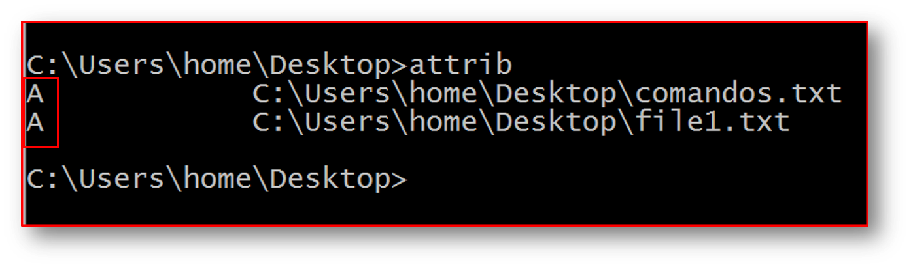</center>


- **Sintaxis**:

```
ATTRIB [+R | -R] [+A | -A] [+S | -S] [+H | -H] [+I | -I]
	   [unidad:] [ruta] [nombreArchivo] [/S [/D] [/L]]
```

- **Key**:
	- **(+)**: Activar un atributo
	- **(-)**: Borrar un atributo 


- **ruta**: Unidad y/o nombre de archivo, por ejemplo, **C:\*.txt**


- **Parámetros:**
	+ **/S**: Procesa archivos que coinciden en la carpeta y todas las subcarpetas actuales.
	+ **/D**: También procesa carpetas.
	+ **/L**: Se trabaja en los atributos del vínculo simbólico en vez de en el destino del vínculo simbólico.


**Comodines**  

Puede utilizar los comodines (**? y ***) con el parámetro de **pathname** para mostrar o cambiar los attributos de un grupo de archivos.

Cuando se crea un archivo suele tener el atributo **'A'**, pero podemos añadirle otro o quitarle el que tiene. Los atributos son: 


**Atributos**

- **A**: Sirve para saber si se ha modificado o no el directorio. Se suele asignar por defecto cuando se crea un nuevo archivo o directorio.
- **R** (Solo lectura): Sirve para que no se pueda ni borrar ni modificar el contenido de un archivo o directorio. Solo podemos ver lo que contiene.
- **H** (Oculto): Sirve para ocultar archivos y directorios durante las operaciones normales.
- **S** (Sistema): Sirve para asignar a un archivo o directorio como si fuera un archivo del sistema, esto hace que este oculto y sea solo de lectura. Muchos archivos de windows están con este atributo con la finalidad de no ser modificados.


Por ejemplo si quisieramos que nuestro archivo fuera de solo lectura, podríamos asignarle ese atributo de la siguiente manera:  

```bash
attrib +r file1.txt
# Ahora si vemos los atributos nuevamente con:
attrib file1.txt
# Obtendriamos la siguiente salida: 
# A    R       C:\Users\home\Desktop\file1.txt
```

Si quisiera modificar este archivo de texto **file1.txt** y guardarlo con el mismo nombre obtendrá un error como el siguiente: 

<center>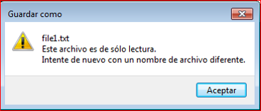</center>

Estos cambios también afectan el modo gráfico en en algunos programas como word:

<center>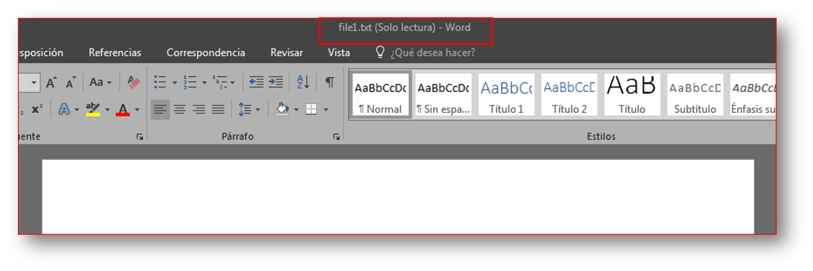</center>


Si queremos mantener nuestro archivo **file1.txt** además del atributo de solo lectura que sea también oculto, volvemos a nuestro símbolo de sistema y ejecutamos el siguiente comando: 

```bash
attrib +h file1.txt
# Ahora si vemos los atributos nuevamente con:
attrib file1.txt
# Obtendriamos la siguiente salida: 
# A    HR       C:\Users\home\Desktop\file1.txt
```
Si listaramos los archivos y carpetas con el comandor **dir** pasaría lo siguiente:  


```bash
dir /b
# repository
# comandos.txt
# ====Ver los archivos ocultos y resumido con:
dir /b/a
# repository
# comandos.txt
# file1.txt
# ====Ver solo los archivos oculos y resumido con:
dir /b/a:h
# file1.txt
```

Una cosa a tener en cuenta es que no podemos tener asignado el **atributo S** con el **atributo H** y viceversa. Lo mismo pasa con **S** y **R**. Para poder asignarlo, debemos primero quitar el atributo correspondiente:

Ejemplo:  

```bash
attrib -r +s file1.txt
# o en caso contrario
attrib -s +r file1.txt
```

Por otra parte, los atributos también pueden ser modificados desde el modo gráfico, simplemente con seleccionar o deseleccionar el atributo, para ello debemos hacer clic derecho en el archivo e ir a sus propiedades:  


<p align="center">
	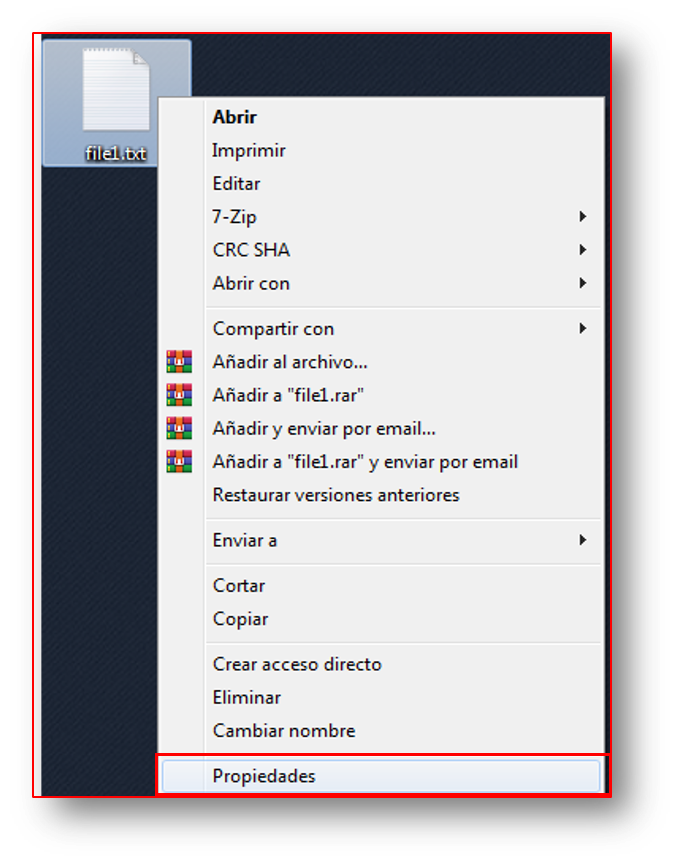
	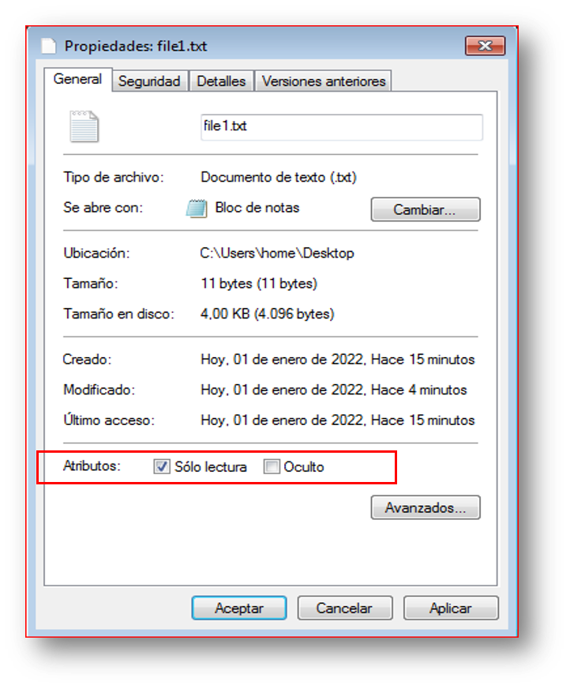
</p>


### <a name="mark2"><u>At</u></a>


El comando **AT** programa la ejecución de comandos y programas en un equipo a una hora y fecha especificadas. El comando aún se encuentra disponible por cuestiones de compatibilidad, pero ha sido extendido en el comando [SCHTASKS](#) que permite opciones más avanzadas. No obstante es posible emplearlo para la programación de tareas sencillas. Para poder usar esta herramientas necesita  **'Abrir como Administrador'** el símbolo de sistema.  


<p align="center">
	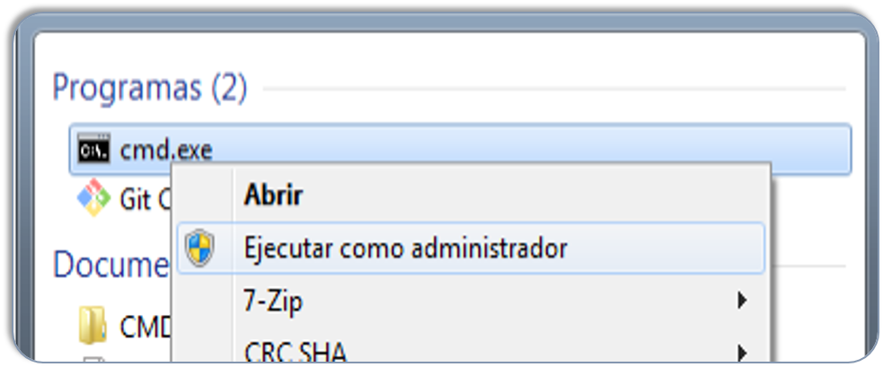
</p>


Sintaxis:  

```bash
at [\Computername][{[ID] [/delete] | /delete [/yes]}]
at [[\Computername] Hours:Minutes [/interactive] [{/every:date[,...] | /next:date[,...]}] command]
```

**Parámetros:**

- **\Computername**: utilice este parámetro para especificar una computadora remota. Si omite este parámetro, las tareas están programadas para ejecutarse en el equipo local.
- **ID**: Especifica el número de identificación asignado a un comando programado.
- **EVERY:DAY**: Ejecuta el comando el o los días especificados, las iniciales de los días utilizados tienen que corresponder a los días en el idioma correspondiente.
- **/DELETE**: Cancela una tarea programa. Si se omite el **ID**, se cancelan todas las tareas programadas en el equipo.


**Ejemplos:**

- **Listar tareas programas y mostrar su ID**


```bash
AT
```

- **A la 6:55 de la mañana inicia el navegador y conecta el equipo a Google.com**

```bash
AT 06:55 cmd /c start http://google.com
```

Si revisamos con el primer comando, obtendrá algo parecido a lo siguiente:

<p align="center">
	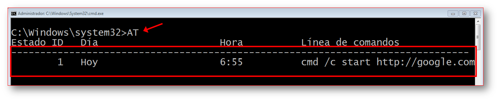
</p>


- **Realiza un respaldo, a las 07:00 de la mañana copia todos los archivos de la carpeta Mis Documentos en la carpeta Backup situada en el disco B:**

```bash
AT 07:00 cmd /c copy %USERPROFILE%\Documents\*.* B:\Backup
```

Tener en cuenta que solo copiará los archivos, no las carpetas ni los archivos que se encuentren en las subcarpetas. A continuación te dejo una ilustración de ejemplo: 

<p align="center">
	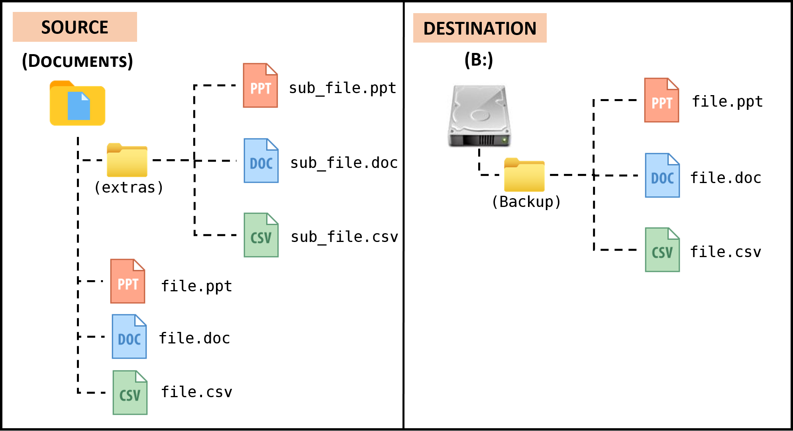
</p>


---


- **Todos los días ejecuta a las 11:30 de la mañana el script en batch llamado copia_diaria.cmd**


```bash
# En caso de tener la configuración regional en inglés
AT 11:30 /EVERY:m,t,w,th,f,s,su c:\backup\copy_daily.cmd
# En caso de tener la configuración regional en español
AT 11:30 /EVERY:l,m,mi,j,v,s,d c:\backup\copy_daily.cmd

```

Para ver la configuración del teclado e idioma, podemos desde el símbolo del sistema ingresar el comando: 

```bash
intl.cpl
```

Esto nos abrirá la ventana de configuración regional e idioma, vamos a la pestaña que dice teclado e idiomas o en su lugar Keyboards and Languages:  

<p align="center">
	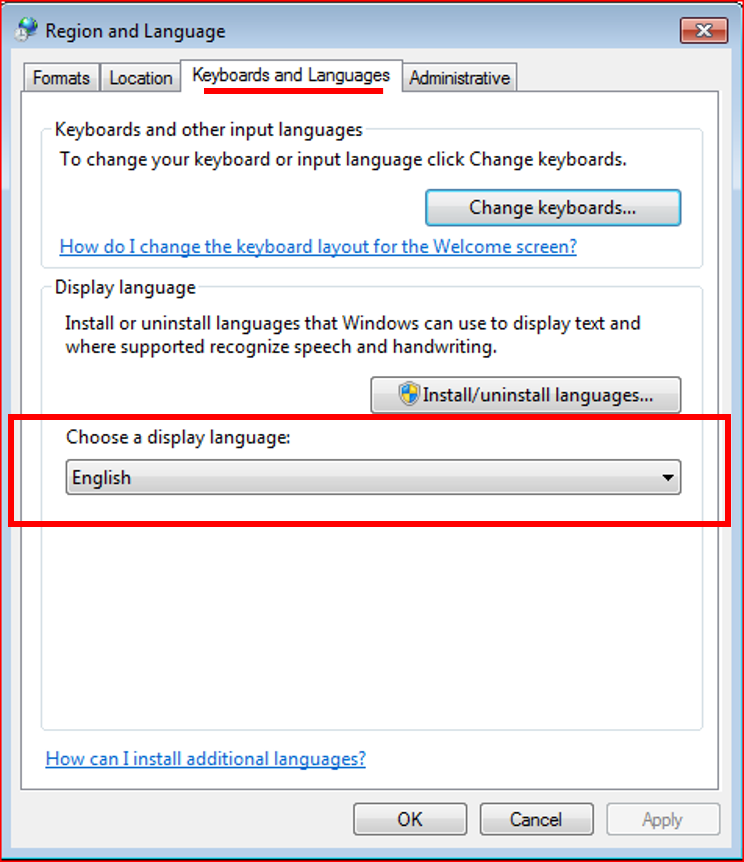
</p>


Abreviaturas de los días de la semana en español:

- **lunes**: l
- **martes**: m
- **miércoles**: mi
- **jueves**: j
- **viernes**: v
- **sábado**: s
- **domingo**: d


Abreviaturas de los días de la semana en inglés:

- **monday**: m
- **tuesday**: t
- **wednesday**: w
- **thursday**: th
- **friday**: f
- **saturday**: s
- **sunday**: su


Según nuestra configuración regional ingresaremos los valores para el argumento **/EVERY**. A continuación te dejo un ejemplo usando los nombres completos en lugar de sus abreviaturas en español: 

<p align="center">
	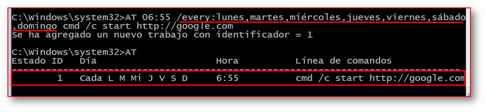
</p>

A continuación te dejo un ejemplo usando las abreviaturas en inglés, en caso de que la configuración se encuentre en ese idioma: 

<p align="center">
	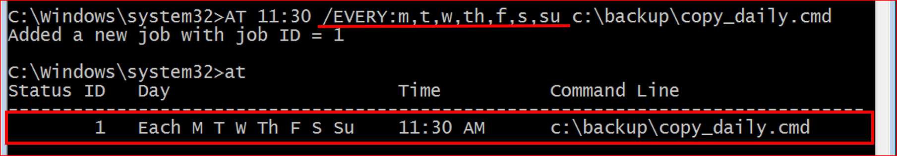
</p>

---


- **Eliminar todos los comandos programados**

```bash
AT /DELETE /Y
```

- **Cancelar la tarea del ID 2**

```bash
AT 2 /DELETE 
```

### <u>call</u>

Llama a un programa por lotes desde otro sin detener el programa por lotes principal.

El comando **CALL** lanzará un nuevo contexto de archivo por lotes junto con los parámetros especificados. Cuando se alzanza el final del segundo archivo por lotes (o si se usa EXIT), el control volverá justo después de la instrucción CALL inicial.

Los argumentos se pueden pasar como una cadena simple o usando una variable:


```bat
CALL myscrit.cmd "1234"
CALL otherscript.cmd %VARIABLE%

```

**Ejemplo**:

```bat
::----------start main.cmd-----------
@echo off
CALL function.cmd 10 first
Echo  %_description% - %_number%
::---------end main.cmd--------------

::---------start function.cmd--------
@echo off 
:: Add 25 to %1
SET /a _number=%1 + 25
:: Store %2
SET _description=[%2]
::----------end function.cmd--------

```

En muchos casos, también querrá usar **SETLOCAL** y **ENDLOCAL** para mantener las variables endiferentes archivos por lotes completamente separadas, esto evitará cualquier problema potencial si dos scripts usan el mismo nombre de variable.

Si ejecuta un segundo archivo por lotes **sin usar CALL**, puede encontrarse con algún comportamiento erróneo


**CALL subrutine (:label)**

El comando **CALL** pasará el control de la declaración después de la etiqueta especificada junto con los parámetros especificados. Para salir de la subrutina especifique **GOTO:** esto transferirá el control al final de la subrutina actual.


Una etiqueta se define de la siguiente manera:

```bat
: myShineLabel
```


### <a href="#net"><u>net</u></a>


>
- **Para listar los usuarios en Windows usamos el comando:**

```bash
net user 
```

- **Para crear un usuario sin privilegio de Administrador:**

```bash
net user <nameUser> /add
```

- **Para agregar una contraseña a un usuario o quitarsela:**

```bash
net user <nameUser> *
```
Cuando pulsemos <kbd>Enter</kbd> nos pedirá la contraseña, la debemos de indicar dos veces como medida de precaución. Si presionamos dos veces la tecla <kbd>Enter</kbd>, representará que dejamos la contraseña vacia; es decir; le quitamos la contraseña.


- **Para eliminar un usuario del sistema usaremos el comando:**

```bash
net user <userName> /delete
```

- **Nos muestra los grupos que existen en el host local**

```bash
net localgroup
```

- **Nos muestra los servicios que están corriendo en Windows**

```bash
net start
```


### <u>break</u>


Este comando establece o elimina la comprobación extendida de <kbd>Ctrl</kbd> + <kbd>C</kbd>


### <a href="#dir"><u>DIR</u></a>

Muestra una lista de archivos y subcarpetas.  


Sintaxis:  

```
DIR [path(s)[display_format][file_attributes][order][time][options]]
```

**Parámetro**

- **/?:** Mostrar la ayuda del comando
- **/A:** Muestra los archivos con los atributos especificados
	- Atributos:
		+ A : Archivos
		+ D : Directorios
		+ H : Archivos ocultos
		+ S : Archivos del sistema
		+ L : Puntos de análisis
		+ I : No archivos indizados (enlaces simbólicos)	
		+ R : Archivos de solo lectura
		+ \- : Prefijo de exclusión
		

		```bash
		DIR /a:-D 
		```


- **Listar solo los nombres del directorio raíz**

```bash
DIR /b c:\
# Mostrar solo los nombres de todos los directorio y archivos de la raíz
# Incluyendo los ocultos
DIR /b/a c:\
```

- **Listar solo los archivos (no carpeta) del directorio raíz de forma recursiva en todas las subcarpertas e incluye los archivos ocultos:**

```bash
DIR /a:-D /s c:\
```

- **Listar solo las carpetas (no archivos) del directorio raíz de forma recursiva en todas las subcarpertas e incluye los archivos ocultos:**

```bash
DIR /a:-A /s c:\
```


- **Listar todos los enlaces simbólicos en el perfil de usuario actual:**

```bash
DIR %USERPROFILE% /a:i
```


### <a href="#mkdir"><u>mkdir - md</u></a>

Este comando, nos sirve para crear directorios:


**Ejemplos**  

- **Crear dos carpetas en el Escritorio**

```bat
md folder1 folder2
```


### <a name="start"><u>Start</u></a>

Inicia de símbolo del sistema separada para ejecutar un programa o comando específico.


Sintaxis: 


```bash
start [<title>] [/d <path>] 
      [/i] [{/min | /max}] 
      [{/separate | /shared}] 
      [{/low | /normal | /high | /realtime | /abovenormal | belownormal}] 
      [/node <NUMA node>] [/affinity <hexaffinity>] 
      [/wait] [/b] [<command> [<parameter>... ] | <program> [<parameter>... ]]
```

**Parámetros:**

- **title**: Especifica el título que se mostrará en la barra de título de la ventana se **símbolo del sistema**.
- **/D <path>**: Especifica el directorio de inicio.
- **/I**: Pasa el entorno de inicio de **Cmd.exe** a la nueva ventana del **símbolo del sistema**. Si no se especifica **/i**, se utiliza el entorno actual.
- **{/min | /max}**: Especifica minimizar (/min) o maximizar (/max) la nueva ventana del **símbolo del sistema**.


**Observaciones:**

- Puede ejecutar archivos no ejecutable a través de su asociación de archivos escribiendo el nombre del archivo como comando.

<p align="center">
	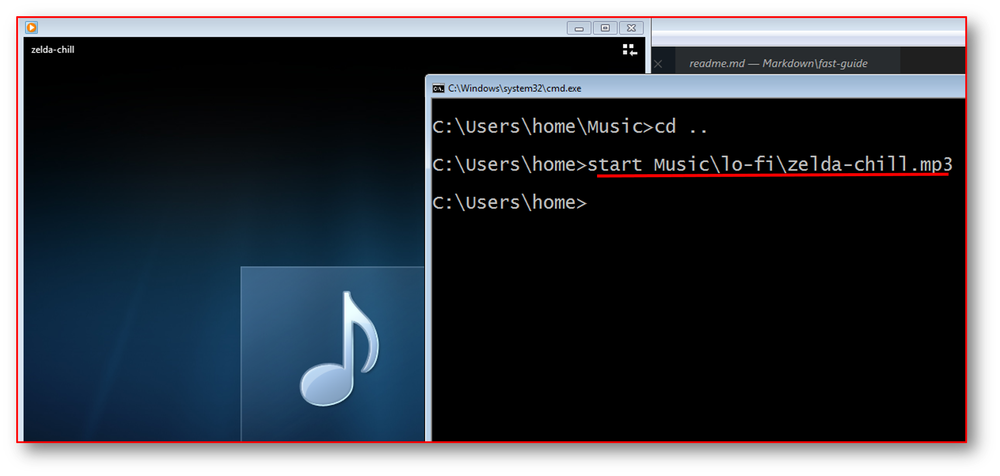
</p>


El comando **START** es de utilidad para todos los que le guste crear sus propias aplicaciones ejecutables (archivos batch) que puedan usar para facilitar la ejecución de una infinidad de tareas.


**Ejemplos:**


- Si ejecutamos solo el comando **start** junto a un punto "." se nos abre el explorador de archivos en esa ubicación.


```bash
start.
# Si colocamos dos puntos, retrocede un nivel.
start..
# Si le pasamos una ruta, una variable con algún path abrirá 
# el explorador en esa ruta:
start %USERPROFILE%
```

<p align="center">
	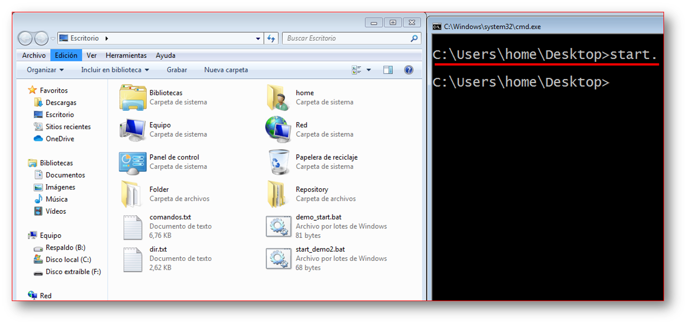
</p>


**Ejemplos Start | Uso en script**


- En un archivo batch podemos hacer que se ejecute un comando cada cierto intervalo de tiempo, en este ejemplo cada 20 segundo.

```bat
REM "demo_start.bat"
@ECHO OFF
:start
START /B ping google.com
cls
timeout /nobreak 20
goto start
```

<p align="center">
	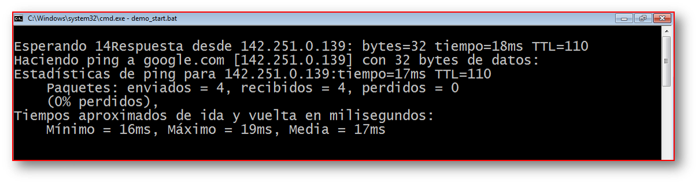
</p>

- Se inicia la el bloc de notas **notepad** con la ventana maximizada.

```bash
start /max notepad
```


- Se inicia la presentación llamada **cmd.pptx** que está en la carpeta "Mis documentos".


```bat
rem "demo_start.bat"
@echo off
start "" "%USERPROFILE%\Documents\cmd.pptx"
rem "run demostart.bat"
```
- Escribir un correo electrónico desde la misma CMD de allí utilizamos **malito** para redactar el correo y **start** para abrir el gestor de correos.

```bat
@echo off
echo.
start /B /MIN "" "mailto:tucorreo@gmail.com?subject=Envio de correo&body=Hola Proyecto Byte! Este correo lo envie desde la CMD de Windows 10 "
exit
```


- **help**:  

- **Ir a otra unidad extraible**: Ingresando la letra del volumen

Ejemplo:

```bash
F:

```

- **cls**: Este comando limpia la ventana de la consola de Windows; es decir, borra todos los comandos que has escrito anteriormente


- **color** : Establece los colores de primer plano y fondo predeterminados de la consola. 


Colores: 

| Código | Color    | Código | Color          |
|--------|----------|--------|----------------|
|0       |Negro     | 8      |Gris.           |
|1       |Azul      | 9      |Azul claro      |
|2       |Verde     | A      |Verde claro     |
|3       |Aguamarina| B      |Aguamarina claro|
|4       |Rojo      | C      |Rojo Claro      |
|5       |Púrpura   | D      |Púrpura claro   |
|6       |Amarillo  | E      |Amarillo claro  |
|7       |Blanco    | F      |Blanco brillante|


Ejemplo:  

```bash
color 17
# 1 = Azul para el fondo
# 7 = Blanco para el primer plano
```


### <a name="#variables"><u>Variables</u></a>


**Pedir la entrada del usuario**

```bat
@echo off
set /p MYNAME="Name :"
rem Mostrar entrada
echo Your name is: %MYNAME%
```
