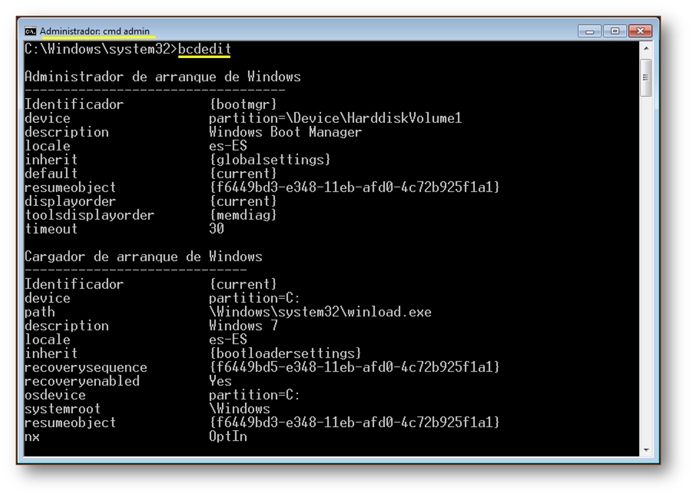
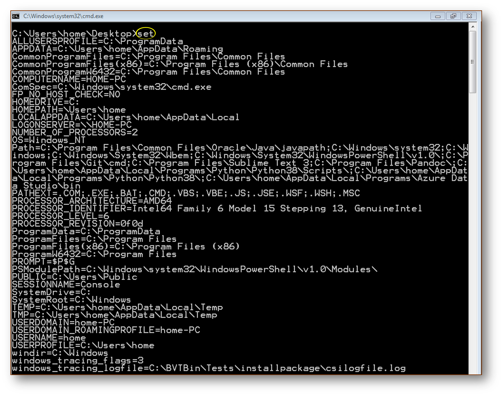
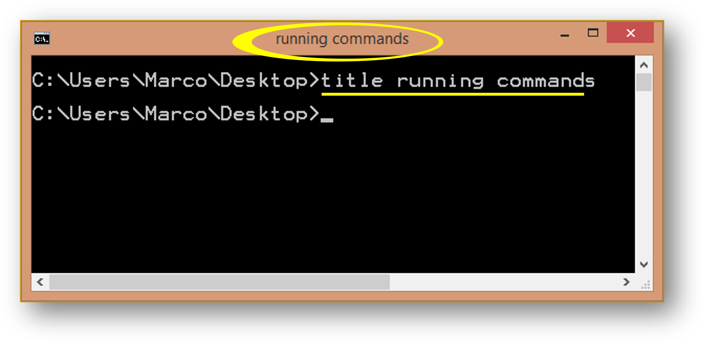
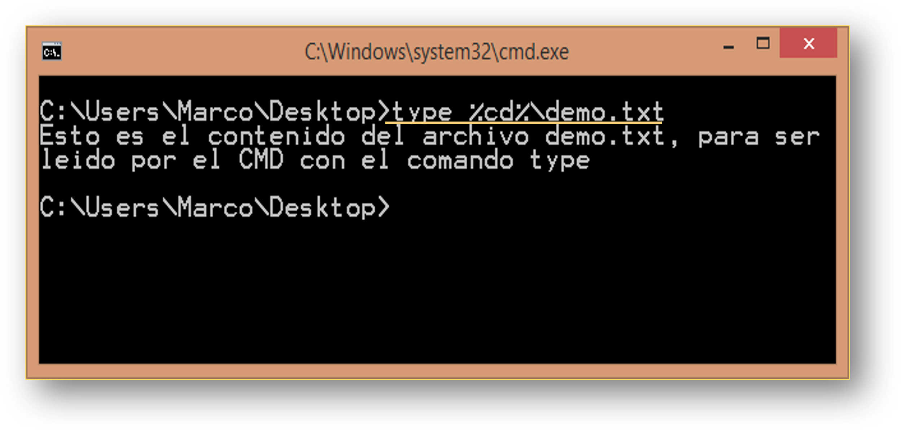

## <u style="padding-left:15px;">Guía rápida CMD</u> 


- [Rutas](#mark0)
	+ [Rutas absolutas](#)
	+ [Rutas relativas](#)
	+ [Variable](#variables)

<a name="top"></a>

- [Comandos](#mark0)
	* [assoc](#assoc)
    * [at](#at)
    * [attrib](#attrib)
    * [bcdedit](#bcdedit)
    * [break](#break)
    * [cacls](#cacls)
    * [call](#call)
    * [chcp](#chcp)
    * [chdir o cd](#chdir)
    * [chkdsk](#chkdsk)
    * [chkntfs](#chkntfs)
    * [cls](#cls)
    * [cmd](#cmd)
    * [color](#color)
    * [comp](#comp)
    * [compact](#compact)
    * [convert](#convert)
    * [copy](#copy)
    * [date](#date)
    * [dir](#dir)
    * [exit](#exit)
    * [if](#if)
    * [mkdir - md](#mkdir)
    * [rem](#rem)
    * [rmdir](#mark5)
    * [pause](#pause)
    * [prompt](#prompt)
    * [start](#start)
    * [shutdown](#shutdown)
    * [ipconfig](#ipconfig)
    * [time](#time)
    * [title](#title)
    * [type](#type)


### <a name="assoc"><u>Assoc</u></a>

Muestra o modifica las asociaciones de extensiones de archivos. La asociación de las extensiones le permite a Windows saber con qué aplicación podrá abrir un archivo por ejemplo, la extensión *xls* está asociada a Excel.


```
ASSOC [.ext[=[fileType]]]
```

**Parámetros**

- **.ext**: Especifica la extensi¢n con la cual asociar el tipo de archivo
- **fileType**: Especifica el tipo de archivo con el que asociar la extensi¢n

**Observaciones**

- Escribir ASSOC sin parámetros para ver las asociaciones de archivo actuales.
- Si ASSOC es llamado con solo la extensión de archivo, mostrárá la asociación actual del archivo para esa extensión. Si no especifica nada para el tipo de archivo y el comando se eliminará la asociación para la extensión de archivo.
- Para eliminar una asociación de una extensión de archivo agrega un espacio en blanco despues del signo igual =.
- Puedes utilizar el operador de redirección > para enviar la salida del comando **ASSOC** a un archivo de texto.
- Para realizar modificaciones debemos abrir la sesión de CMD con permisos de administrador.

**Ejemplos**

Para ver las asociaciones de la extensión .xls ejecuta lo siguiente:

```bat
assoc .xls
:: .xls=Excel.Sheet.8
```

Para ver enviar todas las asociaciones a un archivo txt.

```bat
assoc > asociaciones.txt
```

Para borrar la asociación txt, recuerda incluir un espacio en blanco después del signo igual.

```bat
assoc .txt= 
```

Para asociar las extensión *.txt* con el programa Word.

```bat
assoc .txt=Word.Document.8
:: Varía según Versión del Producto y del S.O 
```

[volver a índice](#top) &#x2934;

---

### <a name="at"><u>At</u></a>


El comando **AT** programa la ejecución de comandos y programas en un equipo a una hora y fecha especificadas. El comando aún se encuentra disponible por cuestiones de compatibilidad, pero ha sido extendido en el comando [SCHTASKS](#) que permite opciones más avanzadas. No obstante es posible emplearlo para la programación de tareas sencillas. Para poder usar esta herramientas necesita  **'Abrir como Administrador'** el símbolo de sistema.  


```
at [\Computername][{[ID] [/delete] | /delete [/yes]}]
at [[\Computername] Hours:Minutes [/interactive] [{/every:date[,...] | /next:date[,...]}] command]
```

<p align="center">
	
</p>


**Parámetros:**

- **\Computername**: utilice este parámetro para especificar una computadora remota. Si omite este parámetro, las tareas están programadas para ejecutarse en el equipo local.
- **ID**: Especifica el número de identificación asignado a un comando programado.
- **EVERY:DAY**: Ejecuta el comando el o los días especificados, las iniciales de los días utilizados tienen que corresponder a los días en el idioma correspondiente.
- **/DELETE**: Cancela una tarea programa. Si se omite el **ID**, se cancelan todas las tareas programadas en el equipo.


**Ejemplos:**

- **Listar tareas programas y mostrar su ID**


```bash
AT
```

- **A la 6:55 de la mañana inicia el navegador y conecta el equipo a Google.com**

```bash
AT 06:55 cmd /c start http://google.com
```

Si revisamos con el primer comando, obtendrá algo parecido a lo siguiente:

<p align="center">
	
</p>


- **Realiza un respaldo, a las 07:00 de la mañana copia todos los archivos de la carpeta Mis Documentos en la carpeta Backup situada en el disco B:**

```bash
AT 07:00 cmd /c copy %USERPROFILE%\Documents\*.* B:\Backup
```

Tener en cuenta que solo copiará los archivos, no las carpetas ni los archivos que se encuentren en las subcarpetas. A continuación te dejo una ilustración de ejemplo: 

<p align="center">
	
</p>


---


- **Todos los días ejecuta a las 11:30 de la mañana el script en batch llamado copia_diaria.cmd**


```bash
# En caso de tener la configuración regional en inglés
AT 11:30 /EVERY:m,t,w,th,f,s,su c:\backup\copy_daily.cmd
# En caso de tener la configuración regional en español
AT 11:30 /EVERY:l,m,mi,j,v,s,d c:\backup\copy_daily.cmd

```

Para ver la configuración del teclado e idioma, podemos desde el símbolo del sistema ingresar el comando: 

```bash
intl.cpl
```

Esto nos abrirá la ventana de configuración regional e idioma, vamos a la pestaña que dice teclado e idiomas o en su lugar Keyboards and Languages:  

<p align="center">
	
</p>


Abreviaturas de los días de la semana en español:

- **lunes**: l
- **martes**: m
- **miércoles**: mi
- **jueves**: j
- **viernes**: v
- **sábado**: s
- **domingo**: d

Abreviaturas de los días de la semana en inglés:

- **monday**: m
- **tuesday**: t
- **wednesday**: w
- **thursday**: th
- **friday**: f
- **saturday**: s
- **sunday**: su

Según nuestra configuración regional ingresaremos los valores para el argumento **/EVERY**. A continuación te dejo un ejemplo usando los nombres completos en lugar de sus abreviaturas en español: 

<p align="center">
	
</p>

A continuación te dejo un ejemplo usando las abreviaturas en inglés, en caso de que la configuración se encuentre en ese idioma: 

<p align="center">
	
</p>


- **Eliminar todos los comandos programados**

```bash
AT /DELETE /Y
```

- **Cancelar la tarea del ID 2**

```bash
AT 2 /DELETE 
```

[volver a índice](#top) &#x2934;

---

### <a name="attrib"><u>Attrib</u></a>


Muestra o cambia los atributos del archivos o directorios. Si se usa sin parámetros, **attrib** muestra los atributos de todos los archivos en el directorio actual.


```
ATTRIB [+R | -R] [+A | -A] [+S | -S] [+H | -H] [+I | -I]
	   [unidad:] [ruta] [nombreArchivo] [/S [/D] [/L]]
```

**Parámetros:**

- **/S**: Procesa archivos que coinciden en la carpeta y todas las subcarpetas actuales.
- **/D**: También procesa carpetas.
- **/L**: Se trabaja en los atributos del vínculo simbólico en vez de en el destino del vínculo simbólico.
- **ruta**: Unidad y/o nombre de archivo, por ejemplo, **C:\*.txt**


**Key**:

- **(+)**: Activar un atributo
- **(-)**: Borrar un atributo 


**Ejemplo:**


<p>
	
</p>


**Comodines**  

Puede utilizar los comodines (**? y ***) con el parámetro de **pathname** para mostrar o cambiar los attributos de un grupo de archivos.

Cuando se crea un archivo suele tener el atributo **'A'**, pero podemos añadirle otro o quitarle el que tiene. Los atributos son: 


**Atributos**

- **A**: Sirve para saber si se ha modificado o no el directorio. Se suele asignar por defecto cuando se crea un nuevo archivo o directorio.
- **R** (Solo lectura): Sirve para que no se pueda ni borrar ni modificar el contenido de un archivo o directorio. Solo podemos ver lo que contiene.
- **H** (Oculto): Sirve para ocultar archivos y directorios durante las operaciones normales.
- **S** (Sistema): Sirve para asignar a un archivo o directorio como si fuera un archivo del sistema, esto hace que este oculto y sea solo de lectura. Muchos archivos de windows están con este atributo con la finalidad de no ser modificados.


Por ejemplo si quisieramos que nuestro archivo fuera de solo lectura, podríamos asignarle ese atributo de la siguiente manera:  

```bash
attrib +r file1.txt
# Ahora si vemos los atributos nuevamente con:
attrib file1.txt
# Obtendriamos la siguiente salida: 
# A    R       C:\Users\home\Desktop\file1.txt
```

Si quisiera modificar este archivo de texto **file1.txt** y guardarlo con el mismo nombre obtendrá un error como el siguiente: 

<p align="center">
	
</p>

Estos cambios también afectan el modo gráfico en en algunos programas como word:

<p align="center">
	
</p>


Si queremos mantener nuestro archivo **file1.txt** además del atributo de solo lectura que sea también oculto, volvemos a nuestro símbolo de sistema y ejecutamos el siguiente comando: 

```bash
attrib +h file1.txt
# Ahora si vemos los atributos nuevamente con:
attrib file1.txt
# Obtendriamos la siguiente salida: 
# A    HR       C:\Users\home\Desktop\file1.txt
```

Si listaramos los archivos y carpetas con el comandor **dir** pasaría lo siguiente:  

```bat
dir /b
:: repository
:: comandos.txt

:: Ver los archivos ocultos y resumido con:
dir /b/a
:: repository
:: comandos.txt
:: file1.txt

:: Ver solo los archivos oculos y resumido con:
dir /b/a:h
:: file1.txt
```

Una cosa a tener en cuenta es que no podemos tener asignado el **atributo S** con el **atributo H** y viceversa. Lo mismo pasa con **S** y **R**. Para poder asignarlo, debemos primero quitar el atributo correspondiente:

Ejemplo:  

```bat
attrib -r +s file1.txt
:: o en caso contrario
attrib -s +r file1.txt
```

Por otra parte, los atributos también pueden ser modificados desde el modo gráfico, simplemente con seleccionar o deseleccionar el atributo, para ello debemos hacer clic derecho en el archivo e ir a sus propiedades:  


<p align="center">
	
	
</p>

[volver a índice](#top) &#x2934;

---

### <a name="bcdedit"><u>Bcdedit</u></a>

**BCDEDIT**: Editor del almacén de datos de la configuración de arranque (BCD)

La herramienta de la línea de comandos Bcdedit.exe modifica el almacén de datos de la configuración de arranque. El almacén de datos de la configuración de arranque contiene parámetros de configuraci¢n de arranque y controla el modo en que arranca el sistema operativo.

Estos parámetros se encontraban antes en el archivo **Boot.ini** en sistemas operativos BIOS o en las entradas RAM no volátil en sistemas operativos basados en EFI (Extensible Firmware Interface). Puede usar Bcdedit.exe para agregar, eliminar, editar y anexar entradas en el almacén de datos de la configuración de arranque.

Para obtener información detallada sobre comandos y opciones, escriba:

```bat
bcdedit.exe /? <comando>
``` 

Por ejemplo, para mostrar información detallada sobre el comando **/createstore**, escriba:

```bat
bcdedit.exe /? /createstore
```

Para obtener una lista alfabática de temas del archivo de ayuda, ejecute:

```bat
bcdedit /? TOPICS
```

<b><u>Comandos que operan en un almacén</u></b>


- **/createstore**: Crea un nuevo almacén de datos de la configuración de arranque vacío.
- **/export**: Exporta el contenido del almacén del sistema a un archivo. Este archivo se puede usar más adelante para restaurar el estado del almacén del sistema.
- **/import**: Restaura el estado del almacén del sistema mediante un archivo de copia de seguridad creado con el comando /export.
- **/sysstore**: Establece el dispositivo de almacén del sistema (solo afecta a los sistemas EFI, pero no se mantiene entre reinicios y solo se usa en los casos en que el dispositivo de almacén del sistema es ambiguo).


<b><u>Comandos que operan en entradas de un almacén</u></b>

- **/copy**: Hace copias de las entradas del almacén.
- **/create**: Crea nuevas entradas en el almacén.
- **/delete**: Elimina entradas del almacén.
- **/mirror**: Crea un reflejo de las entradas del almacén.

Ejecute bcdedit /? ID para obtener información sobre los identificadores usados por estos comandos.


<b><u>Comandos que operan en opciones de entrada</u></b>

- **/deletevalue**: Elimina las opciones de entrada del almacén.
- **/set**: Establece valores de opciones de entrada en el almacén.


Ejecute bcdedit /? TYPES para ver una lista de tipos de datos usados por estos
comandos.

Ejecute bcdedit /? FORMATS para ver una lista de formatos de datos válidos.


<b><u>Comandos que controlan la salida</u></b>

- **/enum**: Muestra la lista de entradas del almacén.
- **/v**: Opción de la línea de comandos que muestra identificadores de entrada completos, en lugar de usar nombres para los identificadores conocidos. Use /v por sí solo como comando para mostrar los identificadores de entrada completos para el tipo ACTIVE.

Ejecutar "bcdedit" por sí solo equivale a ejecutar "bcdedit /enum ACTIVE".


<b><u>Comandos que controlan el administrador de arranque</u></b>

- **/bootsequence**: Establece la secuencia de arranque única para el administrador de arranque.
- **/default**: Establece la entrada predeterminada que usará el administrador de arranque.
- **/displayorder**: Establece el orden en que el administrador de arranque muestra el menú de arranque múltiple.
- **/timeout**: Establece el valor de tiempo de espera del administrador de arranque.
- **/toolsdisplayorder**: Establece el orden en que el administrador de arranque muestra el menú de herramientas.

<b><u>Comandos que controlan los Servicios de administración de emergencia para una aplicación de arranque</u></b>

- **/bootems**: Habilita o deshabilita los Servicios de administración de emergencia para una aplicación de arranque.
- **/ems**: Habilita o deshabilita los Servicios de administración de emergencia para una entrada del sistema operativo.
- **/emssettings**: Establece los parámetros globales de los Servicios de administración de emergencia.

<b><u>Comandos que controlan la depuración</u></b>

- **/bootdebug**: Habilita o deshabilita la depuración de arranque para una aplicación de arranque.
- **/dbgsettings**: Establece los parámetros globales del depurador.
- **/debug**: Habilita o deshabilita la depuración de kernel para la entrada de un sistema operativo.
- **/hypervisorsettings**: Establece los parámetros para el hipervisor.


<b><u>Resumen:</u></b>

BCDEDIT es un comando disponible en la consola de CMD que permite mediante la herramienta Bcdedit.exe, cambiar, modificar y personalizar la configuración de arranque de Windows. Podemos usarlo de forma sencilla para establecer el orden de los sistemas operativos, su nombre en el menú de arranque, usar sistemas en discos virtuales, habilitar o deshabilitar efectos, etc. 
Es imprescindible en los casos que tenemos instalados dos o más versiones de Windows diferentes en un mismo equipo.

**Sistemas de arranque de Windows**

Los parámetros de inicio de Windows se guardan de forma diferente, dependiendo de la versión del sistema operativo.

- **Arranque de Windows XP**: En Windows XP y sistemas anteriores se usa NTLDR (abreviatura de NT Loader), que es el gestor de arranque. Su archivo de configuración es **Boot.ini**, un sencillo archivo de texto que se puede ver en la raíz de la unidad principal. En él se relacionan los sistemas operativos instalados en el equipo, cuál de ellos es el predeterminado, el *timeout* o tiempo de espera, etc. Boot.ini se puede modificar usando el Bloc de notas u otro editor de texto.

- **Arranque de Windows Vista y 7**: En Windows Vista se introduce y se usa también en Windows 7, el nuevo Administrador de arranque de Windows (Windows Boot Manager) BCD (Boot Configuration Data), en ingles: Datos de la Configuración de arranque.
Este sistema más moderno permite el arranque en sistemas que no usan BIOS.
La información se guarda en una base de datos similar al Registro de Windows, en un archivo llamado: **bootmgr** y en **C:\Boot\BCD.LOG.** Para modificarla se usa el comando BCDEDIT

- **Arranque de Windows 8**: Windows 8 incluye un nuevo sistema de arranque, UEFI Secure Boot que según Microsoft ofrece más seguridad y aprovecha la nueva función de Inicio rápido que permite arrancar el sistema con más rapidez.
No obstante en caso de desearlo se puede cambiar al anterior Windows Boot Manager.


<b><u>Uso de BCDEDIT:</u></b>


Usando BCDEDIT se puede agregar, eliminar, editar y anexar entradas en el almacén de datos de la configuración de arranque del equipo. BCDEDIT es necesario usarlo en la consola de CMD con permisos de administrador.

Al usar en la consola el comando BCDEDIT sin ningún parámetro, solo se muestra la configuración de arranque actual del equipo.

- **En la sección Administrador de arranque de Windows**: se muestra el sistema de arranque, el sistema operativo predeterminado (default), etc.
- **En la sección Cargador de arranque de Windows**: se muestran los sistemas operativos instalados.

<p align="center">
	
</p>

Los principales valores son los siguientes:

- **Identificador**: es el identificador usado para dicha partición, encerrado entre dos llaves. Es necesario conocerlo para hacer algunos ajustes usando BCDEDIT. En caso del sistema operativo predeterminado el valor es: {current}. Otro sistema operativo se representa con un identificador único global (GUID), es una secuencia alfanumérica, por ejemplo: {2807aaab-f2a8-11de-8e0c-b4db26ac8165}. Si el sistema es Windows XP o anterior se indica: {ntldr}. Para conocer todos los identificadores usa en la consola: `bcdedit /? ID`
- **Description**: indica el nombre que aparece en el menú de arranque.
- **Bootmenupolicy**: solo en Windows 8, tiene dos valores:
Legacy, sistema de arranque clasico, igual que en Windows 7
Standard, sistema de arranque predeterminado


<b><u>Usos prácticos del comando BCDEDIT</u></b>


Crear y guardar un respaldo de la configuración de arranque Usa:

```bat
bcdedit /export C:\respaldo.txt
```

Restaurar el respaldo guardado:


```bat
bcdedit /import C:\respaldo.txt
```

Cambiar el nombre del sistema operativo en el menú de arranque

En caso de tener dos o más sistemas instalados en el equipo, cambia los nombres que aparecen en el menú de arranque de la siguiente forma:

```bat
:: bcdedit /set {identificador} description "Nombre"

:: Tres ejemplos:
bcdedit /set {c15d0021-1aec-11dc-b49c-9726d7e2da89} description "Windows 7" 
bcdedit /set {current} description "Windows 8" 
bcdedit /set {ntldr} description "Windows XP"
```

Agregar al menú de arranque otro sistema en una unidad virtual usa:

```bat
bcdedit /set {cea643bf-b4b4-6786-543a-fa67654f5d71} device partition=F:
```

Habilitar en Windows 8 el sistema clásico de arranque

Windows 8 usa un sistema de arranque mucho más rápido, pero en caso de tener dos o más sistemas operativos en el equipo, esto se vuelve una molestia cuando hay necesidad de alternar entre sistemas diferentes. Para usar el mismo Windows Boot Manager que en Windows 7, usa el siguiente comando:

```bat
bcdedit /set {default} bootmenupolicy legacy
:: Para cambiar al modo predeterminado usa:
bcdedit /set {default} bootmenupolicy standard
```

En ambos casos asegúrate que aparece el mensaje: La operación se completó correctamente.


Deshabilitar el logotipo de arranque en Windows 8 usa:

```bat
bcdedit /set {globalsettings} custom:16000067 true
```

Para restaurarlo usa:

```bat
bcdedit /set {globalsettings} custom:16000067 false
:: o
bcdedit /deletevalue {globalsettings} custom:16000067
```

Deshabilitar mensajes de Windows 8 en el arranque usa:

```bat
bcdedit /set {globalsettings} custom:16000068 true
:: Para restaurarlos usa:
bcdedit /set {globalsettings} custom:16000068 false
:: o
bcdedit /deletevalue {globalsettings} custom:16000068
```


[volver a índice](#top) &#x2934;

---

### <a name="break"><u>Break</u></a>

Activa o desactiva Ctrl+C extendido en DOS

Está presente para que haya compatibilidad con sistemas DOS, pero no tiene efecto en Windows.

Si se habilitan las extensiones de comando y se ejecuta en la plataforma de Windows, el comando BREAK insertará un punto de interrupci¢n dentro del código, si está siendo depurado por un depurador.

[volver a índice](#top) &#x2934;

---

### <a name="cacls"><u>Cacls</u></a>


**NOTA**: el comando Cacls está obsoleto, use Icacls.

Muestra o modifica listas de control de acceso (ACL) de archivos

```
CACLS archivo [/T] [/M] [/L] [/S[:SDDL]] [/E] [/C] [/G usuario:perm]

               [/R usuario [...]] [/P usuario:perm [...]] [/D usuario [...]]
```


- **archivo**: Muestra las ACL.
- **/T**: Cambia las ACL de archivos especificados en el directorio actual y todos los subdirectorios.
- **/L**: Trabaja en el propio vínculo simbólico en lugar del destino.
- **/M**: Cambia las ACL de los volúmenes montados en un directorio.
- **/S**: Muestra la cadena SDDL para la DACL.
- **/S:SDDL**: Reemplaza las ACL por las especificadas en la cadena SDDL (no válido con /E, /G, /R, /P ni /D).
- **/E**: Edita la ACL en vez de remplazarla.
- **/C**: Continúa, omitiendo los errores de acceso denegado.
- **/G usuario:perm**: Concede derechos de acceso del usuario. Perm puede ser: 
	+ **R**: Leer
	+ **W**: Escribir
	+ **C**: Cambiar (escribir)
	+ **F**: Control total
- **/R usuario**: Revoca derechos del usuario (solo válida con /E).
- **/P usuario:perm**: Reemplaza derechos de acceso del usuario. Perm puede ser: 
	+ **N**: Ninguno
	+ **R**: Leer
	+ **W**: Escribir
	+ **C**: Cambiar (escribir)
	+ **F**: Control total
- **/D usuario**: Deniega acceso al usuario especificado.

Se pueden usar comodines para especificar más de un archivo. Puede especificar más de un usuario.

<b><u>Abreviaturas:</u></b>

- **CI**: Herencia de contenedor.
- **ACE**: Se heredará por directorios.
- **OI**: Herencia de objeto.
- **ACE**: se heredará por archivos.
- **IO**: Solo heredar. ACE no se aplica al archivo o directorio actual.
- **ID**: Heredado. ACE se heredó de la ACL del directorio principal.

[volver a índice](#top) &#x2934;

---

### <a name="call"><u>Call</u></a>

Llama a un programa por lotes desde otro sin detener el programa por lotes principal.

El comando **CALL** lanzará un nuevo contexto de archivo por lotes junto con los parámetros especificados. Cuando se alzanza el final del segundo archivo por lotes (o si se usa EXIT), el control volverá justo después de la instrucción CALL inicial.

Los argumentos se pueden pasar como una cadena simple o usando una variable:


```bat
CALL myscrit.cmd "1234"
CALL otherscript.cmd %VARIABLE%

```

**Ejemplo**:

```bat
::----------start main.cmd-----------
@echo off
CALL function.cmd 10 first
Echo  %_description% - %_number%
::---------end main.cmd--------------

::---------start function.cmd--------
@echo off 
:: Add 25 to %1
SET /a _number=%1 + 25
:: Store %2
SET _description=[%2]
::----------end function.cmd--------

```

En muchos casos, también querrá usar **SETLOCAL** y **ENDLOCAL** para mantener las variables endiferentes archivos por lotes completamente separadas, esto evitará cualquier problema potencial si dos scripts usan el mismo nombre de variable.

Si ejecuta un segundo archivo por lotes **sin usar CALL**, puede encontrarse con algún comportamiento erróneo


**CALL subrutine (:label)**

El comando **CALL** pasará el control de la declaración después de la etiqueta especificada junto con los parámetros especificados. Para salir de la subrutina especifique **GOTO:** esto transferirá el control al final de la subrutina actual.


Una etiqueta se define de la siguiente manera:

```bat
: myShineLabel
```

[volver a índice](#top) &#x2934;

---

### <a name="chcp"><u>Chcp</u></a>

Muestra o establece el número de la página de códigos activa.

```
CHCP [nnn]
```

- **nnn**: Especifica una página de códigos.

Escriba CHCP sin parámetro para mostrar el número de la página de códigos activa.


|Página de códigos|	País o región, o idioma|
|-----------------|------------------------|
|437              |Estados Unidos          |
|850	          |Multilingüe (Latino I)  |
|852	          |Eslavo (Latino II)      |
|855	          |Cirílico (Ruso)         |
|857	          |Turco                   |
|860	          |Portugués               |
|861	          |Islandés                |
|863	          |Francés canadiense      |
|865	          |Nórdico                 |
|866	          |Ruso                    |
|869	          |Griego moderno          |


[volver a índice](#top) &#x2934;

---

### <a name="chdir"><u>Chdir o cd</u></a>


Muestra el nombre del directorio actual o cambia de directorio.

```
CHDIR [/D] [unidad:][ruta]
CHDIR [..]
CD [/D] [unidad:][ruta]
CD [..]
```

- **CD ..**: Especifica que desea cambiar al directorio superior.
- **CD unidad**: (Ej: CD C:) para ver el directorio actual de la unidad especificada.
- **CD sin parámetros**: para ver la unidad y el directorio actual.
- **/D**: Use el modificador /D para cambiar la unidad actual además del directorio actual para una unidad de disco.


Si las extensiones de comando están habilitadas, CHDIR cambia así:

El uso de mayúsculas y minúsculas de la cadena del directorio actual se convierte al mismo uso que se tiene en los nombres de unidades. Así:

```bat
CD C:\Users\username\AppData\Local\Temp
::establecerá  Temp como el directorio actual 
:: si éste es el uso de mayúsculas y minúsculas en la unidad.
```

El comando CHDIR no trata los espacios como separadores, así que es posible usar CD para cambiar a un directorio cuyo nombre de subdirectorio contenga un espacio, sin necesidad de escribir el nombre entre comillas. Por ejemplo:

```bat
CD C:\Users\username\Desktop\Mis repositorios
```

es lo mismo que:

```bat
CD "C:\Users\username\Desktop\Mis repositorios"
```

que sería lo que hay que escribir si las extensiones estuvieran
deshabilitadas.

[volver a índice](#top) &#x2934;

---

### <a name="cls"><u>Cls</u></a>

Borra la pantalla

[volver a índice](#top) &#x2934;

---

### <a name="chkdsk"><u>Chkdsk</u></a>

Comprueba un disco y muestra un informe de estado.


```
CHKDSK [volumen[[ruta]archivo]]] [/F] [/V] [/R] [/X] [/I] [/C] [/L[:tamaño]][/B]
```


- **volumen**: Especifica la letra de unidad (seguida por dos puntos), el punto de montaje o el nombre de volumen.
- **archivo**: sólo para FAT/FAT32 especifica los archivos en donde se comprobar  la fragmentación.
- **/F**: Corrige los errores del disco.
- **/V**: Para FAT/FAT32 muestra la ruta completa y el nombre de cada archivo en el disco. Para NTFS muestra mensajes de limpieza si hay.
- **/R**: Encuentra sectores dañados y recupera la información legible (implica /F).
- **/L**: Tamaño Sólo para NTFS: cambia el tamaño del archivo de registro al número especificado de KB. Si no se especifica ningún tamaño, muestra el tamaño actual.
- **/X**: Obliga al volumen a desmontarse previamente si es necesario. Todos los identificadores abiertos al volumen no serán válidos (implica /F).
- **/I**: Sólo para NTFS: realiza una comprobación menos exhaustiva de entradas de índice.
- **/C**: Sólo NTFS omite la comprobación de ciclos dentro de la estructura de carpetas.
- **/B**: Sólo NTFS vuelve a evaluar los clústeres incorrectos en el volumen (implica el uso de /R). 


Los modificadores /I o /C reducen la cantidad de tiempo necesario para ejecutar Chkdsk ya que omiten ciertas comprobaciones en el volumen.


[volver a índice](#top) &#x2934;

---

### <a name="chkntfs"><u>Chkntfs</u></a>

```
CHKNTFS volumen [...]
CHKNTFS /D
CHKNTFS /T[: tiempo]
CHKNTFS /X volumen [...]
CHKNTFS /C volumen [...]
```

- **volumen**: Especifica la letra de unidad (seguida por dos puntos), el punto de montaje o el nombre de volumen.
- **/D**: Restaura el funcionamiento predeterminado del equipo; todas las unidades se comprueban al arrancar y chkdsk se ejecuta en aquéllas que están dañadas.
- **/T: tiempo**: Cambia el tiempo de la cuenta atrás en el inicio de AUTOCHK a la cantidad de tiempo dada en segundos. Si el tiempo no se específica, se mostrará la configuración actual.
- **/X**: Excluye una unidad de la comprobación predeterminada al arrancar. Las unidades excluidas no se acumulan entre invocaciones de comandos.
- **/C**: Programa una unidad para ser comprobada al arrancar; chkdsk se ejecutará si la unidad está dañada.


Si no se especifican modificadores, CHKNTFS mostrará  si la unidad especificada está dañada o programada para ser revisada al reiniciar el equipo de nuevo.


[volver a índice](#top) &#x2934;

---

### <a name="cmd"><u>Cmd</u></a>


Inicia una nueva instancia del intérprete de comandos de Windows

```
CMD [/A | /U] [/Q] [/D] [/E:ON | /E:OFF] [/F:ON | /F:OFF] [/V:ON | /V:OFF]
    [[/S] [/C | /K] cadena]
```

- **/C**: Ejecuta el comando especificado en cadena y luego finaliza.
- **/K**: Ejecuta el comando especificado en cadena pero sigue activo.
- **/S**: Modifica el tratamiento de cadena después de /C o /K (consultar más abajo).
- **/Q**: Desactiva el eco
- **/D**: Deshabilita le ejecución de los comandos de AutoRun del Registro (consultar m s abajo)
- **/A**: Usa ANSI para la salida de comandos internos hacia una canalización o un archivo.
- **/U**: Usa Unicode para la salida de comandos internos hacia una canalización o un archivo.
- **/T:fg** Configura los colores de primer y segundo plano (para obtener más información, consulte COLOR /?) ej:  
`cmd /t:5f`.
- **/E:ON**: Habilita las extensiones de comando (consultar más abajo).
- **/E:OFF**: Deshabilita las extensiones de comando (consultar más abajo).
- **/F:ON**: Habilita los caracteres de terminación de los nombres de archivos y directorios (consultar más abajo)
- **/F:OFF**: Deshabilita los caracteres de terminación de los nombres de archivos y directorios (consultar más abajo).
- **/V:ON**: Habilita la extensión de variables de entorno retardada con `!` como delimitador. Por ejemplo, /V:ON permitir  que !var! extienda la variable var en tiempo de ejecución.  La sintaxis var extiende variables en tiempo de entrada, lo que es bastante diferente cuando se está dentro de un bucle FOR.
- **/V:OFF**: Deshabilita la extensión de variables de entorno retardada.Tenga en cuenta que los comandos múltiples separados por el separador de comandos '&&' se aceptan como cadena si están entre comillas. Por razones de compatibilidad, /X equivale a /E:ON, /Y equivale a /E:OFF y /R equivale a
/C. Se omitirá cualquier otro tipo de modificador.

Si se especifica /C o /K, lo que viene después de la línea de comandos se ejecuta como línea de comandos, siguiendo la lógica siguiente para procesar caracteres de comillas ("):

1. Se conservan las comillas del comando si se cumplen todas las condiciones siguientes:
    + no aparece el modificador /S
    + hay exactamente dos caracteres de comillas
    + no hay caracteres especiales entre ambas comillas, siendo los, caracteres especiales: `&<>()@^|`
    + hay uno o más espacios en blanco entre ambas comillas
    + la cadena entre ambas comillas es el nombre de un archivo ejecutable.

2. En caso contrario, el comportamiento clásico es comprobar si el primer carácter es una comilla y de ser así, quitar ésta y también la última comilla de la línea de comandos, conservando el texto que venga después de ésta.

Si no se especificó /D en la línea de comandos, cuando CMD.EXE se inicie, buscar  las variables del Registro REG_SZ/REG_EXPAND_SZ, y si alguna de ellas está presente, se ejecutarán en primer lugar.

```
HKEY_LOCAL_MACHINE\Software\Microsoft\Command Processor\AutoRun

y (o)

HKEY_CURRENT_USER\Software\Microsoft\Command Processor\AutoRun
```

Las extensiones de comando están habilitadas de forma predeterminada. Puede deshabilitar las extensiones de una invocación particular con el modificador /E:OFF. Puede habilitar o deshabilitar las extensiones de todas las
invocaciones de CMD.EXE en una sesión de inicio de usuario o de equipo si establece con `REGEDIT.EXE` los dos valores de REG_DWORD del Registro siguientes:

```
HKEY_LOCAL_MACHINE\Software\Microsoft\Command Processor\EnableExtensions

y/o

HKEY_CURRENT_USER\Software\Microsoft\Command Processor\EnableExtensions
```

En 0x1 o 0x0. La configuración específica del usuario tiene preferencia respecto a la del equipo. Los modificadores de la línea de comandos tienen prioridad sobre la configuración del Registro. En un archivo por lotes, los argumentos SETLOCAL ENABLEEXTENSIONS o DISABLEEXTENSIONS tienen prioridad sobre los modificadores /E:ON o /E:OFF. Para obtener información más detallada, vea SETLOCAL /?. Las extensiones de comando implican cambios y ampliaciones en los siguientes comandos:

- **DEL o ERASE**
- **COLOR**
- **CD o CHDIR**
- **MD o MKDIR**
- **PROMPT**
- **PUSHD**
- **POPD**
- **SET**
- **SETLOCAL**
- **ENDLOCAL**
- **IF**
- **FOR**
- **CALL**
- **SHIFT**
- **GOTO**
- **START** (también incluye cambios en la invocación de comandos externos)
- **ASSOC**
- **FTYPE**

Para obtener detalles específicos, escriba nombreDelComando /?.
La expansión de variables de entorno retardada NO está habilitada de forma predeterminada. Puede habilitar o deshabilitar la expansi¢n de variables de entorno retardada para una invocación particular de CMD.EXE con los
modificadores /V:ON o /V:OFF. Puede habilitar o deshabilitar la expansión retardada para todas las invocaciones de CMD.EXE en una sesión de inicio de usuario o equipo si establece con REGEDIT.EXE los dos valores de REG_DWORD del Registro siguientes:

```
HKEY_LOCAL_MACHINE\Software\Microsoft\Command Processor\DelayedExpansion

y/o

HKEY_CURRENT_USER\Software\Microsoft\Command Processor\DelayedExpansion
```

en 0x1 o 0x0. La configuración específica del usuario tiene prioridad sobre la configuración del equipo. Los modificadores de la línea de comandos tienen prioridad sobre la configuración del Registro. En un archivo por lotes, los argumentos SETLOCAL ENABLEDELAYEDEXPANSION o DISABLEDELAYEDEXPANSION tienen prioridad sobre los modificadores /V:ON o /V:OFF. Para obtener información más detallada, vea SETLOCAL /?.

Si la expansión de variables de entorno retardada está habilitada, se puede usar el carácter de exclamación para sustituir el valor de la variable de entorno en tiempo de ejecución.

Puede habilitar o deshabilitar la terminación de un nombre de archivo para una invocación particular de CMD.EXE con el modificador /F:ON o /F:OFF. Se puede habilitar o deshabilitar la terminación para todas las invocaciones de CMD.EXE en una sesión de inicio de equipo o de usuario estableciendo cualquiera de los dos siguientes valores REG_DWORD en el Registro con REGEDT.EXE:

```
HKEY_LOCAL_MACHINE\Software\Microsoft\Command Processor\CompletionChar

HKEY_LOCAL_MACHINE\Software\Microsoft\Command Processor\PathCompletionChar
        
y/o

HKEY_CURRENT_USER\Software\Microsoft\Command Processor\CompletionChar

HKEY_CURRENT_USER\Software\Microsoft\Command Processor\PathCompletionChar
```

con el valor hex de un carácter de control para usarlo en una función particular (por ej. 0x4 es Ctrl-D y 0x6 es Ctrl-F). La configuración de usuario específica tiene precedencia sobre la configuración de la máquina. Los modificadores de la línea de comandos tiene precedencia sobre la configuración del Registro.
Si la terminación está habilitada con el modificador /F:ON, los dos caracteres de control usados son Ctrl-D para la terminación del nombre del directorio y Ctrl-F para la terminación del nombre de archivo. Para deshabilitar una
terminación de carácter determinada en el Registro, use el valor del espacio en blanco (0x20), ya que no es un carácter de control válido.

Se invoca la terminación cuando se escriben cualquiera de los dos caracteres de control. La función de terminación, desplaza el contenido de la ruta de acceso hacia la izquierda del cursor, le anexa un carácter comodín si no hay ninguno todavía presente y genera una lista de rutas de acceso que coincidan. Después muestra la primera ruta de acceso que coincida. Si no
coincide ninguna ruta de acceso, emite un sonido y no muestra nada. Posteriormente, el presionar repetidamente el mismo carácter de control se desplazará a través de la lista de las rutas de acceso que coinciden. Si presiona la tecla Mayús con el carácter de control se mover  a través de la lista hacia atrás. Si se edita la línea de cualquier manera y presiona el
carácter de control de nuevo, la lista de ruta de acceso guardada es anulada y se generará una nueva. Ocurrirá lo mismo si pasa de una terminación de nombre de archivo a uno de directorio. La única diferencia entre los dos caracteres de control es que la terminación del carácter del archivo
coincide con ambos nombres del archivo y del directorio, mientras que la terminación del carácter del directorio sólo coincide con los nombres del directorio. Si la terminación del archivo es usada en cualquier construcción de comandos de directorio (CD, MD o RD) entonces se asume la terminación del directorio.

El código de terminación trata adecuadamente con nombres de archivo que contienen espacios u otros caracteres especiales colocando comillas entre la ruta de acceso que coincide. También, si se hace una copia de seguridad, se llamará a una terminación dentro de la misma línea, el texto a la derecha
del cursor que fue llamado en el punto de la terminación es descartado.

Los caracteres especiales que requieren comillas son:

```
<espacio>&()[]{}^=;!'+,`~
```

[volver a índice](#top) &#x2934;

---

### <a name="color"><u>Color</u></a>


Establece los colores de primer plano y fondo predeterminados de la consola. 

```
COLOR [atr]
```

- **atr**: Especifica el atributo de color de la salida de consola

Los atributos de color están especificados con dos dígitos hex (el primero corresponde al segundo plano; el segundo al pr
imer plano). Los dígitos pueden
ser cualquiera de los siguientes valores:


Colores: 

| Código | Color    | Código | Color          |
|--------|----------|--------|----------------|
|0       |Negro     | 8      |Gris.           |
|1       |Azul      | 9      |Azul claro      |
|2       |Verde     | A      |Verde claro     |
|3       |Aguamarina| B      |Aguamarina claro|
|4       |Rojo      | C      |Rojo Claro      |
|5       |Púrpura   | D      |Púrpura claro   |
|6       |Amarillo  | E      |Amarillo claro  |
|7       |Blanco    | F      |Blanco brillante|


**Ejemplo:**

```bash
color 17
# 1 = Azul para el fondo
# 7 = Blanco para el primer plano
```

[volver a índice](#top) &#x2934;

---

### <a name="comp"><u>Comp</u></a>

Compara el contenido de dos archivos o conjuntos de archivos.

```
COMP [datos1] [datos2] [/D] [/A] [/L] [/N=número] [/C] [/OFF[LINE]]
```

- **datos1**: Especifica la ubicación y los nombres de los primeros archivos que se van a comparar.
- **datos2**: Especifica la ubicación y los nombres de los segundos archivos que se van a comparar.
- **/D**: Muestra las diferencias en formato decimal. Esta es la configuraci¢n predeterminada.
- **/A**: Muestra las diferencias en caracteres ASCII.
- **/L**: Muestra los números de línea para las diferencias.
- **/N=número**: Compara sólo el número de líneas especificado de cada archivo.
- **/C**: Omite las mayúsculas/minúsculas de ASCII al comparar archivos.
- **/OFF[LINE]**: No omite archivos con el atributo "sin conexión" establecido.

Para comparar conjuntos de archivos, use comodines en datos1 y datos2.

[volver a índice](#top) &#x2934;

---

### <a name="compact"><u>Compact</u></a>

Muestra o altera la compresión de los archivos en particiones NTFS.

```
COMPACT [/C | /U] [/S[:dir]] [/A] [/I] [/F] [/Q] [archivo [...]]
```

- **/C**: Comprime los archivos especificados. Los directorios serán marcados para que los archivos agregados después sean comprimidos.
- **/U**: Descomprime los archivos especificados. Los directorios serán marcados para que los archivos agregados después no sean comprimidos.
- **/S**: Efectúa la operación especificada en los archivos del directorio dado y todos los subdirectorios. De forma predeterminada, "dir" es el directorio actual.
- **/A**: Muestra los archivos ocultos o los atributos del sistema. Estos archivos se omiten de manera predeterminada.
- **/I**: Continúa efectuando la operación especificada incluso después de que hayan ocurrido los errores. De forma predeterminada, COMPACT para cuando se encuentra un error.
- **/F**: Exige la operación de compresión en todos los archivos especificados, incluso en los que ya están comprimidos. Los archivos ya comprimidos se omiten de manera predeterminada.
- **/Q**: Muestra sólo la información más esencial.
- **archivo**: Especifica un patrón, archivo o directorio. Si se usa sin parámetros, COMPACT muestra el estado de la compresión del directorio actual y cualquier archivo que contenga. Puede usar múltiples nombres de archivo y comodines. Debe poner espacios entre los parámetros.


Comprima un archivo desde la línea de comandos:

```bat
compact /c archivo.txt
```

[volver a índice](#top) &#x2934;

---

### <a name="convert"><u>Convert</u></a>

Convierte un volumen FAT a NTFS.

```
CONVERT volumen /FS:NTFS [/V] [/CvtArea:nombre_archivo] [/NoSecurity] [/X]
```

- **volumen**: Especifica la letra de unidad (seguida por dos puntos) punto de montaje o nombre de volumen.
- **/FS:NTFS**: Especifica que el volumen se convertirá a NTFS.
- **/V**: Especifica que Convert se ejecutará en modo detallado.
- **/CvtArea:nombre_archivo**: Especifica un archivo contiguo en el directorio raíz, que ser el marcador de posición para los archivos de sistema NTFS.
- **/NoSecurity**: Especifica que la configuración de seguridad en los archivos y directorios convertidos permitir  que todos los usuarios tengan acceso a ellos.
- **/X**: Fuerza a que el volumen se desmonte primero si es necesario. Todos los identificadores abiertos al volumen no serán válidos.

[volver a índice](#top) &#x2934;

---

### <a name="copy"><u>Copy</u></a>

Copia uno o más archivos en otra ubicación.

```
COPY [/D] [/V] [/N] [/Y | /-Y] [/Z] [/L] [/A | /B ] origen [/A | /B]
     [+ origen [/A | /B] [+ ...]] [destino [/A | /B]]
```


- **origen**: Especifica el archivo o archivos que deben copiarse.
- **/A**: Indica un archivo de texto ASCII.
- **/B**: Indica un archivo binario.
- **/D**: Permite que el archivo de destino se cree sin cifrar.
- **destino**: Especifica el directorio y/o el nombre de archivo de los nuevos archivos.
- **/V**: Comprueba si los nuevos archivos están escritos correctamente.
- **/N**: Si está disponible, usa un nombre de archivo corto al copiar un archivo cuyo nombre no tiene el formato 8.3.
- **/Y**: Suprime la solicitud de confirmación antes de sobrescribir un archivo de destino existente.
- **/-Y**: Solicita confirmación antes de sobrescribir un archivo de destino existente.
- **/Z**: Copia archivos de red en modo reiniciable.
- **/L**: Si el origen es un vínculo simbólico, copia el vínculo al destino en lugar del archivo real al que apunta el vínculo.

El modificador /Y puede preestablecerse en la variable de entorno COPYCMD. Esto puede anularse con el modificador /-Y en la línea de comando. La confirmación del usuario se solicita de forma predeterminada antes de sobrescribir algo, excepto si el comando COPY se ejecuta desde un script por lotes.

Para anexar archivos, especifique un único archivo de destino pero varios archivos de origen (con caracteres comodines o el formato archivo1+archivo2+archivo3).


**Ejemplos:**


Copia el archivo.txt dentro de la carpeta 'Mis textos'


```bat
copy archivo.txt "Mis repositorios"
```


Hace una copia en el directorio actual del archivo `contactos.txt` y lo nombra `contactos.bak.txt`


```bat
copy contactos.txt contactos.bak.txt
```


[volver a índice](#top) &#x2934;

---

### <a name="date"><u>Date</u></a>


Muestra o establece la fecha.

```
DATE  [/T | fecha]
```

Escriba DATE sin parámetros para mostrar la fecha actual y poder 
especificar una nueva. Presione <kbd>Enter</kbd> para mantener la misma fecha.

Si están habilitadas las extensiones de comandos, el comando DATE admite
el par metro /T, que indica al comando mostrar tan sólo la fecha actual
sin pedir una nueva fecha.


[volver a índice](#top) &#x2934;

---


### <a name="if"><u>If</u></a>


Realiza el procesamiento condicional de los programas por lotes.
	
```
IF [NOT] ERRORLEVEL número comando
IF [NOT] cadena1==cadena2 comando
IF [NOT] EXIST archivo comando
```


- **NOT**: Especifica que Windows debe llevar a cabo el comando solo si la condición es falsa.

- **ERRORLEVEL número**: El número especifica una condición verdadera si el último programa que se ejecutó devolvió un código de salida igual o mayor que el número especificado.

- **cadena1==cadena2**:  Especifica una condición verdadera si las cadenas de texto especificadas coinciden.

- **EXIST archivo**: Especifica una condición verdadera si el archivo especificado existe.

- **comando**: Especifica el comando que se va a ejecutar si se cumple la condición. El comando puede ir seguido de la palabra clave **ELSE**, que ejecutará el comando tras las palabra clave ELSE si la condición especificada es FALSE.

La cláusula **ELSE** debe aparecer en la misma línea que la del comando que sigue a IF  Por ejemplo:

```bat
IF EXIST archivo. (
    del archivo.
) ELSE (
    echo archivo. no existente.
)
```
Lo siguiente NO funcionará porque el comando del debe terminar con una nueva línea:

```bat
IF EXIST archivo. del archivo. ELSE echo archivo. no existente
```

Tampoco funcionará lo siguiente, ya que el comando ELSE debe estar en la 
misma línea que el comando IF:

```bat
IF EXIST archivo. del archivo.
ELSE echo archivo. no existente
```

Si desea mantenerlo todo en una misma línea, lo siguiente funcionará:

```bat
IF EXIST archivo.txt (del archivo.txt) ELSE echo archivo.txt no existente
```

Si los comandos de extensión están habilitados, IF cambia así:

 
 - **IF [/I] cadena1 op-de-comparación cadena2 comando**
 - **IF CMDEXTVERSION número comando**
 - **IF DEFINED variable comando**

donde **op-de-comparación** puede ser:

- **EQU**: igual
- **NEQ**: no igual
- **LSS**: menor que
- **LEQ**: menor que o igual
- **GTR**: mayor que
- **GEQ**: mayor que o igual

Y el modificador **/I**, si se especifica, realiza comparaciones de cadena que
no distinguen entre mayúsculas y minúsculas. El modificador **/I** también puede
usarse en la forma cadena1==cadena2 de IF. Estas comparaciones son genéricas,
por lo que si tanto cadena1 como cadena2 se constituyen únicamente por dígitos
numéricos, entonces las cadenas se convierten a números y se realiza una
comparación numérica.

El condicional CMDEXTVERSION funciona solo como ERRORLEVEL, excepto si se
compara con un número de versión interna asociada con las extensiones de
comando. La primera versión es 1. Será incrementada en uno cuando las
significantes mejoras sean agregadas a las extensiones de comando. El
condicional CMDEXTVERSION nunca es verdadero cuando las extensiones de
comando están deshabilitadas.

El condicional DEFINED funciona solo como EXIST excepto cuando toma un
nombre de variable de entorno y vuelve como verdadero si se define la
variable de entorno.

%ERRORLEVEL% se expandirá a una representación de cadena del valor actual
de ERRORLEVEL, siempre y cuando no exista ya una variable de entorno con el 
nombre ERRORLEVEL, en cuyo caso obtendrá su valor. 

Después de ejecutar un programa, lo siguiente ilustrará el uso de ERRORLEVEL

```bat
goto answer%ERRORLEVEL%
:answer0
echo El programa devolvió el código 0
:answer1
echo El programa devolvió el c¢digo 1
```

También puede usar las comparaciones numéricas anteriores:

```bat    
IF %ERRORLEVEL% LEQ 1 goto okay
```

%CMDCMDLINE% se expandirá a una línea de comandos original pasada al anterior
CMD.EXE a cualquier proceso CMD.EXE, siempre y cuando no exista ya una variable de entorno con el nombre CMDCMDLINE, en cuyo caso obtendrá su valor.

%CMDEXTVERSION% se expandirá a una representación de la cadena del valor actual CMDEXTVERSION, siempre y cuando no exista ya una variable de entorno con el nombre CMDEXTVERSION, en cuyo caso obtendrá su valor


### <a href="#net"><u>net</u></a>


>
- **Para listar los usuarios en Windows usamos el comando:**

```bash
net user 
```

- **Para crear un usuario sin privilegio de Administrador:**

```bash
net user <nameUser> /add
```

- **Para agregar una contraseña a un usuario o quitarsela:**

```bash
net user <nameUser> *
```
Cuando pulsemos <kbd>Enter</kbd> nos pedirá la contraseña, la debemos de indicar dos veces como medida de precaución. Si presionamos dos veces la tecla <kbd>Enter</kbd>, representará que dejamos la contraseña vacia; es decir; le quitamos la contraseña.


- **Para eliminar un usuario del sistema usaremos el comando:**

```bash
net user <userName> /delete
```

- **Nos muestra los grupos que existen en el host local**

```bash
net localgroup
```

- **Nos muestra los servicios que están corriendo en Windows**

```bash
net start
```


### <u>break</u>


Este comando establece o elimina la comprobación extendida de <kbd>Ctrl</kbd> + <kbd>C</kbd>


### <a href="#dir"><u>DIR</u></a>

Muestra una lista de archivos y subcarpetas.  


Sintaxis:  

```
DIR [path(s)[display_format][file_attributes][order][time][options]]
```

**Parámetro**

- **/?:** Mostrar la ayuda del comando
- **/A:** Muestra los archivos con los atributos especificados
	- Atributos:
		+ A : Archivos
		+ D : Directorios
		+ H : Archivos ocultos
		+ S : Archivos del sistema
		+ L : Puntos de análisis
		+ I : No archivos indizados (enlaces simbólicos)	
		+ R : Archivos de solo lectura
		+ \- : Prefijo de exclusión
		

		```bash
		DIR /a:-D 
		```


- **Listar solo los nombres del directorio raíz**

```bash
DIR /b c:\
# Mostrar solo los nombres de todos los directorio y archivos de la raíz
# Incluyendo los ocultos
DIR /b/a c:\
```

- **Listar solo los archivos (no carpeta) del directorio raíz de forma recursiva en todas las subcarpertas e incluye los archivos ocultos:**

```bash
DIR /a:-D /s c:\
```

- **Listar solo las carpetas (no archivos) del directorio raíz de forma recursiva en todas las subcarpertas e incluye los archivos ocultos:**

```bash
DIR /a:-A /s c:\
```


- **Listar todos los enlaces simbólicos en el perfil de usuario actual:**

```bash
DIR %USERPROFILE% /a:i
```


### <a href="#mkdir"><u>mkdir - md</u></a>

Este comando, nos sirve para crear directorios:


**Ejemplos**  

- **Crear dos carpetas en el Escritorio**

```bat
md folder1 folder2
```

### <a name="exit"><u>Exit</u></a>

Abandona el programa CMD.EXE (intérprete de comandos) o el script por lotes actual.

```
EXIT [/B] [código]
```

- **/B**: Especifica que se debe abandonar el archivo por lotes actual y no CMD.EXE. Si se ejecuta desde fuera de un archivo por lotes, abandonará CMD.EXE
- **código**: Especifica un número.  Si se ha especificado /B, establece ERRORLEVEL con este número. Si abandona CMD.EXE, establece el código de salida del proceso con este número.


### <a href="#rem"><u>Rem</u></a>


Registra los comentarios en un archivo por lotes o en CONFIG.SYS. Cabe destacar que también puede utilizar los siguientes símbolos en una línea de comentario:


```bat
REM [comentario]
:: [comentario]
% comentario %
```


### <a name="start"><u>Start</u></a>

Inicia una ventana separada para ejecutar un programa o comando especificado.


```
START ["título"] [/D ruta] [/I] [/MIN] [/MAX] [/SEPARATE | /SHARED]
      [/LOW | /NORMAL | /HIGH | /REALTIME | /ABOVENORMAL | /BELOWNORMAL]
      [/NODE <nodo NUMA>] [/AFFINITY <m scara de afinidad hex>] [/WAIT] [/B]
      [comando o programa] [parámetros]
```


- **"título"**: Título que se mostrará en la barra de título de la ventana.
- **ruta**: Directorio de inicio.
- **B**: Iniciar la aplicación sin crear una nueva ventana. La aplicación omite el manejo de ^C. A menos que la aplicación habilite el procesamiento de ^C, solo se podrá interrumpir la aplicación con ^Enter. El nuevo entorno será el entorno original pasado a cmd.exe, y no el entorno actual.
- **MIN**: Iniciar la ventana minimizada.
- **MAX**: Iniciar la ventana maximizada.
- **SEPARATE**: Iniciar un programa de Windows de 16 bits en un espacio de memoria separado.
- **SHARED**: Iniciar un programa de Windows de 16 bits en un espacio de memoria compartido.
- **LOW**: Iniciar la aplicación en la clase de prioridad Inactiva.
- **NORMAL**: Iniciar la aplicación en la clase de prioridad Normal.
- **HIGH**: Iniciar la aplicación en la clase de prioridad Alta.
- **REALTIME**: Iniciar la aplicación en la clase de prioridad Tiempo real.
- **ABOVENORMAL**: Iniciar la aplicación en la clase de prioridad por encima de lo normal.
- **BELOWNORMAL**: Iniciar la aplicación en la clase de prioridad por debajo de lo normal.
- **NODE**: Especifica el nodo de arquitectura de memoria no uniforme (NUMA) preferido como un entero decimal.
- **AFFINITY**: Especifica la máscara de afinidad de procesador como un número hexadecimal. La ejecución del proceso se restringe a estos procesadores. La máscara de afinidad se interpreta de distinta forma si /AFFINITY y /NODE se combinan. Especifique la máscara de afinidad como si la máscara del procesador del nodo NUMA estuviera desplazada a la derecha para comenzar por el bit cero. La ejecución del proceso se restringe a los procesadores en común entre la máscara de afinidad especificada y el nodo NUMA. Si no hay ning£n procesador en común, la ejecución del proceso se restringe al nodo NUMA especificado.
- **WAIT**: Iniciar aplicación y esperar a que finalice comando o programa. Si se trata de un comando cmd interno o un archivo por lotes, el procesador de comandos se ejecuta con el modificador /K en cmd.exe. Esto significa que la ventana permanecerá después de que el comando se ejecute. Si no es un comando cmd interno ni archivo por lotes, entonces se considera un programa y se ejecutará como una aplicación de ventana o aplicación de consola.
- **parámetros**:  Parámetros transmitidos al comando o programa.

NOTA: las opciones SEPARATE y SHARED no se admiten en plataformas de 64 bits.

La especificación de /NODE permite crear los procesos de forma que se pueda
aprovechar la ubicación de memoria en los sistemas NUMA. Por ejemplo, se
pueden crear dos procesos con una comunicación estrecha entre sí mediante la
memoria compartida para compartir el mismo nodo NUMA preferido y minimizar las
latencias de memoria. Asignan memoria del mismo nodo NUMA si es posible y se
pueden ejecutar en procesadores externos al nodo especificado.

```cmd
start /NODE 1 application1.exe
start /NODE 1 application2.exe
```

Estos dos procesos se pueden restringir aún más para ejecutarse en
procesadores específicos en el mismo nodo NUMA. En el siguiente ejemplo,
application1 se ejecuta en los dos procesadores de valor inferior del nodo y
application2 se ejecuta en los siguientes dos procesadores del nodo. En este
ejemplo, se da por supuesto que el nodo especificado tiene como mínimo
cuatro procesadores lógicos. Tenga en cuenta que el número de nodo se puede
cambiar a cualquier número de nodo válido para el equipo sin necesidad de
cambiar la máscara de afinidad.

```cmd
start /NODE 1 /AFFINITY 0x3 application1.exe
start /NODE 1 /AFFINITY 0xc application2.exe
```

Si las extensiones de comandos están habilitadas, la invocación del
comando externo a través de la línea de comandos o del comando START se
cambia así:

Se pueden invocar archivos no ejecutables a través de la asociación del
archivo solo con escribir el nombre del archivo como un comando. (por ej.,
WORD.DOC abrir¡a la aplicación asociada con la extensión de archivo .DOC).
Consulte los comandos ASSOC y FTYPE para saber cómo crear estas asociaciones
dentro de un script de comandos.

Cuando se ejecuta una aplicación de 32 bits con interfaz gráfica, CMD.EXE
no espera a que la aplicación termine antes de volver al s¡mbolo del sistema.
Este nuevo comportamiento NO ocurre si se ejecuta dentro de un
script. Cuando se ejecuta una l¡nea de comandos cuyo primer token es la
cadena "CMD " sin extensión o ruta, entonces se reemplaza "CMD" con el valor
de la variable COMSPEC. Esto evita tomar CMD.EXE del directorio actual.

Cuando se ejecuta una línea de comandos cuyo primer token NO contiene una
extensión, entonces CMD.EXE usa el valor de la variable de entorno PATHEXT
para determinar las extensiones que hay que buscar y en que orden. El valor
predeterminado para la variable PATHEXT es:

.COM;.EXE;.BAT;.CMD

Tenga en cuenta que la sintaxis es la misma que la variable PATH, con los
puntos y comas separando los elementos diferentes.

Cuando se busca un archivo ejecutable, si no hay ninguna coincidencia en
ninguna extensión, entonces se comprueba si el nombre coincide con el nombre
de un directorio. Si es así, el comando START inicia el explorador en esa
ruta. Si se hace desde la línea de comandos, es equivalente a hacer CD /D
en esa ruta.

**Observaciones:**

- Puede ejecutar archivos no ejecutable a través de su asociación de archivos escribiendo el nombre del archivo como comando.

<p align="center">
	
</p>


El comando **START** es de utilidad para todos los que le guste crear sus propias aplicaciones ejecutables (archivos batch) que puedan usar para facilitar la ejecución de una infinidad de tareas.


**Ejemplos:**


- Si ejecutamos solo el comando **start** junto a un punto "." se nos abre el explorador de archivos en esa ubicación.


```bat
start.
:: Si colocamos dos puntos, retrocede un nivel.
start..
:: Si le pasamos una ruta, una variable con algún path abrirá 
:: el explorador en esa ruta:
start %USERPROFILE%
```

<p align="center">
	
</p>


**Ejemplos Start | Uso en script**


- En un archivo batch podemos hacer que se ejecute un comando cada cierto intervalo de tiempo, en este ejemplo cada 20 segundo.

```bat
REM "demo_start.bat"
@ECHO OFF
:start
START /B ping google.com
cls
timeout /nobreak 20
goto start
```

<p align="center">
	
</p>

- Se inicia la el bloc de notas **notepad** con la ventana maximizada.

```bash
start /max notepad
```


- Se inicia la presentación llamada **cmd.pptx** que está en la carpeta "Mis documentos".


```bat
rem "demo_start.bat"
@echo off
start "" "%USERPROFILE%\Documents\cmd.pptx"
rem "run demostart.bat"
```
- Escribir un correo electrónico desde la misma CMD de allí utilizamos **malito** para redactar el correo y **start** para abrir el gestor de correos.

```bat
@echo off
echo.
start /B /MIN "" "mailto:tucorreo@gmail.com?subject=Envio de correo&body=Hola Proyecto Byte! Este correo lo envie desde la CMD de Windows 10 "
exit
```


- **help**:  

- **Ir a otra unidad extraible**: Ingresando la letra del volumen

Ejemplo:

```bash
F:

```

### <a name="#variables"><u>Variables</u></a>


**SET**

Muestra, establece o quita las variables de entorno de cmd.exe.

```cmd
SET [variable=[cadena]]
```

- **variable**: Especifica el nombre de la variable de entorno.
- **cadena**: Especifica una serie de caracteres que se asignar  a la variable.

Escriba SET sin par metros para ver las variables de entorno actuales.

<p align="center">
	
</p>


mostrar todas las variables que empiecen con la letra 'P'.

```
SET P
```
El comando SET devuelve ERRORLEVEL en 1 si no se encuentra el nombre
de la variable en el entorno actual.

El comando SET no permite  que un signo de igual "=" sea parte de una variable.

Se han agregado dos modificadores nuevos al comando SET:

```
SET /A expression
SET /P variable=[promptString]
```

El modificador **/A**:

Especifica que la cadena a la derecha del signo de igual es una expresión numérica que es evaluada. El evaluador de expresiones es bastante simple y es compatible con las siguientes operaciones, en orden de precedencia decreciente:

 - **()** : agrupar
 - **! ~ -** : operadores unarios
 - **+ -** : operadores aritméticos
 - **<< >>** : desplazamiento logico
 - **&** : bit a bit 
 - **^** : bit a bit o exclusivo
 - **|** : bit a bit
 - **=, =\*, /=, %=, +=, -=** : asignación 
 - **&=, ^=, |=, <<=, >>=** : separador de expresión

El modificador **/P**:

Permite establecer el valor de una variable para una línea de entrada escrita por el usuario. Muestra la cadena del símbolo del sistema
antes de leer la línea de entrada. La cadena del símbolo del sistema puede
estar vacía.

La sustitución de variables de entorno ha sido mejorada así:

```
%PATH:str1=str2%
```

**Pedir la entrada del usuario**

```bat
@echo off
set /p MYNAME="Name :"
rem Mostrar entrada
echo Your name is: %MYNAME%
```


La sintaxis normal del comando FOR es: 

```bat
FOR %var IN (lista) DO (
	comando
	comando
)
```

Pero si lo vamos a usar dentro de un archivo BAT será así:

```bat
FOR %%var IN (lista) DO (
	comando
	comando
	...
)
```

Observa que ahora la variable "var" va precedida por dos simbolos de "%". Además, si este for está dentro de un archivo BAT el nombre de la variable debe usar UNA SOLA LETRA (p.ej: $$n, %%i, %%j, etc.)

**Ejemplos:**

```bat
@echo off
echo example for: 

FOR %%A IN (uno dos tres cuatro cinco) DO (
	echo %%A
)
pause>nul
```


Si el ciclo "for" está dentro de un archivo BAT, y tome los valores posicionales que se pasan cuando se llama al archivo desde la consola.

```bat
@echo off
echo example for: 

FOR %%x IN (%*) DO (
	echo %%x
)
pause>nul
```

Cuando lo llamemos debemos hacerlo de la siguiente manera:

```cmd
example_for.bat uno dos tres cuatro cinco
```

Si queremos recorrer una lista de archivos de un determinado directorio (solo archivos, no directorios):

```bat
@echo off
echo example for: 

FOR %%f IN (*) DO (
	echo %%f
)
pause>nul
```

Y si queremos mover a la papelera de reciclaje algunos archivos con determinadas extensiones:

```bat
@echo off
echo example for: 

FOR %%f IN (*.jpg, *.mp3, *.bmp) DO (
	move %%f %UserProfile%\Desktop
)
pause>nul
```

### Mejoras en el for

**Recursivida:**

FOR /R [ruta] %V IN (lista) DO comando

**Directorios:**

FOR /D [ruta] %V IN (lista) DO comando

**Lista con contador:**

FOR /L [ruta] %V IN (inicio, incremento, fin) DO comando

**Recorrido de Tokens en lineas de texto:**

FOR /F ["tokens=... delims=..."] %V IN (inicio, incremento, fin) DO comando


**Ejemplo: parametro/R**

Recorrer y mostrar todos los archivos de la unidad C: empezando en su directorio raiz y recorriendo recursivamente el resto de directorio que contiene:

```bat
@echo off
echo example for: 

FOR /R c:\ %%v IN (*) DO (
	echo %%v
)
pause>nul
```

Una variación de este ejemplo sería el buscar un determinado tipo de archivos dentro de un directorio recursivamente. Voy a buscar todos los archivos "dll" y "exe" dentro del directorio "windows":

```bat
@echo off
echo example for: 

FOR /R c:\windows %%v IN (*.dll, *.exe) DO (
	echo %%v
)
pause>nul
```

**Ejemplo: parametro/D**

Si lo que me interesa es listar los directorios en vez de los archivos:

```bat
@echo off
echo example for: 

FOR /D %%v IN (*) DO (
	echo %%v
)
pause>nul
```

Y si lo quiero hacer recursivamente puedo añadir "/R" al comando anterior:

```bat
@echo off
echo example for: 

FOR /R /D %%v IN (*) DO (
	echo %%v
)
pause>nul
```

Y si quiero hacerlo recursivamente desde un directorio concreto (p.ej: c:\windows):

```bat
@echo off
echo example for: 

FOR /R c:\windows /D %%v IN (*) DO (
	echo %%v
)
pause>nul
```

**Ejemplo: parametro/L**

Para crear un tipico bucle contador 1 a 10, saltando de 1 en 1:

```bat
@echo off
echo example for: 

FOR /L %%x IN (1, 1, 10) DO (
	echo %%x
)
pause>nul
```


Y saltando de 2 en 2:

```bat
@echo off
echo example for: 

FOR /L %%x IN (1, 2, 10) DO (
	echo %%x
)
pause>nul
```

Hay que observar que el primer numero dentro del parentesis es el valor inicial que tomará la variable "%x", el segundo numero es el incremento que sufrirá dicha variable en la proxima iteracion del FOR, y el tercer número es el valor máximo que tomará dicha variable y que cuando alcance o supere dicho valor, el bucle FOR terminará de ejecutarse.


**Otro ejemplo**:

Archivo BAT que crea varios archivos vacios y los llama a todos con el mismo nombre, pero terminados en un numero diferente:

```bat
@echo off
cls

set/p nombre=Indica el nombre de los archivos a crear:

set/p num=Cuantos archivos hay que crear?:

for /L %%x in (1, 1, %num%) do (
  echo 2> %%x%nombre%
)
pause>nul
```

**EJEMPLO: (parametro /F)**

Recorrer un archivo y mostrar solo la primera palabra de cada linea:

```bat
@echo off
cls

for /F %%x in (archivo.txt) do (
  echo %%x
)
pause>nul
```

 El FOR va recorriendo todas las lineas, y cada linea se ha dividido en "tokens" (token=palabra). La variable del for almacena la primera palabra de cada linea.


**EJEMPLO: (parametro /F con tokens)**

 Podemos seleccionar varios tokens mediante la clausula tokens=. Los distintos tokens se irán guardando automáticamente en variables alfabeticamente consecutivas a partir de la variable creada en el for.

 En el siguiente ejemplo nos quedamos con los tokens (palabras) 1,3 y 5 de cada linea:

 ```bat
 @echo off
cls

for /F "tokens=1, 3, 5" %%a in (archivo.txt) do (
  echo %%a %%b %%c
)
pause>nul
 ```

observa que aunque yo solamente he definido la variable "%%a" en el FOR, las variables "b" y "c" se crean automaticamente.

Podemos escoger rangos, como en el siguiente ejemplo, en el que vamos a escoger los tokens del 1 al 3, y además el token 5

 ```bat
 @echo off
cls

for /F "tokens=1-3,5" %%a in (archivo.txt) do (
  echo %%a %%b %%c %%d
)
pause>nul
 ```

 O si queremos capturar la línea completa a partir de la septima palabra:

  ```bat
 @echo off
cls

for /F "tokens=7*" %%a in (archivo.txt) do (
  echo %%a
)
pause>nul
 ```

O si queremos capturar la linea completa:


  ```bat
 @echo off
cls

for /F "tokens=*" %%a in (archivo.txt) do (
  echo %%a
)
pause>nul
 ```


 EJEMPLO8: (parametro /F con delimitadores)

Además de la clausula "tokens" con el parámetro "/F", podemos usar la clausula "delims", que indica la separacion entre los distintos tokens. Por defecto, los caracteres delimitadores entre tokens son los espacios en blanco y los tabuladores.

En el siguiente ejemplo anulamos los delimitadores y obtenemos lo mismo que antes:

for /F "delims=" %%a in (fichero.txt) do (
  echo %%a
)

Si queremos usar como delimitadores los simbolos de puntuacion, como el punto, la coma, el punto y coma, etc...:

for /F "delims=.,;:" %%a in (fichero.txt) do (
  echo %%a


http://profesoremiliobarco.blogspot.com/2012/05/comando-for-para-archivos-bat.html


### <a name="time"><u>Time</u></a>


Muestra o establece la hora del sistema.


```
TIME  [/T | hora]
```

Escriba TIME sin parámetros para mostrar la hora actual y poder
especificar una nueva hora. Presione Entrar si no desea cambiar la hora.

Si están habilitadas las extensiones de comandos el comando TIME admite
el parámetro **/T** que indica al comando mostrar tan solo la
hora actual, sin pedir una nueva hora.


### <a name="title"><u>Title</u></a>


Fija el título de la ventana en la ventana del s¡mbolo del sistema.


```
TITLE [cadena]
```

- **cadena** : Especifica el título de la ventana del símbolo del sistema.

<p align="center">
	
</p>


### <a name="type"><u>Type</u></a>


Muestra el contenido de uno o más archivos de texto.

```
TYPE [unidad:][ruta]archivo
```


<p align="center">
	
</p>


### <a href="#pause"><u>Pause</u></a>

Suspende el proceso de un programa por lotes y muestra el mensaje  
`Presione una tecla para continuar. . .` 


### <a href="#prompt"><u>Prompt</u></a>

Cambia el símbolo del sistema de cmd.exe.


```
PROMPT [texto]
```


- **texto**: Especifica un nuevo s¡mbolo del sistema.


En el símbolo del sistema se pueden escribir caracteres normales y los
siguientes códigos especiales:

- **$A**: & (Símbolo de unión)
- **$B**: | (barra vertical)
- **$C**: ( (Paréntesis izquierdo)
- **$D**: Fecha actual
- **$E**: <- Código de escape (código ASCII 27)
- **$F**: ) (Paréntesis derecho)
- **$G**: > (signo mayor que)
- **$H**: Retroceso (elimina el carácter previo)
- **$L**: < (signo menor que)
- **$N**: Unidad actual
- **$P**: Unidad y ruta de acceso actual
- **$Q**: = (signo igual)
- **$S**: (espacio)
- **$T**: Hora actual
- **$V**: Versión de Windows
- **$_**: Retorno de carro y alimentación de línea
- **$$**: $ (signo del dólar)

Si las Extensiones de comando están habilitadas, el comando PROMPT
admite los siguientes caracteres de formato adicionales:

- **$+**: Cero o más caracteres de signo "más" (+) en función de la profundidad del directorio de pila PUSHD, un carácter por cada nivel insertado.
- **$M**: Muestra el nombre remoto asociado a la letra de unidad actual o la cadena vacía si la unidad actual no es una unidad de red.


### <a href="#pause"><u>Shutdown</u></a>


```
Uso: shutdown [/i | /l | /s | /r | /g | /a | /p | /h | /e | /o] [/hybrid] [/f]
    [/m \\equipo][/t xxx][/d [p|u:]xx:yy [/c "comentario"]]
```

- **Sin argumentos**: Muestra la ayuda. Es lo mismo que escribir /?.
- **/?**: Muestra la ayuda. Es lo mismo que no especificar argumentos.
- **/i**: Muestra la interfaz gráfica de usuario (GUI). Debe ser la primera opción.
- **/l**: Cierra la sesión. No se puede utilizar con las opciones /m o /d.
- **/s**: Apaga el equipo.
- **/r**: Apaga completamente y reinicia el equipo.
- **/g**: Apaga completamente y reinicia el equipo. Después de que el sistema reinicie las aplicaciones registradas.
- **/a**: Anula el apagado del sistema. Solo se puede usar durante el período de tiempo de espera.
- **/p**: Apaga el equipo local sin tiempo de espera ni advertencia. Se puede usar con las opciones /d y /f.
- **/h**: Hiberna el equipo local. Se puede usar con la opción /f.
- **/hybrid**: Realiza un apagado del equipo y lo prepara para un inicio rápido. Debe usarse con la opción /s.
- **/e**: Documenta la razón del apagado inesperado de un equipo.
- **/o**: Va al menú de opciones de arranque avanzadas y reinicia el equipo. Debe usarse con la opción /r.
- **/m \\\\equipo**: Especifica el equipo de destino.
- **/t xxx**: Establece el período de tiempo de espera antes del apagado en xxx segundos. El intervalo válido es de 0 a 315360000 (10 años); el valor predeterminado es 30. Si el período de tiempo de espera es superior a 0, el parámetro /f es implícito.
- **/c "comentario"**: Comentario acerca de la razón del reinicio o apagado. Se permiten 512 caracteres como máximo.
- **/f**: Fuerza el cierre de las aplicaciones que se ejecutan sin advertir previamente a los usuarios. El parámetro /f es implícito cuando se especifica un valor mayor que 0 para el parámetro /t.
- **/d [p|u:]xx:yy**:  Proporciona la razón del reinicio o apagado.
	+ **p**: indica que el reinicio o el apagado está planeado.
	+ **u**: indica que la razón está definida por el usuario. Si no se especifica p ni u, el reinicio o el apagado no estarán planeados.
	+ **xx**: es el número de razón principal (entero positivo inferior a 256).
	+ **yy**: es el número de razón secundario (entero positivo inferior a 65536).  
	**Razones en este equipo**:  
	(E = Se esperaba U = No se esperaba P = Planeado, C = Definido por el cliente)

	|Tipo|Princ.|Secund.|Título|
	|----|------|-------|------|
	|U   |0	    |0	    |Otros (no planeado)|
	|E   |0	    |0	    |Otros (no planeado)|
    |E P |0	    |0	    |Otros (planeado)|
    |U   |0	    |5	    |Otro error: el equipo no responde|
    |E   |1	    |1	    |Hardware: mantenimiento (no planeado)|
    |E P |1	    |1	    |Hardware: mantenimiento (planeado)|
    |E   |1	    |2	    |Hardware: instalación (planeada)|
    |E P |1	    |2	    |Hardware: instalación (planeada)|
    |E   |2	    |2	    |Sistema operativo: recuperación (no planeada)|
    |E P |2	    |2	    |Sistema operativo: recuperación (planeada)|
    |P 	 |2	    |3	    |Sistema operativo: actualización (planeada)|
    |E   |2	    |4	    |Sistema operativo: reconfiguración (no planeada)|
    |E P |2	    |4	    |Sistema operativo: reconfiguración (planeada)|
    |P 	 |2	    |16	    |Sistema operativo: service pack (planeado)|
    |	 |2	    |17	    |Sistema operativo: corrección urgente (no planeada)|
    |P 	 |2	    |17	    |Sistema operativo: corrección urgente (planeada)|
    |    |2	    |18	    |Sistema operativo: corrección de seguridad (no plan.)|
    |P 	 |2	    |18	    |Sistema operativo: corrección de seguridad (planeada)|
    |E   |4	    |1	    |Aplicación: mantenimiento (no planeado)|
    |E P |4	    |1	    |Aplicación: mantenimiento (planeado)|
    |E P |4	    |2	    |Aplicación: instalación (planeada)|
    |E   |4	    |5	    |Aplicación: sin respuesta|
    |E   |4	    |6	    |Aplicación: inestable|
    |U   |5	    |15	    |Error del sistema: sistema detenido|
    |U   |5     |19	    |Problema de seguridad (no planeado)|
    |E   |5	    |19	    |Problema de seguridad (no planeado)|
    |E P |5	    |19	    |Problema de seguridad (planeado)|
    |E   |5	    |20	    |Pérdida de conectividad de red (no planeada)|
    |U   |6	    |11	    |Error de alimentación: se desconectó el enchufe|
    |U   |6	    |12	    |Error de alimentación: externo|
    |P 	 |7	    |0	    |Apagado de la API heredada|


### <a href="#rmdir"><u>Rd o rmdir</u></a>


Quita (elimina) un directorio.

```
RMDIR [/S] [/Q] [unidad:]ruta
RD [/S] [/Q] [unidad:]ruta
```

- **/S**: Quita todos los directorios y archivos del directorio además del mismo directorio. Se usa principalmente cuando se desea quitar un árbol.
- **/Q**:  Modo silencioso, no pide confirmación para quitar un árbol de directorio con /S


Ejecuta el comando para cada uno de los archivos especificados en el conjunto de archivos.

```
FOR %variable IN (conjunto) DO comando [parámetros]
```
  
- **%variable**: Especifica un parámetro reemplazable de una sola letra.
- **(conjunto)**:  Especifica un conjunto de uno o más archivos. Se pueden usar comodines.
- **comando**: Especifica el comando que se ejecutará para cada archivo. 
- **parámetros**: Especifica los parámetros o modificadores del comando especificado.


Para usar el comando FOR en un programa por lotes, especificar %%variable en vez de %variable. Los nombres de las variables distinguen entre mayúsculas y minúsculas, por lo tanto %i no es lo mismo que %I.

Si las extensiones de comandos están habilitadas, se admiten las siguientes formas adicionales del comando FOR:


```
FOR /D %variable IN (conjunto) comando DO [parámetros]
```

Si el conjunto contiene comodines, se especifica para coincidir con el nombre del directorio en vez de los nombres de archivo.

```
FOR /R [[unidad:]ruta] %variable IN (set) comando DO [par metros]
```

Guía el directorio del árbol de raíz a [unidad:]ruta, ejecutando la instrucción FOR en cada directorio del árbol. Si no se especifica el directorio después de /R entonces se asume que es el directorio actual. Si el conjunto es solamente un simple carácter de punto (.) entonces enumerará el árbol del directorio.

```
FOR /L %variable IN (inicio, paso, fin) comando DO [parámetros]
```

El conjunto es una sucesión de números que va desde inicio hasta fin y que aumenta (o disminuye) en función de lo especificado en paso. 

Así (1, 1, 5) generará la sucesión: 1 2 3 4 5 y (5, -1, 1) generará la sucesión: 5 4 3 2 1


```
FOR /F ["opciones"] %variable IN (conjunto de archivos) comando DO
[parámetros]
FOR /F ["opciones"] %variable IN ('cadena') comando DO [comando-par metros]
FOR /F ["opciones"] %variable IN ('comando') comando DO [comando-par metros]
```

O, si la opción usebackq está presente:


```
FOR /F ["opciones"] %variable IN (conjunto de archivos) comando DO
       [comando-parámetros]
FOR /F ["opciones"] %variable IN ('cadena') comando DO [comando-par metros]
FOR /F ["opciones"] %variable IN (`comando`) comando DO [comando-par metros]
```

Conjunto de archivos es uno o más nombres de archivos. Cada archivo es abierto, leído y procesado antes de ir al siguiente archivo del conjunto de archivos. Procesar consiste en leer el archivo, partirlo en líneas individuales de texto y analizar cada línea en cero o más tokens. El cuerpo del bucle se llama con los valores de la variable establecidos para las cadenas de token encontradas. De forma predeterminada, /F pasa el primer token separado en blanco desde cada línea. Las líneas en blanco se omiten. Puede invalidar el comportamiento de análisis predeterminado si especifica el parámetro opcional "opciones". Esto es una cadena entre comillas que contiene una o más palabras claves para especificar diferentes opciones de análisis. Las palabras claves son:

- **eol=c**: especifica un carácter de comentario al final de la línea (solo uno)
- **skip=n**: especifica el n£mero de líneas que hay que saltarse al principio del archivo.
- **delims=xxx**: especifica un grupo de delimitadores. Esto reemplaza al grupo de delimitadores predeterminados de espacio y tabulación.
- **tokens=x,y,m-n**: especifica qué token de cada línea deben pasarse al cuerpo de la cláusula "for" en cada iteración. Esto causará que los nombres de variables adicionales sean asignados. La forma m-n es un intervalo del token m-‚ al token n-‚. Si el último carácter en la cadena tokens= es un asterisco, se asigna una variable adicional que recibe el resto del texto en la línea posterior al último token analizado. 
- **usebackq**: especifica que la nueva semántica está vigente, donde una cadena entre comillas inversas se ejecuta como un comando y una cadena con comillas simples es un comando de cadena literal y permite el uso de comillas dobles para entrecomillar los nombres de archivo en un conjunto de archivos.


Estos ejemplos pueden ayudar:

```
FOR /F "eol=; tokens=2,3* delims=, " %i in (archivo.txt) do @echo %i %j %k
```

analizará cada línea en mi archivo.txt excepto las que se inicien con un punto y coma, pasando el segundo y tercer símbolo (token) de cada línea al cuerpo de FOR. Los símbolos están delimitados por comas y/o espacios. Tenga en cuenta que las instrucciones del cuerpo de FOR hacen referencia a %i para obtener el segundo símbolo, a %j para obtener el tercero y a %k para obtener el resto de los símbolos posteriores al tercero. Para los nombres de archivo que contengan espacios, necesita poner comillas dobles en los nombres de archivos. Para usar comillas dobles de esta manera, también necesita usar la opción usebackq; de lo contrario se interpretará que las comillas dobles están definiendo el análisis de una cadena literal. %i está explícitamente declarado en la instrucción FOR y %j y %k están declarados implícitamente a través de la opción =tokens. Puede especificar hasta 26 símbolos a través de la línea tokens=, siempre y cuando no cause un intento de declarar una variable mayor que la letra 'z' o 'Z'. Recuerde, los nombres de variables de FOR son de una sola letra y distinguen mayúsculas de minúsculas. Además, las variables son globales y no puede haber más de 52 variables activas al mismo tiempo.

También puede usar la lógica de análisis de FOR /F en una cadena inmediata convirtiendo el conjunto de archivos entre paréntesis en una cadena entre comillas simples. Será tratada y analizada como una sola línea de entrada de un archivo. Finalmente, puede usar el comando FOR /F para analizar la salida de un comando. Se hace convirtiendo el conjunto de archivos entre paréntesis una cadena con comillas invertidas. Se tratará como una línea de comandos que se pasa a un CMD.EXE secundario y la salida se captura en memoria y se evalúa como si fuera un archivo. Como en el siguiente ejemplo:

```
FOR /F "usebackq delims==" %i IN (`conjunto`) DO @echo %i
```

enumerará los nombres de variable de entorno en el entorno actual. Además, la sustitución de las referencias de variables FOR ha sido mejorada. Ahora puede usar la siguiente sintaxis opcional:


- **%~I**: expande %I quitando las comillas (") que pudiera haber
- **%~fI**: expande %I a un nombre de ruta calificado
- **%~dI**: expande %I solo a una letra de unidad
- **%~pI**: expande %I solo a una ruta
- **%~nI**: expande %I solo a un nombre de archivo
- **%~xI**: expande %I solo a una extensión de archivo
- **%~sI**: ruta expandida contiene solo nombres cortos
- **%~aI**: expande %I a atributos de archivos
- **%~tI**: expande %I a fecha/hora del archivo
- **%~zI**: expande %I a tamaño del archivo
- **%\~$PATH:I**: busca los directorios de la lista de la variablende entorno de PATH y expande %I al nombre totalmente calificado del primero que se encuentre. Si el nombre de la variable de entorno no es definido o no se encuentra el archivo en la búsqueda, el modificador se expande a la cadena vacía


Los modificadores se pueden combinar para conseguir resultados compuestos:


- **%~dpI**: expande %I solo a una letra de unidad y ruta
- **%~nxI**: expande %I solo a un nombre de archivo y extensión
- **%~fsI**: expande %I solo a un nombre de ruta con nombres cortos
- **%~dp$PATH:i**: busca los directorios de la lista de la variable de entorno de PATH para %I y se expande a la letra de unidad y ruta del primero que encuentre.
- **%\~ftzaI**: expande %I a DIR como línea de salida.S

En los ejemplos anteriores %I y PATH pueden ser reemplazados por otros valores válidos. La sintaxis %~ está terminada por un nombre de variablem FOR válido. El código se vuelve más legible si se usan variables en mayúscula como %I, además esto evita confundir las variables con los modificadores, los cuales no distinguen entre mayúsculas y minúsculas.
Muestra o modifica la comprobaci¢n del disco en el tiempo de arranque.


