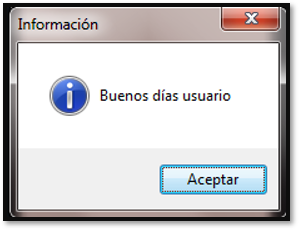
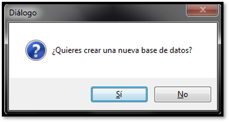
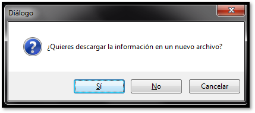

## tkinter.messagebox  

Código fuente: Lib/tkinter/messagebox.py

El módulo **tkinter.messagebox** proporciona una clase base de plantilla, así como una variedad de métodos prácticos para configuraciones de uso común. Los cuadros mensaje son modales y devolverán un subconjunto de (True, False, OK, None, Yes, No) según la selección del usuario. Los estilos y diseños comunes de los cuadros de mensaje incluyen, entre otros:  


Class tkinter.messagebox.Message(*master=None,* *\*\*options*)


## Cuadro informativo.  

```python
from tkinter import messagebox

message = messagebox.showinfo(title='Información', message='Buenos días usuario.')
```

<p align="center">
    
</p>


## Cuadro de mensaje de advertencia.  

```python
from tkinter import messagebox

message = messagebox.showwarning(title='Advertencia', message='Cruce con cuidado la calle.')
```

<p align="center">
    
</p>

## Cuadro de mensaje de error.

```python
from tkinter import messagebox

message = messagebox.showerror(title='Error', message='Error al abrir el archivo.')
```

<p align="center">
    
</p>

## Cuadro de mensajes de preguntas  

```python
from tkinter import messagebox

pregunta = messagebox.askquestion('Diálogo', '¿Estás seguro de salir de la aplicación?')

```
<p align="center">
    
</p>

```python
from tkinter import messagebox
pregunta = messagebox.askokcancel('Diálogo', '¿Estás seguro de modificar esta fila?')
```

<p align="center">
    
</p>


```python
from tkinter import messagebox
pregunta = messagebox.askretrycancel('Diálogo', '¿Quieres volver a intentar la petición?')
```
<p align="center">
    
</p>

```python
from tkinter import messagebox
pregunta = messagebox.askyesno('Diálogo', '¿Quieres crear una nueva base de datos?')
```

<p align="center">
    
</p>

```python
from tkinter import messagebox
pregunta = messagebox.askyesnocancel('Diálogo', '¿Quieres descargar la información en un nuevo archivo?')

```

<p align="center">
        
</p>