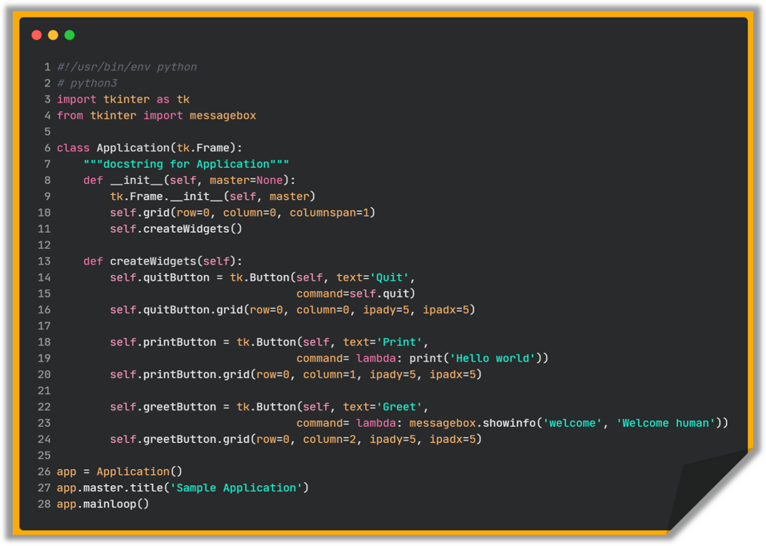

## Una aplicación mínima

Aquí hay un programa trivial de *Tkinter* que contiene solo 3 botones para Salir, imprimir en consola y mostrar un mensaje en una ventana emergente: 

	

Explicación: 

- **1** Esta línea hace que el script se ejecute automáticamente, asumiendo que su sistema tiene Python correctamente instalado.
- **3** Esta línea importa el módulo *tkinter* en el espacio de nombres de su programa, pero lo renombra como *tk*.
- **4** Esta línea importa desde el módulo *tkinter* la clase *messagebox* que sirve para crear ventanas emergentes.
- **6** Esta línea declara la clase Application que debe heredar del módulo *tkinter* de la clase *Frame*.
- **9** Llama al constructor de la clase padre *Frame*.
- **10** Necesario para que la aplicación aparezca realmente en la pantalla
- **11** Llamamos al método que crea los botones en el método inicial o constructor de la clase.
- **13** Declaramos un método para crear los 3 widgets de tipo *tk.Button*.
- **14-15** Crea un botón con la etiqueta 'Quit'.
- **16** Coloca el botón en la aplicación.
- **18-19** Crea un botón con la etiqueta 'Print'.
- **20** Coloca el botón en la aplicación.
- **22-23** Crea un botón con la etiqueta 'Greet'
- **24** Coloca el botón en la aplicación.
- **26** El programa principal comienza aquí creando una instancia de la clase *Application*.
- **27** Esta llamada al método establece el título de la ventana en "Sample Application" 
- **28** Inicia el bucle principal de la aplicación, esperando evento de mouse y teclado.

[volver a índice](../readme.md)

