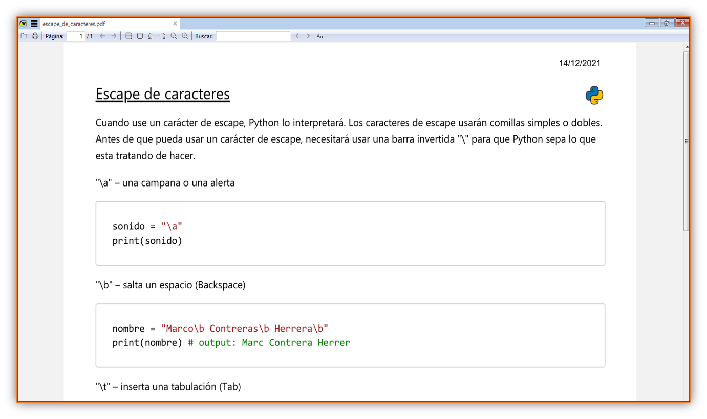
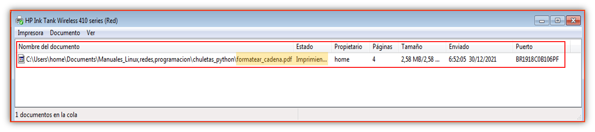

## Módulo OS 

Este módulo provee una manera versátil de usar funcionalidades depndiente del sistema operativo.  

## <a name='TOC'></a>


1. [Crear carpetas y archivos](#makedir)
1. [Eliminar archivos y carpetas](#remove)


- [Funciones](#mark0)
    * [name](#mark1)
    * [environ, getenv(), putenv()](#mark2)
    * [starfile]('#')
    * [system]('#')


### <a name='mark1' style="text-decoration:underline;">Crear carpetas y archivos</a>


**makedirs - creación de directorios recursivo**  


### <a name='mark1' style="text-decoration:underline;">os.name</a>
  
El nombre del módulo dependiente del sistema operativo importado. Los siguientes nombres están registrados: **'posix'**, **'nt'**, **'java'**, **'os2'**, **'ce'**,**'riscos'**.

Además de esta función tenemos otros métodos para averiguar en que sistema operativo se está ejecutando: 

- **sys.platform**
- **platform.system()**

Solo para tener en cuenta. A continuación podemos ver la salida de **os.name**

ejemplo:

```py
## Ejemplo en Windows
import os
print(os.name)
'nt'
```


<details><summary>Ver más ejemplos con <b>os.name</b></summary>


<h6>&#176; Limpiar pantalla de la terminal o símbolo de sistema</h6>


```py
import os 

def clear():
    if os.name == 'nt':
        # Windows
        os.system('cls')
    else:
        # Linux o Mac
        os.system('clear')
clear()
```  

<h6>&#176; Abrir el explorador en la ruta indicada</h6>


```py
def openFolder(self, path):
     if os.name == 'nt':
         os.startfile(path)
     elif os.name == 'posix':
         os.system('xdg-open "%s"' % path)
     elif os.name =='os2':
         os.system('open "%s"' % path)
```

</details>

<hr>
<br>


### <a name='mark1' style="text-decoration:underline;">os.environ, os.getenv(key), os.putenv(key)</a>


- **os.environ**

El valor de **os.environ** se conoce como un objeto de mapeo que devuelve un diccionario de las **variables de entorno del usuario**. Al tratarse de un diccionario puede acceder a las variables de entorno utilizando sus métodos habituales.  


Aquí un ejemplo:


```py
print(os.environ['TMP'])
'C:\\Users\\user\\AppData\\Local\\temp'
# Otra forma
print(os.getenv('TMP'))
'C:\\Users\\user\\AppData\\Local\\temp'
```

<details><summary>Ver más ejemplos con <b>os.environ</b></summary>


<h4>&#164; Escribir las variables de entorno del sistema en un archivo de texto plano.</h4>


```py
import os 

d = os.environ 

with open('environ.txt', 'w+') as file:
    for key, value in d.items():
        file.write(f'{key} : {value}'+'\n')

```  

</details>

<hr>
<br>


- **os.getenv(key)**


El beneficio de usar **os.getenv()** en lugar del diccionario **os.environ** es que si intenta acceder a una variable de entorno que no existe, la función **os.getenv()** simplemente devolverá **None**, si lo hicieramos con **os.environ** recibiremos una excepción como : `raise KeyError (key)`.

Otro ejemplo: 


```py
print(os.getenv('USER'))
# output: None
print(os.getenv('USERNAME'))

```
<br><br>

- **os.putenv(key, value)**

**os.putenv(key, value)** Establece la variable de entorno llamada key con el valor de la cadena value. Dichos cambios en el entorno impactan a los subprocesos iniciados con **os.system()**, **popen()** o **fork()** y **execv()**.  

---

- **os.chdir() y os.getcwd()**  
La función **os.chdir** nos permite cambiar de directorio en el que estamos ejecutando nuestra sesión de Python, Si realmente desea saber en que ruta se encuentra actualmente, debe llamar a **os.getcwd**  

```py
>>>os.getcwd()
'C:\\Python3'
>>>os.chdir(r'C:\Users\user\Documents')
>>>os.getcwd()
'C:\\Users\\user\\Documents'
```

Python contempla los **raw string**, en los que los caracteres se ponen tal cual y no se interpreta ninguno, por lo que no hace falta "escapar" ninguno en la siguiente línea:  


```py
>>>os.chdir(r'C:\Users\user\Documents')
```
---  

- <a name='makedir'>Crear carpetas y archivos</a>  
**os.mkdir(path) y os.makedirs(path)**  

El primer método nos permite crear una sola carpeta.  

```py
>>>os.mkdir("test") # Crea la carpeta en el directorio actual  
>>>ruta = r'C:\Users\user\Document\prueba'
>>>os.mkdir(ruta)
```
La función **os.makedirs** creará todas las carpetas intermedias en una ruta si aún no existen. Básicamente, esto significa que puede crear una ruta que tenga carpetas anidadas.   

```py
>>># Crea la carpeta Blog y dentro la carpeta Controllers
>>>ruta = r'C:\Users\user\Document\Blog\Controllers'
>>>os.makedirs(ruta)
```

---  


- <a name='remove'>Eliminar archivos y carpetas</a>  

**os.remove(path) y os.rmdir(path)**  

Las funciones  **os.remove y os.rmdir** se utilizan para eliminar archivos y directorios respectivamente.  

```py
>>>os.remove('text.txt')
>>os.rmdir('folder')
```

Esto intentará de eliminar el archivo o carpeta, probablemente tengamos algún tipo de error si no lo encuentra, si esta en uso o no tiene permisos para eliminar.  También existe **os.unlink** para desvincular, también es posible utilizar **os.removedirs(path)** que puede eliminar directorios vacios abnidados de forma recursiva.  
 
---

### <a name='mark1' style="text-decoration:underline;">Startfile</a>

El método **os.startfile** nos permite 'iniciar' un archivo con su programa asociado. En otras palabras. Podemos abrir un archivo con su programa asociado, al igual que cuando hace doble clic en un PDF y se abre con AdobeReader o el programa predeterminado que  tiene instalado. 


Sintaxis:  

```py
os.startfile(path[, operation][, arguments][, cwd][, show_cmd])
```

**Ejemplo:**  


```py
os.startfile(r'C:\Users\user\Documents\escape_de_caracteres.pdf')
```

**Obtendriamos lo siguiente:**

<p align="center">
	
</p>


Cuando se de otra operación, debe ser un "verbo de comando" por ejemplo: `print` si lo pasaramos como segundo argumento, mandará a imprimir el documento y lo pondrá en la cola de impresión.


**Ejemplo** 


```py
os.startfile(r'C:\Users\home\Documents\Manuales_Linux,redes,programacion\chuletas_python\escape_de_caracteres.pdf', 'print')
```

**Obtendriamos lo siguiente:**

<p align="center">
	
</p>


Los parámetros **cwd** y **show_cmd** cabe destacar que solo están disponible de la versión 3.10 de Python, pero para conocimiento tiene relación con las dimensiones de la ventana y esto son los posibles valores que puede tomar: 


- 0 significa abrir en una ventana oculta.
- 1 se abre en una ventana normal (posiblemente restaurando una aplicación minimizada).
- 2 abre minimizados.
- 3 abre maximizado.
- 4 abre la aplicación con su ventana en su tamaño y posición más recientes.
- 10 abre la aplicación "con su ventana en el estado predeterminado especificado por la aplicación".


### <a name='mark1' style="text-decoration:underline;">System</a>

Esta función recibe lo siguiente

**Parámetro:**

- **command** : Es de tipo cadena indica qué comando ejecutar.


**Retorno:** en Unix, el valor de retorno es el estado de salida del proceso y en Windows, el valor de retorno es el valor devuelto por el shell del sistema después de ejecutar el comando.


Ejemplo:  

```py
# Linux 
os.system('date')
# output: Thu Dec 30 17:38:53 HSP 2021

# Windows
os.system('date /T')
# output: 30/12/2021


