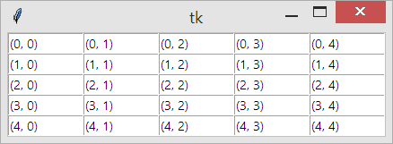
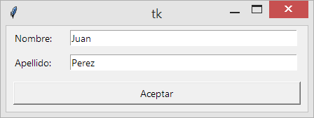

## El método grid()


El método **grid** nos permite posicionar los widgets en una celda en especifico, indicamos la celda usando el índice de fila y columna correspondiente, el ancho y la altura de cada celda son configurables, además un widget puede ocupar varias celdas si lo deseamos, usando **grid** podemos crear fácilmente interfaces gráficas de usuario tipo formulario.

Un ejemplo simple, para posicionar el widget *w* usando  el método **grid()** deberemos indicar mínimo la fila y la columna donde este se ubicará, de este modo: **w.grid(row=1, column=2)** en este ejemplo el widget **w** se ubicará en la celda correspondiente a la fila 1 y la columna 2, los índice de filas y columnas inician de cero.

En este otro ejemplo creamos una matríz de elementos **Entry**(cuadro que nos permite escribir texto), a cada uno le asignamos el valor de fila y columna que le correspondiente.


El código Python tkinter es el siguiente:


```py
from tkinter import *

root = Tk()

for r in range(0, 5):
    for c in range(0, 5):
        cell = Entry(root, width=10)
        cell.grid(row=r, column=c)
        cell.insert(0, '({}, {})'.format(r, c))

root.mainloop()

```


<p align="center">
	
</p>


También disponemos de **ipadx** e **ipady** que funcionan de manera similar, salvo que el espacio es algo interno de la celda, prueba y compara los resultados para entender mejor.

Para crear una GUI tipo formulario solo añadimos los widget en las celdas correspondientes, para el ejemplo que se muestra en la imagen, tenemos 3 filas y 2 columnas, si le prestamos atención el botón veremos que ocupa dos columnas.


```py
from tkinter import *

root = Tk()

Label(root, text="Nombre:").grid(pady=5, row=0, column=0)
Label(root, text="Apellido:").grid( pady=5, row=1, column=0)

Entry(root, width=40).grid(padx=5, row=0, column=1)
Entry(root, width=40).grid(padx=5, row=1, column=1)

Button(root, text="Aceptar", width=50).grid(padx=10, pady=10, row=2, column=0, columnspan=2)

root.mainloop()

```

<p align="center">
	
</p>


Para que el botón se posicione en dos columnas usamos `columnspan=2` podemos indicar 
Para mostrar un widget(w) en la pantalla de su aplicación:

Sintaxis:

```python
w.grid(option=value,...)
```

Este método registra un widget(w) con el administrador de geometría de cuadrícula; si no lo hace, el widget existirá internamente, pero no estará visible en la pantalla. Para conocer las opciones veremos la siguiente tabla: 


**Argumentos del administrador de geometría .grid()**

<table>
	<thead>
		<tr>
			<th style="width:10%;">opción</th>
			<th>descripción</th>
		</tr>
	</thead>
	<tbody>
		<tr>
			<td>
				<pre>column</pre>
			</td>
			<td>
				<p>El número de columna donde desea que se cuadricule el widget, contando desde cero. El valor por defecto es cero.</p>
			</td>
		</tr>
		<tr>
			<td>
				<pre>columnspan</pre>
			</td>
			<td>
				<p>Normalmente, un widget ocupa solo una celda en la cuadrícula. Sin embargo, puede tomar varias celdas de una fila y combinarlas en una celda más grande configurando la opción <i>columnspan</i> en el npumero de celdas. Por ejemplo:<br><pre>w.grid(row=0, column=2, columnspan=3)</pre><br>Colocaría el widget(w) en una celda que abarque las columnas 2, 3 y 4 de la fila 0.</p>
			</td>
		</tr>
		<tr>
			<td>
				<pre>in_</pre>
			</td>
			<td>
				<p>Para registrarse como hijo de algún widget. El nuevo padre debe ser descendiente del widget utilizado cuando se creó.</p>
			</td>
		</tr>
		<tr>
			<td>
				<pre>ipadx</pre>
			</td>
			<td>
				<p>Acholchado interno en el eje x. Esta dimensión se agrega dentro del widget dentro de sus lados izquierdo y derecho.</p>
			</td>
		</tr>
		<tr>
			<td>
				<pre>ipady</pre>
			</td>
			<td>
				<p>Acholchado interno en el eje y. Esta dimensión se agrega dentro del widget dentro de sus bordes superior e inferior.</p>
			</td>
		</tr>
		<tr>
			<td>
				<pre>padx</pre>
			</td>
			<td>
				<p>Acholchado externo en el eje x. Esta dimensión se agrega a la izquierda y a la derecha fuera del widget.</p>
			</td>
		</tr>
		<tr>
			<td>
				<pre>pady</pre>
			</td>
			<td>
				<p>Acholchado externo en el eje y. Esta dimensión se agrega por encima y por debajo del widget.</p>
			</td>
		</tr>
		<tr>
			<td>
				<pre>row</pre>
			</td>
			<td>
				<p>El número de fila en el que desea insertar el widget, contando desde 0. El valor predeterminado es la siguiente fila desocupada con el número más alto.</p>
			</td>
		</tr>
	</tbody>
</table>