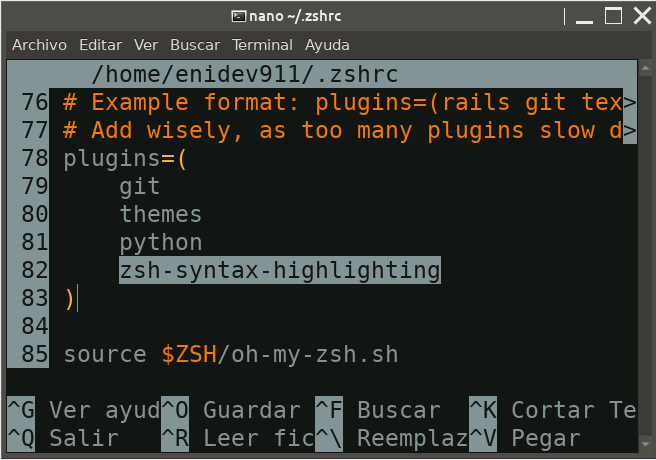

**zsh-sintax-highlighting**: Nos colores los comandos correctos en la terminal.  

```bash
git clone https://github.com/zsh-users/zsh-syntax-highlighting.git ${ZSH_CUSTOM:-~/.oh-my-zsh/custom}/plugins/zsh-syntax-highlighting
```

Ahora lo habilitamos en nuestro archivo **.zshrc** en la sección plugin:  

<p align="center">
	
</p>


Ahora reiniciamos para que surta efecto los cambios: 

```bash
source ~/.zshrc
```
