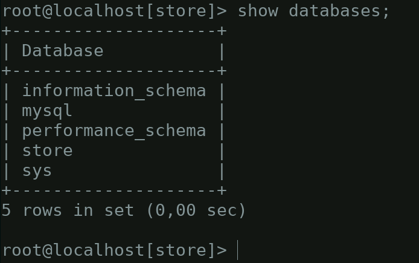

[comment]: <> (Author: Marco Contreras Herrera)
[comment]: <> (Email: enidev911@gmail.com)

<h2 align="center">
  <u>Cambiar el prompt del cliente MySQL</u>
  
</h2>

<br>

En los sistemas se suele personalizar el **prompt** para ofrecer cierta información a simple vista. En MySQL también lo podemos personalizar mediante la variable de entorno **MYSQL_PS1** o con el parámetro **prompt**. Pero, ¿Qué es el **prompt**? visualmente es el conjunto de caracteres que se muestra en la línea de comandos para indicar que está a la espera de órdenes. En todos los intérpretes de comandos esto suele variar y a su vez suele ser configurable.

Por ejemplo, mediante la variable **MYSQL_PS1="(\u@\h)[\d]> "** indicamos al cliente de **MySQL** que queremos que nos muestre el usuario con el que conectamos, el host al que nos hemos conectado y la base de datos. Algunos de las opciones de información son:

- **\\U** : nombre del usuario conectado y host(Ej: root@localhost)
- **\\u** : nombre del usuario conectado (Ej: root)
- **\\h** : nombre dl host (Ej: localhost)
- **\\d** : nombre de la base de datos en uso (Ej: test)
- **\\D** : Fecha y hora actual (Ej: Sun Jan 30 13:38:52 2022)


Una vez dentro de la sesión interactiva podemos cambiar el prompt usando \R.	 


## Cambiar el prompt en la configuración de MySQL/MariaDB

Editamos el archivo de configuración de MySQL/MariaDB

```bash
sudo nano /etc/mysql/my.cnf
```

Buscamos la sección mysql y añadimos lo siguiente:  

```
[mysql]
prompt=\\u@\\h[\\d]>\\_
```

<p align="center">
	
</p>

Para ver los caractes de a continuación es necesario instalar la siguiente fuente:  


## Algunos ejemplos:

**Para el usuario** 

ﱲ

**Para el host**  

ﲾ ﳕ ﳖ 

**Para la base de datos**  

⛁ ⛃