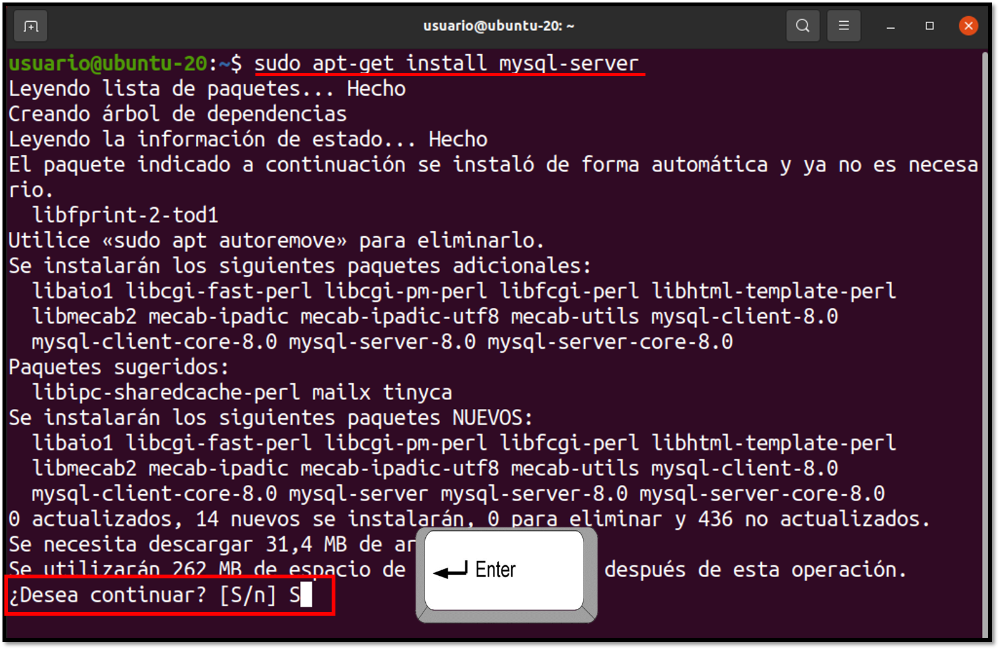
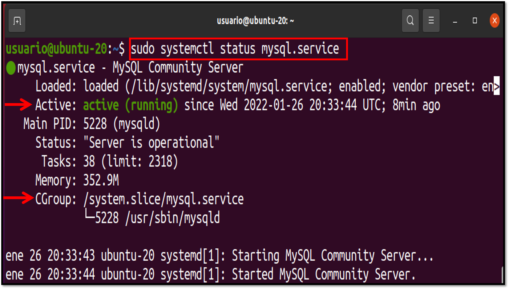
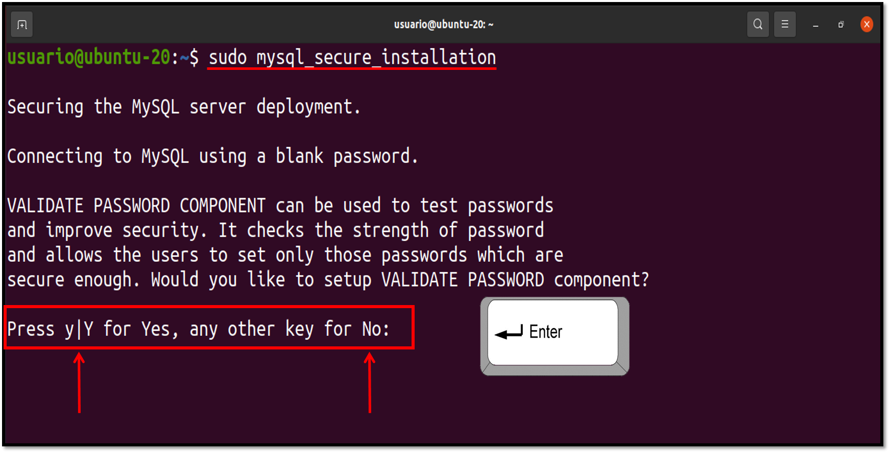
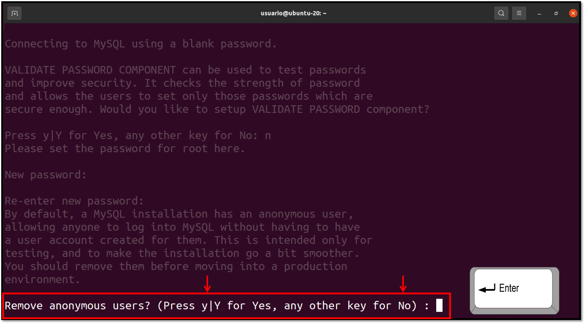
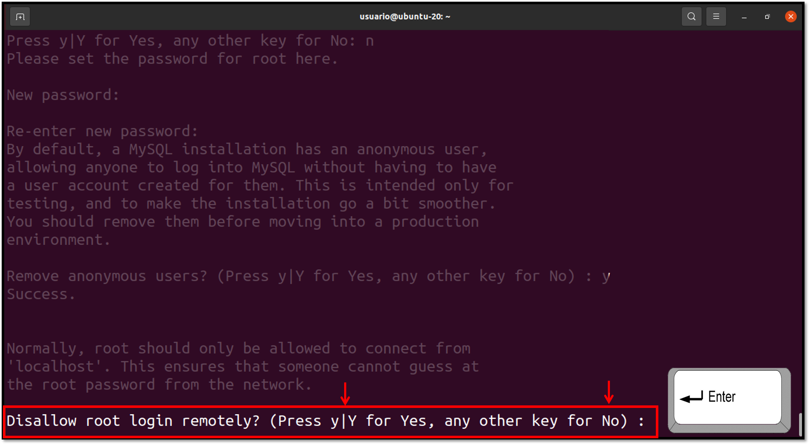
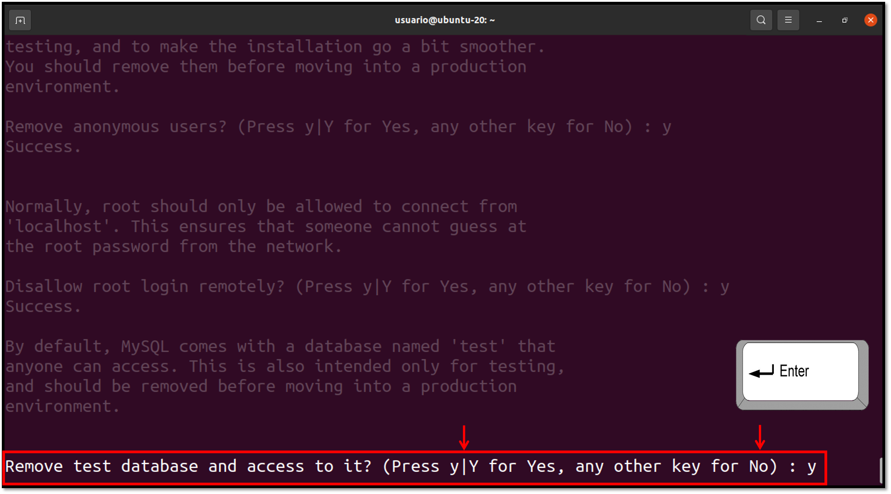
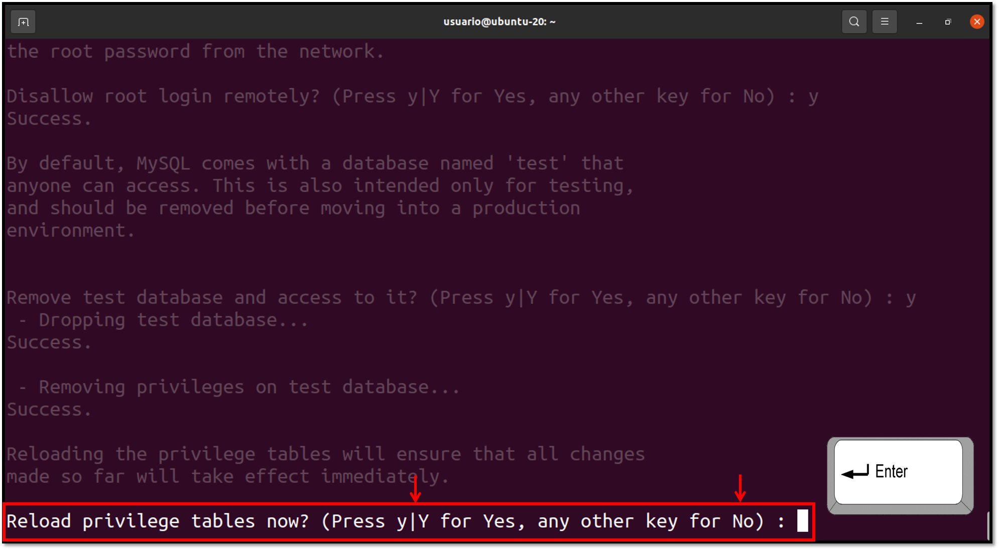
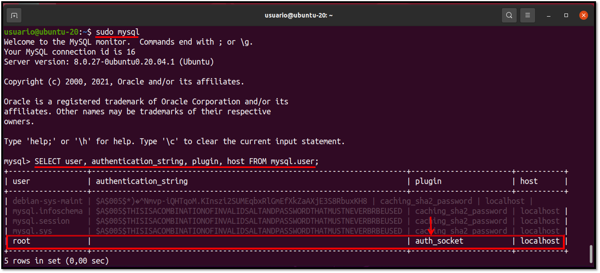

[comment]: <> (Author: Marco Contreras Herrera)
[comment]: <> (Email: enidev911@gmail.com)

<h2 align="center">
  <u>Instalación de MySQL en Ubuntu</u>
  
  
</h2>

<br>


**1. Actualizar el índice de paquetes apt con el siguiente comando:**  

```bash
sudo apt update
```


**2. Instalar el paquete de MySQL con el comando:**  

```bash
sudo apt install mysql-server
```

<p align="center">
  
</p>


**3. Concluida la instalación, el demonio de MySQL se iniciará automáticamente. Para verificar si esta ejecutandose el servidor usamos el comando:**  

```bash
sudo systemctl status mysql
```

<p align="center">
  
</p>


**3.1 Ver en que puerto está abierto**

```bash
cat /etc/services | grep mysql
```


**4. Utilizar el script para una configuración segura con el comando:**  

```bash
sudo mysql_secure_installation
```

La primera pregunta nos solicitará si queremos validar password para conectarnos al servidor sea seguro, si lo deseamos al momento de crear un nuevo usuario en el sistema MySQL nos validará si el password cumple con las condiciones mínimas de seguridad. Si no queremos esto solamente ingresamos **`N`**


<p align="center">
  
</p>


Luego de acuerdo a la opción que ingresemos nos solicitará ingresar el password para el usuario root (Ojo: esto no tendrá efecto hasta que cambiemos el método de autenticación al usuario root de **auth_socket** a  otro complemento). Una vez ingresamos nuestro password, nos preguntará si deseamos remover a los usuarios ánonimos que se crean por defecto junto a la instalación de MySQL, lo mejor es removerlos.  

<p align="center">
  
</p>


Normalmente, a root solo se le debe permitir conectarse desde 'localhost'. Para así asegurar que no puedan adivinar la password de root desde la red. Así que deshabilitamos el logín remoto.  

<p align="center">
  
</p>

Luego nos preguntá si queremos eliminar la base de datos de prueba, esto es opcional. 

<p align="center">
  
</p>


Luego nos pregunta si queremos recargar la tabla de privilegios. Pondremos si (Y).  

<p align="center">
  
</p>


<h2 align="center">
  <u>Ajustes de autenticación y privilegios de usuario</u>
  
  
</h2>

<br>

En los sistemas Ubuntu con MySQL 5.7 (y versiones posteriores), el usuario **root** de MySQL se configura para la autenticación usando el complemento **auth_socket** de manera predeterminada en lugar de una contraseña. Esto en muchos casos proporciona mayor seguridad y utilidad, pero también puede generar complicaciones cuando deba permitir que un programa externo (como phpMyAdmin) acceda al usuario.  

Para usar un password para conectar a MySQL como **root**, deberemos cambiar el método de autenticación de **auth_socket** a otro complemento, como **caching_sha2_password** o **mysql_native_password**. Para hacer esto, abra la consola de MySQL desde su terminal:

```bash
sudo mysql
```

Para ver el método de autenticación utilizado por las cuentas de usuarios de MySQL ejecutamos la siguiente sentencia dentro de la consola de MySQL:  

```bash
SELECT user, authentication_string, plugin, host FROM mysql.user;
```

<p align="center">
  
</p>


Para cambiar el método de autenticación de **root** con una password, utilizaremos el comando **ALTER USER** para cambiar el complemento de autenticación. Lo podriamos hacer todo en una sola línea como lo siguiente:


```sql
ALTER USER 'root'@'localhost' IDENTIFIED WITH caching_sha2_password BY 'password';
```

O realizar el cambio en dos pasos:

1. Cambiamos solo el complemento.
```sql
  ALTER USER 'root'@'localhost' IDENTIFIED WITH mysql_native_password;
```
2. Cambiamos el password. (La función **`user()`** devuelve al usuario en sessión) 
```sql
  ALTER USER user() IDENTIFIED BY 'Strong_Password;
```


Y por último recargamos la tabla de permisos:  

```sql
FLUSH PRIVILEGES;
```

Otra opción recomendada es crear un nuevo usuario administrativo con todos los privilegios y acceso a todas las bases de datos:

```sql
GRANT ALL PRIVILEGES ON *.* TO 'admin_user'@'localhost' IDENTIFIED BY 'very_strong_password';
```


Para desinstalar MySQL con:

```bash
sudo apt-get remove --purge mysql-server mysql-client mysql-common
```

