[comment]: <> (Author: Marco Contreras Herrera)
[comment]: <> (Email: enidev911@gmail.com)

<h2 align="center">
  <u>Instalación y configuración manual de MySQL</u>
  
</h2>

<br><br>

### 1. Descargamos el archivo zip de [aquí](https://dev.mysql.com/downloads/file/?id=509736)

- Ya esta seleccionado el archivo, solo damos clic en donde está señalado en la siguiente ilustración y comenzará la descarga.

<p align="center">
	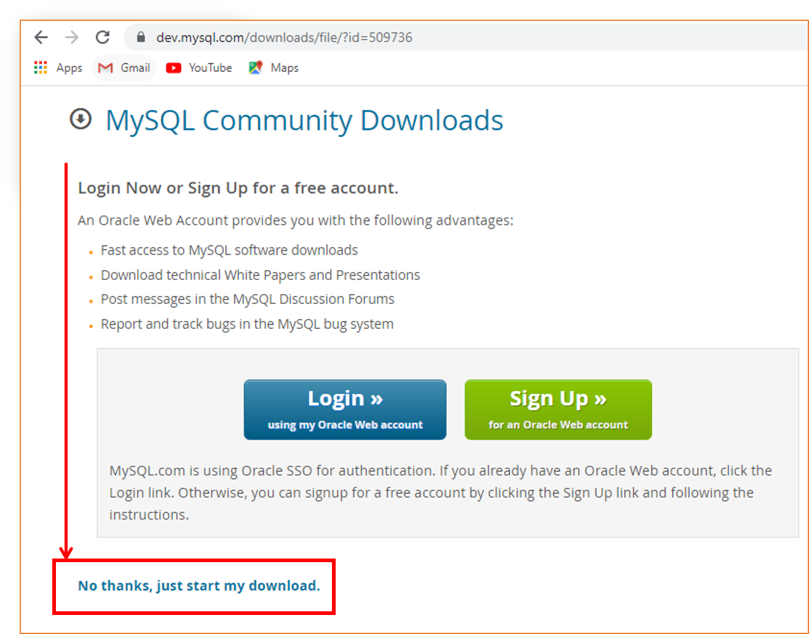
	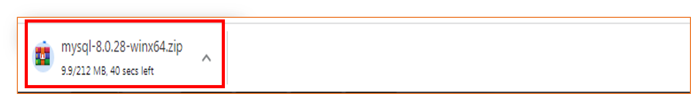
</p>


1.1 Extraemos el contenido del archivo dentro del directorio de instalación deseado. Por ejemplo en: "C:\MySQL8":

<p align="center">
	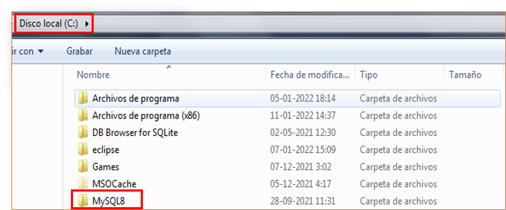
</p>

---

<br>

### 2. Crear un archivo de opciones.

Si es necesario especificarle opciones al servidor durante su inicio, esto puede hacerse desde la línea de comandos o bien colocando las opciones en un archivo de opciones. Aquellas opciones que se usarán cada vez que se inicie el servidor, es conveniente colocarlas en un archivo. Esto es especialmente necesario en las siguiente circuntancias:

1. El directorio de instalación o de datos son diferentes de los usados por defecto Por ejemplo:  
    - C:\Program Files\MySQL\MySQL Server 8.x  
    - C:\Program Files\MySQL\MySQL Server 8.x\data

2. Es necesario afinar la configuración del servidor.

Un archivo de opciones puede crearse y modificarse con cualquier editor de textos, como el Bloc de Notas o Notepad. Por ejemplo, si MySQL está descomprimido en **C:\MySQL8** y el directorio de datos es **C:\data**, se puede crear un archivo de opciones que contenga una sección [mysqld] para especificar los valores que tendrán los parámetros `basedir` y `datadir`. Un archivo **my.ini** es un archivo de configuración utilizado en la base de datos MySQL. La modificación de este archivo conlleva el actualizar las configuraciones del servidor al iniciarse, este archivo se almacena en el directorio raíz de la instalación. La sección **[client\]** las opciones definidas aqui serán leídas por aplicaciones clientes enviadas por MySQL. A continuación veremos una demostración de un archivo `my.ini` con algunas secciones que suelo utilizar.

<p align="center">
  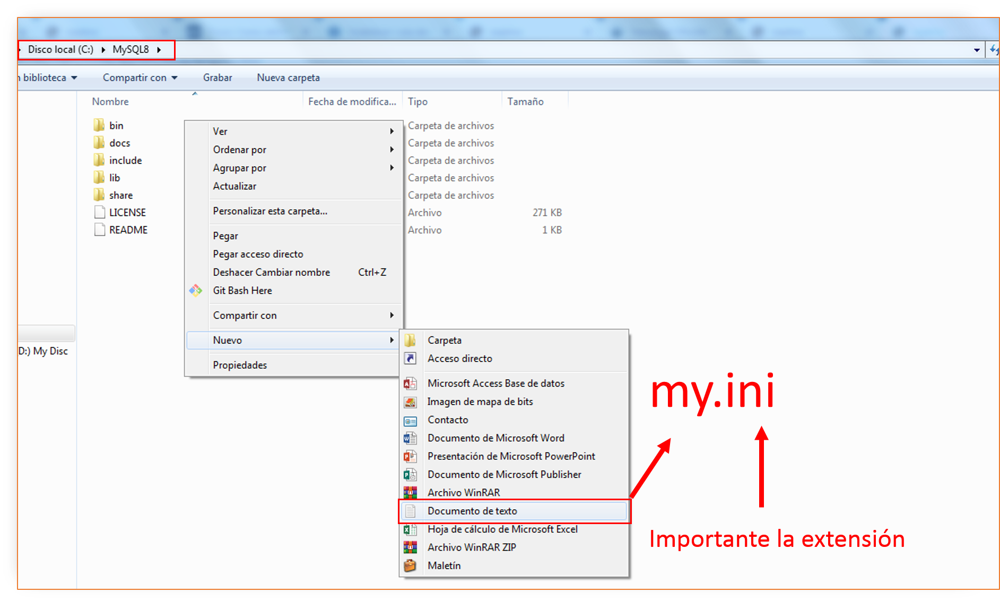
  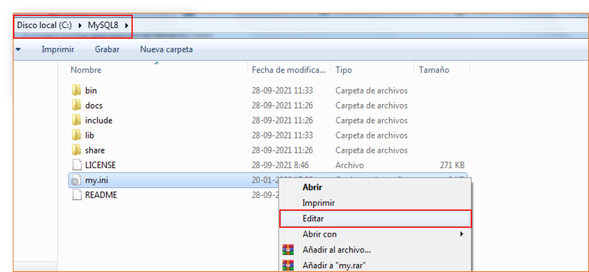
  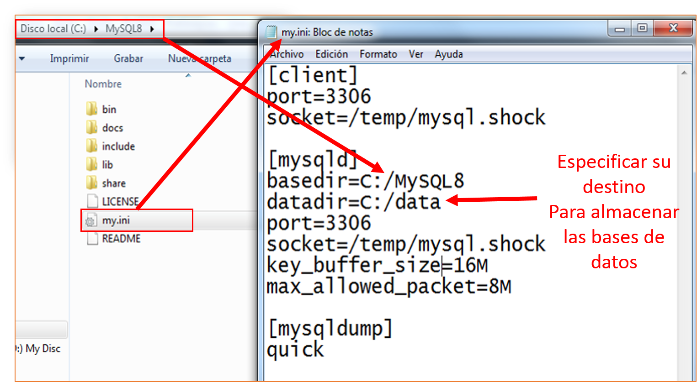
</p>

Aquí está en mi caso tengo las siguientes opciones:

```mysql.ini
[client]
port=3306
socket=/temp/mysql.shock

[mysqld]
basedir=C:/MySQL8
datadir=C:/data
port=3306
socket=/temp/mysql.shock
key_buffer_size=16M
max_allowed_packet=8M

[mysqldump]
quick
```

Los nombres de las rutas de acceso de Microsoft Windows se especifican en los archivos de opciones mediante barras diagonales (hacia adelante) en lugar de barras diagonales inversas. Si usa barras invertidas, duplíquelas Ej:


```mysql
[mysqld]
basedir=C:\\MySQL8
datadir=C:\\data
```

El archivo ZIP no incluye un directorio **data**. Para inicializar una instalación de MySQL creando el directorio **data** y llenando las tablas en la base de datos del sistema mysql, inicialice MySQL usando las siguientes opción:

```mysql
mysqld --initialize o --initialize-insecure.
```

<p align="center">
  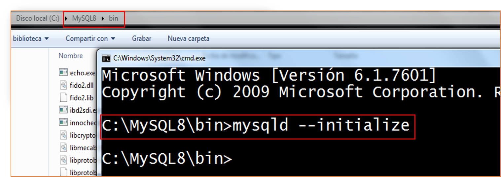
  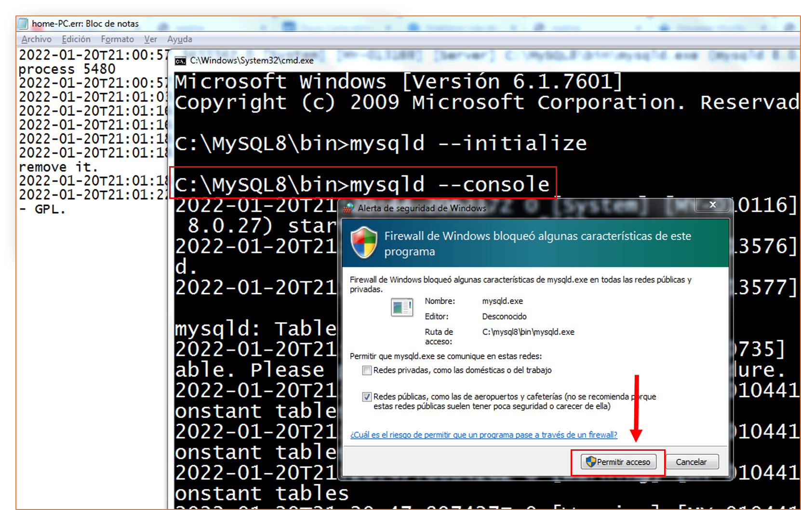
  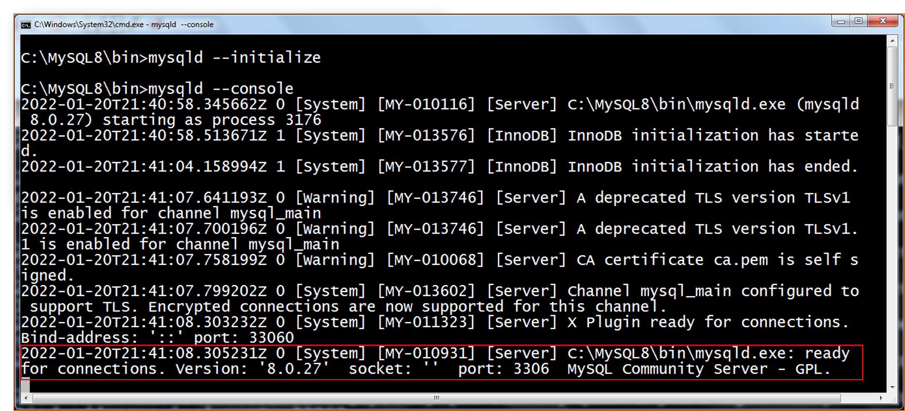
</p>

Despues de inicializado, como se ve en las ilustraciones podemos pasar la opción `--console` para ver el log en la línea de comandos y asi evitar ir abrir el archivo <PCNAME.ERR\>


En nuestro caso especificamos el destino para las bases de datos del sistema y las nuestra `C:\data` si no la encuentra la crea y almacena el contenido. Si desea utilizar un directorio de datos en una ubicación diferente, debe copiar todo el contenido del directorio data en la nueva ubicación. Por ejemplo, si desea utilizarlo C:\mydata como directorio de datos, debe hacer dos cosas:

1. Mueva todo el directorio data y todo su contenido desde la ubicación predeterminada (por ejemplo C:\Path\installation\data), a C:\mydata.

2. Utilice una opción `--datadir` para especificar la nueva ubicación del directorio de datos cada vez que inicie el servidor. Ej:

```mysql
mysqld --datadir 'path\your\data'
```

<p align="center">
	
</p>


**2.1 Primera conexión**

Indepndiente de la configuración que hemos dado para conectarnos al servidor, primero que nada debemos inicializarlo, y luego conectarnos como clientes, dentro de la carpeta data se encuentra un archivo llamado con el nombre de tu equipo y la extensión `.err` abrimos ese archivo con el bloc de nota y buscamos el password generado para el usuario root de manera temporal:

<p align="center">
  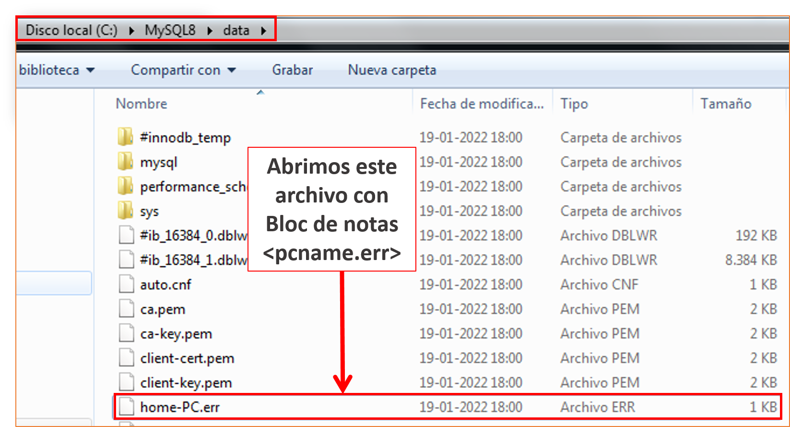
  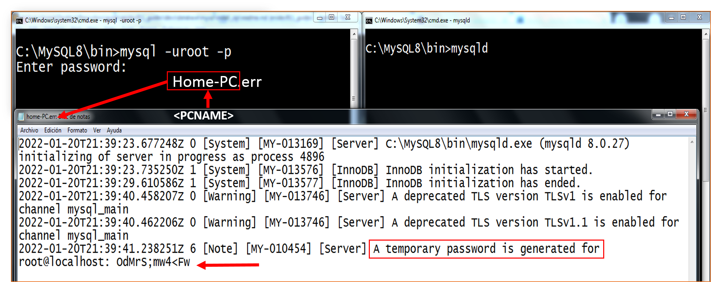
  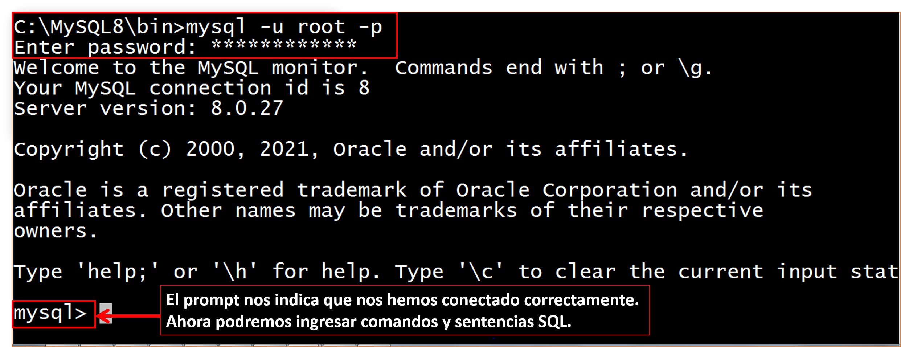
</p>

Ahora la primera tarea antes de comenzar a manipular bases de datos, será cambiar el password de nuestro usuario root. De hecho si intentamos ejecutar un comando sql nos va a requerir esta acción:

<p align="center">
  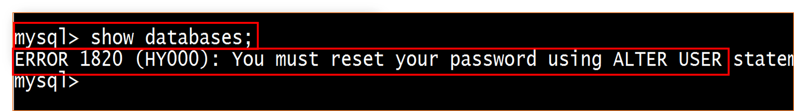
</p>

**2.2. Restablecer la contraseña root**

Si conoce la contraseña del usuario root y deseamos cambiarla, veamos detalladamente como realizar esto:  

- **Sentencia ALTER USER**

```sql
ALTER USER [IF EXISTS]
  user [auth_option] [, user [auth_option]] ...
  [REQUIRE {NONE | tls_option [[AND] tls_option] ...}]
  [WITH resource_option [resource_option] ... ]
  [password_option | lock_option] ...


ALTER USER [IF EXISTS]
    USER() IDENTIFIED BY 'auth_string'

user:
    (see Section 6.2.4, “Specifying Account Names”)

auth_option: {
    IDENTIFIED BY 'auth_string'
  | IDENTIFIED WITH auth_plugin
  | IDENTIFIED WITH auth_plugin BY 'auth_string'
  | IDENTIFIED WITH auth_plugin AS 'auth_string'
}

tls_option: {
   SSL
 | X509
 | CIPHER 'cipher'
 | ISSUER 'issuer'
 | SUBJECT 'subject'
}

resource_option: {
    MAX_QUERIES_PER_HOUR count
  | MAX_UPDATES_PER_HOUR count
  | MAX_CONNECTIONS_PER_HOUR count
  | MAX_USER_CONNECTIONS count
}

password_option: {
    PASSWORD EXPIRE
  | PASSWORD EXPIRE DEFAULT
  | PASSWORD EXPIRE NEVER
  | PASSWORD EXPIRE INTERVAL N DAY
}

lock_option: {
    ACCOUNT LOCK
  | ACCOUNT UNLOCK
}
```

La declaración `ALTER_USER` modifica las cuentas de MySQL. Permite modificar las propiedades de autenticación, SSL/TLS, límite de recursos y administración de contraseñas para las cuentas existentes. 

Para cada cuenta afectada, `ALTER USER` modifica la fila correspondiente en la tabla `mysql.user` del sistema para reflejar las propiedades especificadas en el extracto. Las propiedades no especificadas conservan sus valores actuales.


```sql
ALTER USER USER() IDENTIFIED BY 'auth_string';
```

Esta sintaxis permite cambiar su propia contraseña sin nombrar literalmente su cuenta. A continuación e dado un password al usuario root con el que nos conectamos la contraseña generada temporalmente por el servidor al momento de su instalación.

<p align="center">
  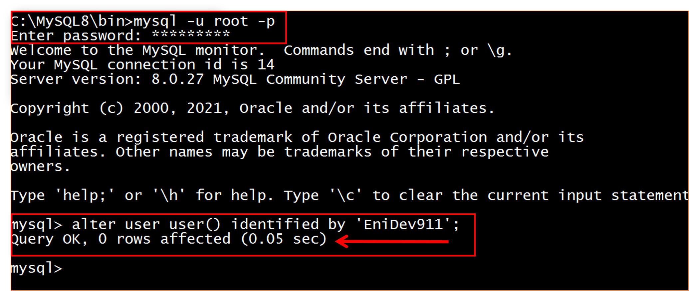
</p>

Ahora recargamos los privilegios con: 

```sql
FLUSH PRIVILEGES;
```

Ahora ya podemos conectarnos con la nueva contraseña que hemos asignado, podemos consultar en la tabla de usuario el complemento de autenticación con el siguiente comando: 

```sql
SELECT user, plugin FROM mysql.user;
```

<p align="center">
  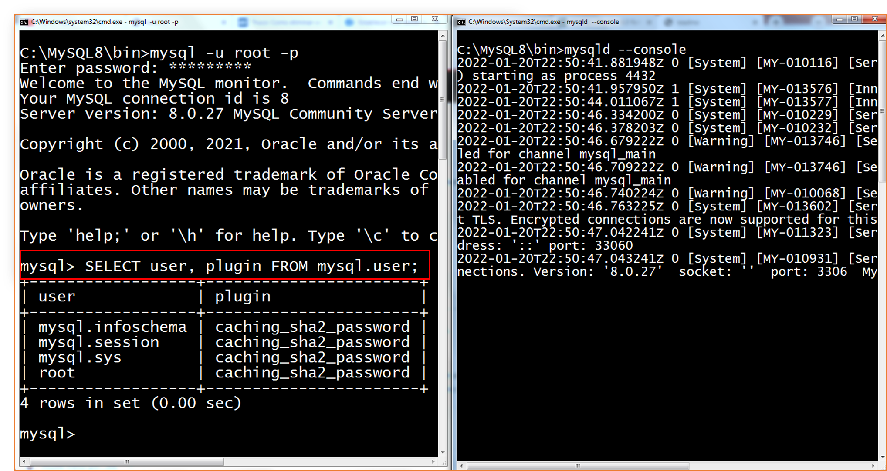
</p>

Adicionalmente, podemos establecer esta ruta de donde lanzamos el servidor como variable de entorno para que nos resulte más comodo lanzar el servidor desde cualquier ubicación. Con el siguiente comando podemos establecer la ruta de instalación de MySQL a la variable **path** del usuario:


```bat
setx path "%path%;"C:\MySQL8\bin\
```

Cerramos la ventana de comandos y abrimos una nueva.


---

### 3. Configurar MySQL como un servicio.

<br>

- Con el siguiente comando podemos registrar MySQL como un servicio donde podremos configurarlo para que se inicie automáticamente, para llevar a cabo este paso es necesario abrir la sesión de CMD con privilegios de administrador.


```bat
:: Se registra con el nombre pasado como argumento.
:: De lo contrario solo con el nombre MySQL por defecto.
mysqld --install "MySQL8"
```

<p align="">
	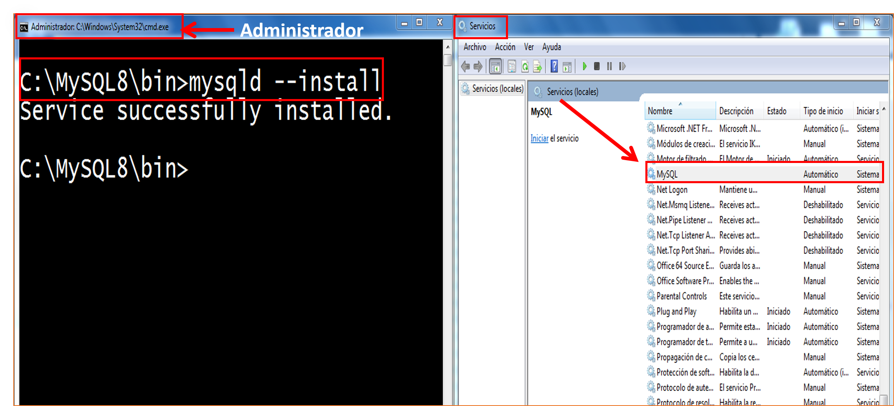
</p>

Ahora ya podemos iniciar el servicio o detenerlo desde la línea de comandos, pero para llevar a cabo el proceso tenemos que abrir una nueva ventana como **administrador**.

- Iniciar el servicio con el comando net

```
net start MySQL
```

- Detener el servicio con el comando:

```
net stop MySQL
```


<p align="center">
  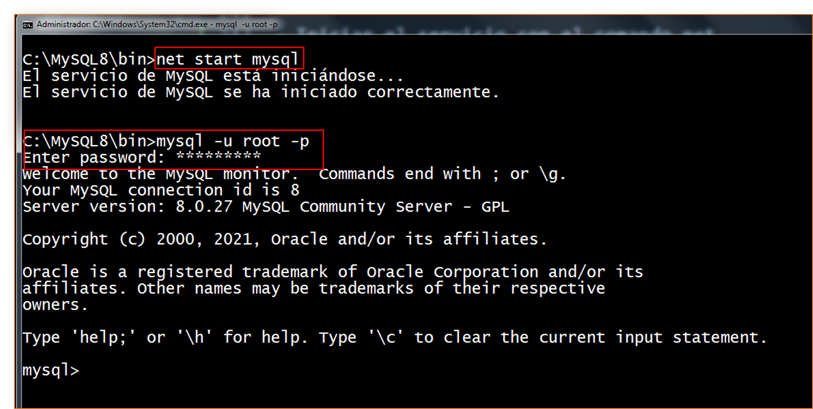
</p>

<p align="center">
Sigueme en:<br>
<!-- facebook -->
<a href="https://www.facebook.com/profile.php?id=100009064421475"></a>
<!-- github -->
<a href="https://github.com/EniDev911"></a>
<!-- twitter -->
<a href="https://twitter.com/MarcoContreraas"></a><br>
<!-- buymecoffe -->
<a href="https://www.buymeacoffee.com/9111592">
</a>
</p>