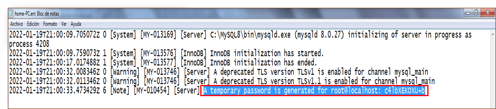

[comment]: <> (Author: Marco Contreras Herrera)
[comment]: <> (Email: enidev911@gmail.com)

<h2 align="center">
  <u>Instalación y configuración manual de MySQL</u>
  
</h2>


1. Descargamos el archivo zip de [aquí](https://dev.mysql.com/downloads/file/?id=509736)
	- Ya esta seleccionado el archivo solo damos clic en el siguinte enlace y comenzará la descarga.

<p align="center">
	
	
</p>


1.1 Extraemos el contenido del archivo dentro del directorio de instalación deseado. Por ej: "C:\MySQl":

<p align="center">
	
</p>


### 2. Crear un archivo de opciones.

Si es necesario especificarle opciones al servidor durante su inicio, esto puede hacerse desde la línea de comandos o bien colocando las opciones en un archivo de opciones. Aquellas opciones que se usarán cada vez que se inicie el servidor, es conveniente colocarlas en un archivo. Esto es especialmente cierto en las siguiente circuntancias:

- El directorio de instalación o de datos son diferentes de los usados por defecto (C:\Archivos de Programa\MySQL\MySQL Server 8.x y C:\Archivos de Programa\MySQL\MySQL Server 8.x\data)
- Es necesario afinar la configuración del servidor

Un archivo de opciones puede crearse y modificarse con cualquier editor de textos, como el Bloc de Notas o Notepad. Por ejemplo, si MySQL está instalado en *C:\mysql* y el directorio de datos es *C:\mydata\data*, se puede crear un archivo de opciones que contenga una sección [mysqld] para especificar los valores que tendrán los parámetros basedir y datadir:


```mysql.ini
[client]
port=3306
socket=/temp/mysql.shock

[mysqld]
# set basedir to your installation path
basedir=E:/mysql
# set datadir to the location of your data directory
datadir=E:/mydata/data
port=3306
socket=/temp/mysql.shock
key_buffer=16M
max_allowed_packet=8M

[mysqldump]
quick
```

Los nombres de las rutas de acceso de Microsoft Windows se especifican en los archivos de opciones mediante barras diagonales (hacia adelante) en lugar de barras diagonales inversas. Si usa barras invertidas, duplíquelas:


```mysql
[mysqld]
# set basedir to your installation path
basedir=E:\\mysql
# set datadir to the location of your data directory
datadir=E:\\mydata\\data
```

El archivo ZIP no incluye un directorio **data**. Para inicializar una instalación de MySQL creando el directorio **data** y llenando las tablas en la base de datos del sistema mysql, inicialice MySQL usando las siguientes opción:

```mysql
mysqld --initialize o --initialize-insecure.
```

Si desea utilizar un directorio de datos en una ubicación diferente, debe copiar todo el contenido del directorio data en la nueva ubicación. Por ejemplo, si desea utilizarlo C:\mydata como directorio de datos, debe hacer dos cosas:

1. Mueva todo el directorio data y todo su contenido desde la ubicación predeterminada (por ejemplo C:\Path\installation\data), a C:\mydata.

2. Utilice una opción `--datadir` para especificar la nueva ubicación del directorio de datos cada vez que inicie el servidor. Ej:

```mysql
mysqld --datadir 'path\your\data'
```

<p align="center">
	
</p>

**Instalar como un servicio**

- Con el siguiente comando podemos registrar MySQL como un servicio que podremos configurar para que se incie automáticamente, para llevar a cabo este paso es necesario abrir la sesión de CMD con privilegios de administrador.

```bat
:: Se registra con el nombre pasado como argumento.
:: De lo contrario solo con el nombre MySQL por defecto.
mysqld --install "MySQL8"
```

<p align="">
	
</p>


Iniciar el servicio con el comando net

```
net start MySQL8
```

Detener el servicio con el comando:

```
net stop MySQL8
```


Establecer la seguridad de las cuentas de usuario por defecto

<p align="">
	
	
	
	
</p>


Paso 13

Concluido el paso anterior, ya estamos conectado al servidor como Administrador. Antes de iniciar con la creación o consulta de Bases de Datos; en la consola del servidor ingresamos la dirección:

https://dev.mysql.com/doc/refman/5.7/en/resetting-permissions.html


Restablecer la contraseña root 

Si nunca ha asignado contraseña para MySQL, el servidor no requiere ninguna contraseña para conectarse como root. Sin embargo, esto es inseguro. Para obtener instrucciones sobre como asignar una contraseña, consulte [aquí](https://dev.mysql.com/doc/refman/5.7/en/default-privileges.html)

Si conoce la contraseña del usuario root y deseamos cambiarla, veamos detalladamente como realizar esto:  

- **Sentencia ALTER USER**

```sql
ALTER USER [IF EXISTS]
	user [auth_option] [, user [auth_option]] ...
	[REQUIRE {NONE | tls_option [[AND] tls_option] ...}]
	[WITH resource_option [resource_option] ... ]
	[password_option | lock_option] ...


ALTER USER [IF EXISTS]
    USER() IDENTIFIED BY 'auth_string'

user:
    (see Section 6.2.4, “Specifying Account Names”)

auth_option: {
    IDENTIFIED BY 'auth_string'
  | IDENTIFIED WITH auth_plugin
  | IDENTIFIED WITH auth_plugin BY 'auth_string'
  | IDENTIFIED WITH auth_plugin AS 'auth_string'
}

tls_option: {
   SSL
 | X509
 | CIPHER 'cipher'
 | ISSUER 'issuer'
 | SUBJECT 'subject'
}

resource_option: {
    MAX_QUERIES_PER_HOUR count
  | MAX_UPDATES_PER_HOUR count
  | MAX_CONNECTIONS_PER_HOUR count
  | MAX_USER_CONNECTIONS count
}

password_option: {
    PASSWORD EXPIRE
  | PASSWORD EXPIRE DEFAULT
  | PASSWORD EXPIRE NEVER
  | PASSWORD EXPIRE INTERVAL N DAY
}

lock_option: {
    ACCOUNT LOCK
  | ACCOUNT UNLOCK
}
```

La declaración `ALTER_USER` modifica las cuentas de MySQL. Permite modificar las propiedades de autenticación, SSL/TLS, límite de recursos y administración de contraseñas para las cuentas existentes. 

Para cada cuenta afectada, `ALTER USER` modifica la fila correspondiente en la tabla `mysql.user` del sistema para reflejar las propiedades especificadas en el extracto. Las propiedades no especificadas conservan sus valores actuales.


```sql
ALTER USER USER() IDENTIFIED BY 'auth_string';
```
Esta sintaxis permite cambiar su propia contraseña sin nombrar literalmente su cuenta. A continuación e dado un password al usuario root con el que nos conectamos la contraseña generada temporalmente por el servidor al momento de su instalación.

<p align="">
	
</p>

Ahora ya podemos conectarnos con la nueva contraseña que hemos asignado, podemos consultar en la tabla de usuario el complemento de autenticación con el siguiente comando: 

```sql
SELECT user, plugin FROM mysql.user;
```

Complemento de autenticación  


