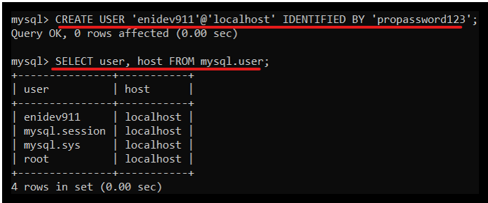
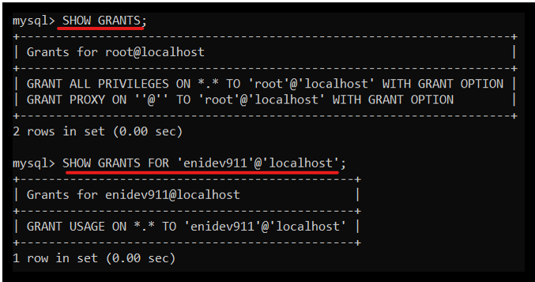
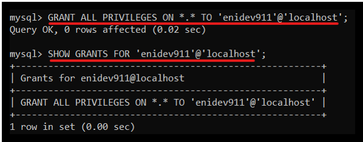
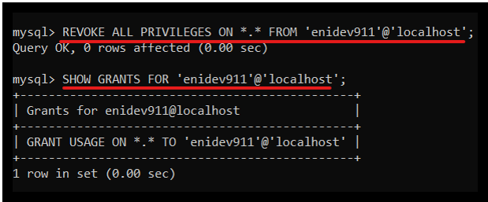
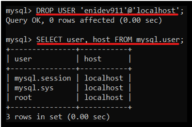

[comment]: <> (Author: Marco Contreras Herrera)
[comment]: <> (Email: enidev911@gmail.com)

<h2 align="center">
  <u>Administrar usuarios -  </u>
  
</h2>

<br>


Para crear cuentas de usuario en **mysql** se necesita tener permisos de usuarios. Por medio del comando **`CREATE USER`**. 

A cada cuenta se le puede asignar una contraseña por medio de la cláusula **`IDENTIFIED BY`**, si desea que la contraseña se guarde en texto plano, no se utilizará la palabra <strong>password</strong> caso contrario la contraseña se guardará cifrada con el valor hash que es devuelto por la función <strong>Password()</strong>   

<b>Ejemplo:</b>  

```sql
mysql>CREATE USER 'user'@'server' IDENTIFIED BY 'passworduser';
```

<p align="center">
    
</p>

El usaurio ha sido creado, sin embargo puede conectarse al servidor pero hace falta asignarle los diferentes privilegios, para que pueda realizar cualquier tipo de tarea.  

---


<h2 align="center"><u>Privilegios de usuarios</u></h2>

<br>

Para ver los privilegios asignados a una cuenta utilizamos la sentencia **`SHOW GRANTS`** para el usuario conectado. Para consultar los privilegios que tiene otro usuario con la siguiente sentencia:  

```sql
mysql>SHOW GRANTS FOR user;
```


<p align="center">
    
</p>


- **Asignar privilegios a un usuarios:**  
    Para asignar privilegios a una cuenta usamos el comando **`GRANT`**, el cual permite asignar a una cuenta diferentes servicios, siendo de tipo:  

    +   **Globales:** otorga los privilegios a un usuario sobre todo el servidor, esto se realiza por medio de la sentencia: 

    ```sql
    GRANT privileges ON *-* TO 'username';
    ```

    Si queremos que el nuevo usuario tenga permisos de administrador (todos los permisos), debemos de ejecutar la siguiente sentencia:  

    ```sql
    GRANT ALL PRIVILEGES ON *.* TO 'username'@'localhost';
    ```

    Los asteriscos indican que los permisos serán asignados a todas las bases de datos y a todas las tablas (primer asteriscos bases de datos, segundo asterisco tablas).


    <p align="center">
        
    </p>

    Si queremos asignar permisos para ciertas acciones, la sentencia quedaría de la siguiente manera. Reemplazamos ALL PRIVILEGES y colocamos las acciones que queremos asignar.


    ```sql
    mysql>GRANT SELECT, INSERT, UPDATE, DELETE, CREATE, DROP
        -> ON userdb.*
        -> TO 'username'@'localhost';
    ```

    Una vez hayamos finalizado con los permisos, el último paso será refrescarlos. 

    ```sql
    mysql>FLUSH PRIVILEGES;
    ```

- **Revocar privilegios a un usuarios:**

    Para borrar los privilegios de una cuenta con la sentencia:

    ```sql
    REVOKE privileges ON*-*TO 'username';
    ```

    Remover permisos en concreto (Ejemplo create y delete):  

    ```sql
    REVOKE CREATE, DELETE ON *.* FROM 'username'@'localhost';
    ```

    Remover todos los privilegios:  

    ```sql
    REVOKE ALL PRIVILEGES ON *.* FROM 'username'@'localhost';
    ```

<p align="center">
    
</p>


- **Borrar usuarios:**  

    De igual forma para crear usuarios, necesitamos  tener los permisos pertinentes para poder borrarlos. Para borrar a un usuario utilzamos la sentencia **DROP USER**:  

    ```sql
    mysql>DROP USER user;
    ```

<p align="center">
    
</p>


<h2 align="center">
  <u>Tipos de autenticaciones</u>
  
</h2>

<br>


MySQL incluye el complemento **mysql_native_password** que implementa la autenticación nativa; es decir; autenticación basada en el método de hash.  

**Nombres de complementos y bibliotecas para autenticación de contraseña nativa.**  


|Complemento o archivo|Complemento o nombre de archivo|
|:-------------------:|-------------------------------|
|Complemento del lado del servidor|mysql_native_password|
|Complemento del lado del cliente|mysql_native_password|
|Biblioteca|Ninguno (los complementos están integrados)|

- El complemento del lado sel servidor está integrado en el servidor, no es necesario cargarlo explícitamente y no se puede deshabilitar descargándolo.

- El complemento del lado del cliente está integrado en la biblioteca `libmysqlclient` y está disponible para cualquier programa vinculado a libmysqlclient.


En el caso de usar el complemento auth_socket, este autentica a los clientes que se conectan desde el localhost a través del archivo de socket Unix. Este complemento auth_socket verifica si el nombre de usuario del socket coincide con el nombre de usuario MySQL del programa cliente con el servidor.