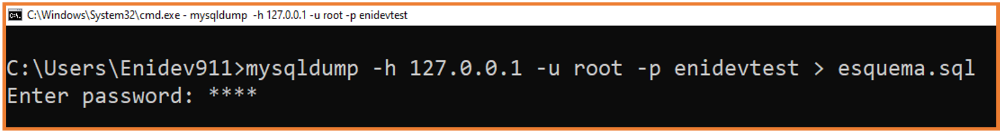
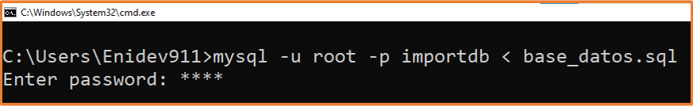
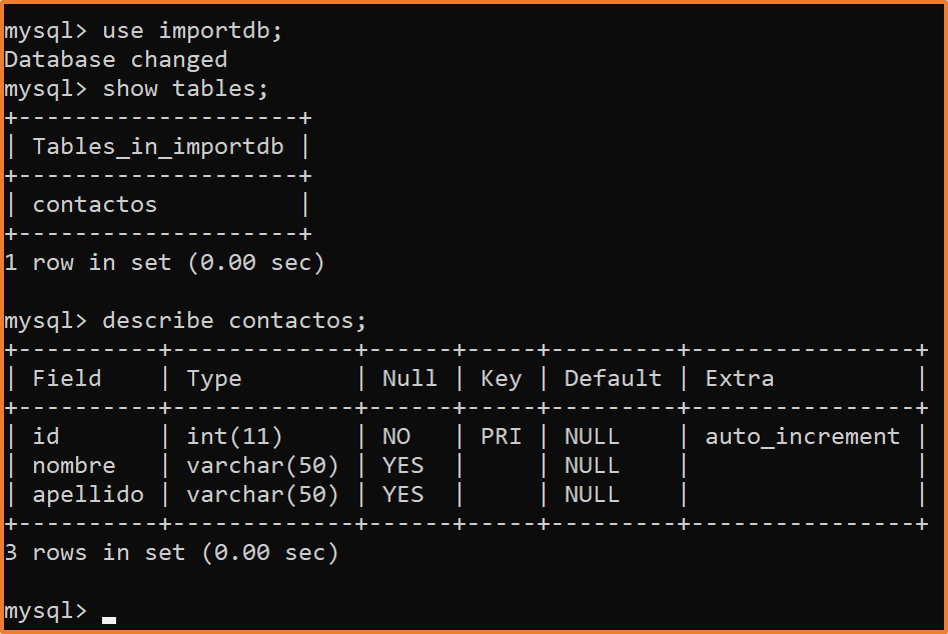
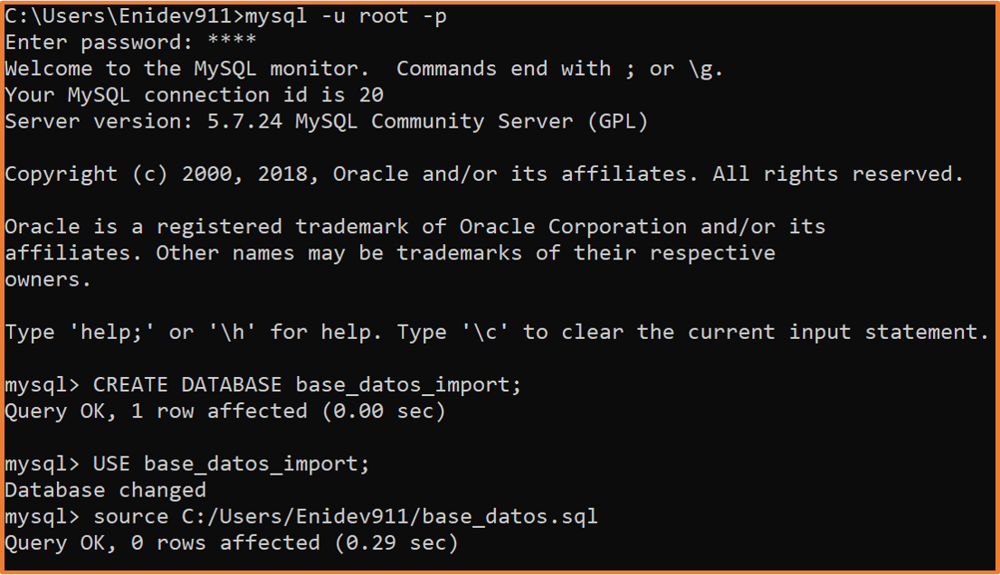
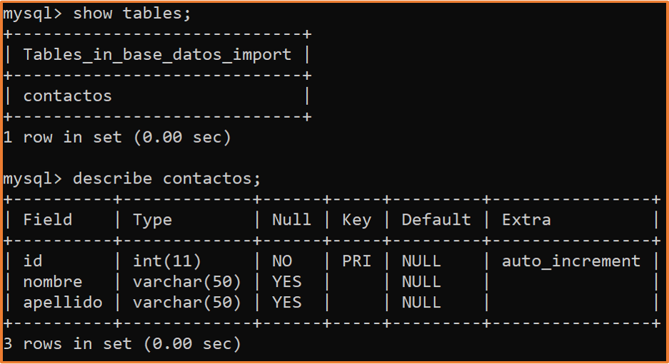

[comment]: <> (Author: Marco Contreras Herrera)
[comment]: <> (Email: enidev911@gmail.com)

<h2 align="center">
  <u>Exportar e Importar bases de datos MySQL</u>
  
</h2>

<br>

1. [Objetivo y descripción](#intro)
1. [Requerimientos](#dependencies)
1. [Uso básico](#uso)
1. [Puesta en marcha](#run)

## <a name='TOC'></a>

### <a name='intro'>Objetivo y Descripción</a>

Si bien los clientes de base de datos ( Navycat, MySQLWorkbrench, etc… ) son una excelente herramienta que facilitan la gestión de bases de datos, no siempre tendremos la opción de utilizarlos, por lo que es necesario saber hacer la mayoría de tareas más comunes desde línea de comandos. Es por eso que en esta guía vamos a ver el **proceso para exportar e importar una base de datos MySQL desde linea de comandos.** Vamos a conocer algunas utilidades incluidas junto al servidor de MySQL.


### <a name='dependencies'>Requerimientos</a>


- [MySQL](http://www.mysql.com/) - Tener instalado o en su lugar(XAMP, MAMP, LAMP,etc)
    * **mysqldump**: es una pequeña pero muy potente utilidad que acompaña al servidor MySql. Su principal uso es para realizar copias de seguridad de las bases de datos mysql. Con esto en mente, en esta ocasión revisaremos los comandos que nos permitirán exportar e importar una base de datos.


### <a name='uso'>Uso básico</a>

Tres formas básicas de invocar a **mysqldump** son posibles:

**1.** 

```bash
mysqldump [opciones] nombre_bd [nombre_tabla nombre_tabla2 ...] > respaldo.sql
```

Respalda una sola base de datos, indicando su nombre, y opcionalmente una o más tablas de la misma base de datos. Si no se indican tablas, se respaldan todas.


**2.** 

```bash
mysqldump [opciones] --databases nombre_bd1 nombrebd2 > respaldo.sql
```

Respalda una o más bases de datos de forma completa, no se pueden indicar tablas individuales de esta manera.

**3.**

```bash
mysqldump [opciones] --all-databases > respaldo.sql
```

Respalda de forma completa todas las bases de datos del servidor MySQL de forma completa, no se pueden indicar tablas individuales de esta manera.

#### Opciones más comunes

**mysqldump** es una herramienta con decenas de opciones, para verlas todas podemos utilizar el siguiente comando:  

```cmd
mysqldump --help
```

Lo anterior muestra las posibles opciones específicas de la versión de MySQL que utilices asi que pueden variar con respecto a la siguiente tabla: 


|Opción|Corto|Descripción|
|------|-----|-----------|
|--add-drop-database| |Añade la sentencia 'DROP DATABASES' antes de cada sentencia 'CREATE DATABASE'|
|--add-drop-table| |Añade la sentencia 'DROP TABLE' antes de cada sentencia 'CREATE TABLE'|
|--all-databases|-A|Respalda todas las tablas de todas las bases de datos.|
|--comments|-i|Añade comentarios en el archivo de respaldo. Esta opción está por defecto activada, para desactivar los comentarios utiliza --skip-comments.|
|--compatible=nombre| |Produce una salida más compatible con otros sistemas de bases de datos o versiones anteriores de MySQL. nombre puede tomar los siguientes valores: ansi, mysql323, mysql40, postgresql, mssql, oracle, db2, maxdb.|
|--complete-insert|-c|Usa sentencias INSERT completas que incluyen nombres de columnas.|
|--create-options| |Incluye todas las opciones específicas de MySQL para la creación de tablas que se usan en la sentencia 'CREATE TABLE'.|
|--databases|-B|Permite respaldar una o más bases de datos. Después de la opción se indican el(los) nombre(s) de las base de datos a respaldar. Se respalda cada base de datos completa. En la salida se incluye con esta opción las sentencias 'CREATE DATABASE' y 'USE' antes de cada nueva base de datos.|
|--extended-insert|-e|Usa la sentencia 'INSERT' con el formato de múltiples registros con varias listas de 'VALUES'. Esto produce una salida más reducida y acelera el proceso de INSERTS cuando el archivo es restaurado. Ideal para bases de datos con tablas que contienen miles de registros.|
|--force|-f|Si se te tienen views o vistas en la base de datos a respaldar y la vista hace referencia a una tabla que ya no existe, el vaciado del respaldo terminará con un error sin completarse. Con esta opción se podrá continuar.|
|--host=


### <a name='run'>Puesta en marcha</a>


**Exportar**

Con nuestra Terminal y nuestro servidor corriendo hacemos lo siguiente:

1. Accedemos a nuestra terminal y ejecutamos el siguiente comando:

```
$ mysqldump -h ip_servidor -u usuario_bd -p base_de_datos > archivo.sql
```

Donde:

- **-h ip_servidor**: es el servidor de acceso (generalmente localhost), o la dirección IP del servidor.
- **-u usuario_bd**: es el usuario de la base de datos (puede ser root u otro usuario con privilegios de administrador).
- **-p**: es para que nos pregunte el password.
- **base_de_datos**: es el nombre de la base de datos a exportar.
- **archivo.sql**: es el fichero resultante de la exportación, (**>**) es para volcar el contenido al archivo con la extensión sql
  
2. Una vez que la ejecución del comando termine, se creará el archivo **archivo.sql** con los querys que crean las tablas e información que pudiera contener nuestra base de datos. 

Ejemplo: 

<p align = 'center'>
  
</p>

Generando un archivo similar a este según sus bases de datos que quieran exportar: 

```sql
-- MySQL dump 10.13  Distrib 5.7.24, for Win32 (AMD64)
--
-- Host: 127.0.0.1    Database: enidevtest
-- ------------------------------------------------------
-- Server version	5.7.24

/*!40101 SET @OLD_CHARACTER_SET_CLIENT=@@CHARACTER_SET_CLIENT */;
/*!40101 SET @OLD_CHARACTER_SET_RESULTS=@@CHARACTER_SET_RESULTS */;
/*!40101 SET @OLD_COLLATION_CONNECTION=@@COLLATION_CONNECTION */;
/*!40101 SET NAMES utf8 */;
/*!40103 SET @OLD_TIME_ZONE=@@TIME_ZONE */;
/*!40103 SET TIME_ZONE='+00:00' */;
/*!40014 SET @OLD_UNIQUE_CHECKS=@@UNIQUE_CHECKS, UNIQUE_CHECKS=0 */;
/*!40014 SET @OLD_FOREIGN_KEY_CHECKS=@@FOREIGN_KEY_CHECKS, FOREIGN_KEY_CHECKS=0 */;
/*!40101 SET @OLD_SQL_MODE=@@SQL_MODE, SQL_MODE='NO_AUTO_VALUE_ON_ZERO' */;
/*!40111 SET @OLD_SQL_NOTES=@@SQL_NOTES, SQL_NOTES=0 */;

--
-- Table structure for table `tareas`
--

DROP TABLE IF EXISTS `tareas`;
/*!40101 SET @saved_cs_client     = @@character_set_client */;
/*!40101 SET character_set_client = utf8 */;
CREATE TABLE `tareas` (
  `id` int(11) NOT NULL AUTO_INCREMENT,
  `nombre` varchar(30) DEFAULT NULL,
  `description` varchar(250) DEFAULT NULL,
  PRIMARY KEY (`id`)
) ENGINE=InnoDB AUTO_INCREMENT=10 DEFAULT CHARSET=utf8;
/*!40101 SET character_set_client = @saved_cs_client */;

/*!40101 SET SQL_MODE=@OLD_SQL_MODE */;
/*!40014 SET FOREIGN_KEY_CHECKS=@OLD_FOREIGN_KEY_CHECKS */;
/*!40014 SET UNIQUE_CHECKS=@OLD_UNIQUE_CHECKS */;
/*!40101 SET CHARACTER_SET_CLIENT=@OLD_CHARACTER_SET_CLIENT */;
/*!40101 SET CHARACTER_SET_RESULTS=@OLD_CHARACTER_SET_RESULTS */;
/*!40101 SET COLLATION_CONNECTION=@OLD_COLLATION_CONNECTION */;
/*!40111 SET SQL_NOTES=@OLD_SQL_NOTES */;

-- Dump completed on 2021-05-13 19:54:42
```

Adicional a esto, podemos ejecutar el mismo comando con las siguientes variaciones:
```
$ mysqldump -h ip_servidor -u usuario_bd -p --no-data=TRUE base_de_datos > archivo.sql
```
Esta variación exporta solo la estructura de la base de datos, sin la información que pudiera contener nuestra base.
```
$ mysqldump -h ip_servidor -u usuario_bd -p --no-create-info=TRUE base_de_datos > archivo.sql
```
Esta variación exporta solo la información de nuestra base de datos, excluyendo la estructura de la misma.

## <a name='TOC'></a>

**Importar**

Para importar una base de datos desde un archivo **.sql** tenemos dos caminos.

El más sencillo y directo consiste en ejecutar el siguiente comando en la terminal ( asegurándonos que base_de_datos ya exista ).
```
$ mysql -u usuario_mysql -p base_de_datos < archivo.sql
```
Ejemplo: 

Suponiendo que tengamos el siguiente script llamado **base_datos.sql** y previamente tengamos creada una base de datos llamada **importdb**

```sql
CREATE TABLE IF NOT EXISTS contactos (
    id int(11) NOT NULL AUTO_INCREMENT,
    nombre varchar(50),
    apellido varchar(50),
    PRIMARY KEY (id)
);
```
CMD: 

<p align = 'center'>
  
</p>

Obtendriamos lo siguiente al revisar:

<p align = 'center'>
  
</p>


O bien podemos seguir estos pasos:

1. Nos conectamos a la base de datos a donde vamos a importar.
```
$ mysql -h ip_servidor -u usuario -p
```
2. Una vez dentro de la consola MySQL, si la base de datos no existe, la creamos con:
```
mysql> create database base_datos;
```
3. En cualquier caso indicamos la base de datos a usar:
```
mysql> use base_datos;
```
4. Y ahora, el proceso de importación, que sería tan sencillo como ejecutar:
```
mysql> source /home/usuario/archivo.sql
```

PROMPT:

<p align = 'center'>
  
</p>

<p align = 'center'>
  
</p>
