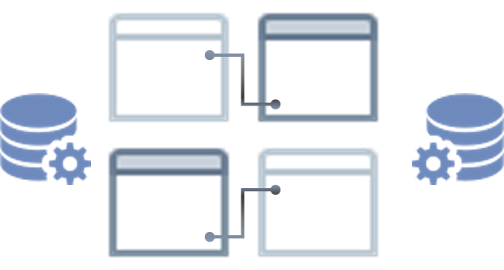

[comment]: <> (Author: Marco Contreras Herrera)
[comment]: <> (Email: enidev911@gmail.com)

<h2 align="center">
  <u>MySQL resumen</u>
  
</h2>

 

MySQl es un sistema open source de administración de bases de datos que actualmente es desarrollado y soportado por Oracle.  

Una base de datos es una colección  estructurada de datos que está organizada para ser usada y extraída de forma sencilla.  

MySQL fue lanzado en 1995. Desde entonces, ha pasado por varios cambios. A pesdar de que Oracle está a cargo ahora, MySQL sigue siendo un **software open source**, lo que quiere decir que puede ser usado y modificado por cualquier persona.

Para entender un poco el funcionamiento de MySQL, es importante conocer dos conceptos que van conectados.  

- [Bases de datos relacionales]
- [Modelo de Cliente-Servidor]

<h2 align="center">
  <u>Bases de datos relacionales</u>  
  
</h2>

Cuando se trata de almacenar datos en una base de datos, hay distintos enfoques que se pueden utilizar.

MySQL opta por un enfoque basado en el modelo o esquema relacional. Con una base de datos relacional, sus datos son fragmentados en varias áreas de almacenamiento separadas - llamadas **tablas** en lugar de poner todo junto en una gran unidad de almacenamiento.  

Por ejemplo, quisiera almacenar dos tipos de información:

- **Pedidos**: Nos interesa el producto, el precio, quién hizo la orden, etc. 
- **Cliente**: Su nombre, dirección, detalles, etc.

Si intenta poner todos estos datos juntos en un gran almacen, tendrá algunos problemas como:  

- **Datos distintos**: Los datos que usted necesita para recolectar para una orden son diferentes que lo que son para un cliente. 
- **Datos duplicados**: Cada 

