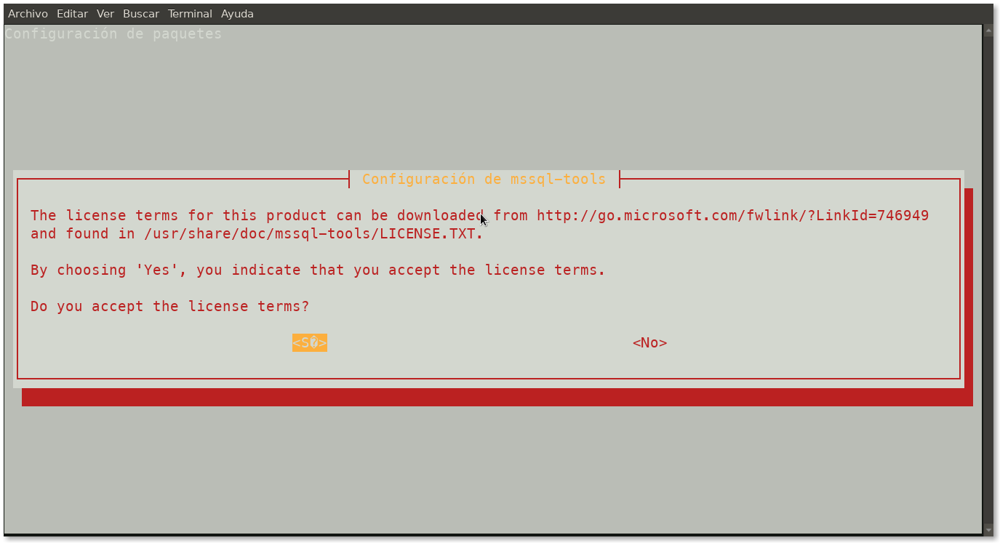
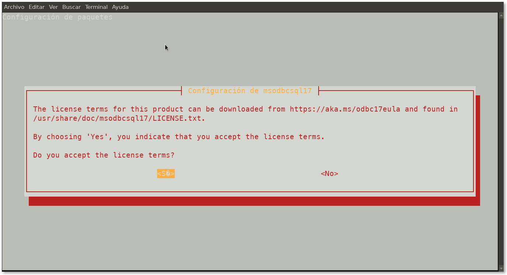
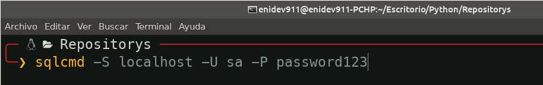
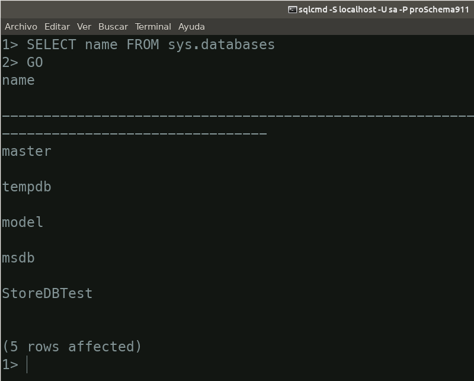

# install-linux

### Instalar sqlcmd y bcp herramientas de líneas de comandos para SQL Server

**En Linux**

Los siguientes pasos instalan las herramientas de líneas de comandos, los controladores ODBC de Microsoft y sus dependencias. El paquete **mssql-tools** contiene:

* **sqlcmd**: utilidad de consulta de la línea de comandos.
* **bcp**: utilidad de importación y exportación.

Instale las herramientas para su plataforma:

* Red Hat Enterprise Linux
* [Ubuntu](./#ubuntu)
* SUSE Linux Enterprise Server
* Mac OS
* Docker

### Usando SQLCMD en Linux:

* [Conectarse](./#conectar)
* [Consultando las bases de datos](./#consultadb)

### Instalar las herramientas en Ubuntu

1. Importe las claves GPG del repositorio público.

```bash
curl https://packages.microsoft.com/keys/microsoft.asc | sudo apt-key add -
```

1. Registre el repositorio de Microsfot Ubuntu.

```bash
curl https://packages.microsoft.com/config/ubuntu/16.04/prod.list | sudo tee /etc/apt/sources.list.d/msprod.list
```

1. Actualice la lista de fuentes y ejecute el comando de instalación con el paquete de desarrollador unixODBC

```bash
sudo apt-get update 
sudo apt-get install mssql-tools unixodbc-dev
```

Al ejecutar este comando se nos mostrarán las siguientes ventanas, debemos aceptar ambas:





**Nota**:

Para actualizar a la última versión de **mssql-tools**, ejecute los siguientes comandos:

```bash
sudo apt-get update 
sudo apt-get install mssql-tools
```

1. **Opcional:** agregue **/opt/mssql-tools/bin/** a las variable de entorno **PATH** en un shell como bash.

Para hacer que **sqlcmd** y **bcp** sea accesible desde el shell para las sesiones de inicio de sesión, modifique su **PATH** en el archivo **\~/.bash\_profile** con el siguiente comando.

```bash
echo 'export PATH="$PATH:/opt/mssql-tools/bin"' >> ~/.bash_profile
```

Para hacer que **sqlcmd** **bcp** sea accesible desde el shell bash para sesiones interactivas sin inicio de sesión, modifique la ruta del archivo **\~/.bashrc** con el siguiente comando:

```bash
echo 'export PATH="$PATH:/opt/mssql-tools/bin"' >> ~/.bashrc
source ~/.bashrc
```

### Conectandose con SQLCMD en Linux

Para establecer una conexión al servidor local con el usuario sa en una sola línea es de la siguiente manera:



* **S** : para especificar la instancia de SQL Server a la que se conecta.
* **U**: para especificar las credencial que usa SQlCMD para conectarse a la instancia de SQL Server.
* **P**: para especificar la contraseña en la mismca cadena.
* **p**: para poder especificar la contraseña en la siguiente línea del prompt sin ser visible.

### Consultando las bases de datos de la instancias

Una vez establecemos la conexión, podemos realizar la siguiente consulta:


