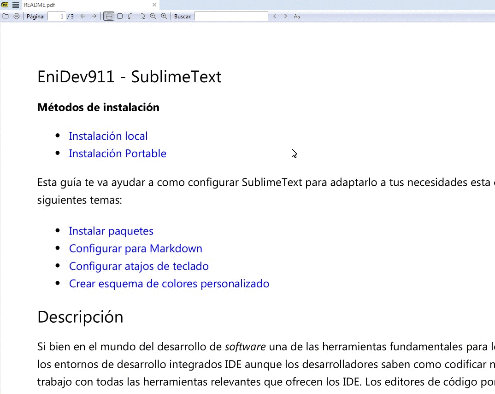

## <u>Guía rápida para instalar y configurar SublimeText</u> 

Esta guía rápida sirve para recordar todas las posibilidade que tenemos de configurar el editor de código Sublimetext yo comúnmente lo empleo para programar pero no me limito solo a programar adicionalmente a día de hoy lo utilizo bastante para crear documentación, artículos de blog editando archivos en formato Markdown. Espero que esta guía les sirva para que puedan hacer de este gran editor su herramienta favorita.  

A continuación sigue una lista de las tópicos de esta guía.

- [SublimeText](https://www.sublimetext.com/)
    * [Breve introducción](#intro)
	* [Instalación](#install)
	* [Configurar Package Control]()
	* [Configurar para Markdown](ST3_edit_markdown/README.md)
	* [Configurar atajos de teclado](./ST3_shorcuts_effective/README.md)
	* [Crear esquema de colores personalizado](Color-Scheme/README.md)
	

### <u><a name="intro">*Breve introducción*</a></u>

Si bien en el mundo del desarrollo de *software* una de las herramientas fundamentales para los desarrolladores son los entornos de desarrollo integrados IDE aunque los desarrolladores saben como codificar necesitan un lugar de trabajo con todas las herramientas relevantes que ofrecen los IDE. Los editores de código por otra parte son más minimalistas podemos mencionar editores de códigos más tradicionales como **Vim**, **Nano** en sistemas unix, **Notepad** o mítico **Bloc de nota** en windows. Siendo los IDE más completos con muchas funcionalidades que te brindan productividad y herramientas para el [Debugging](https://es.wikipedia.org/wiki/Depuraci%C3%B3n_de_programas) pero con el costo de que estos consumen mayor espacio en la memoria RAM al cargarse todos las funciones que lo componen y suelen pesar bastante a la hora de instalarse. Así que si tu computadora es de recursos limitados no tendrás la mejor experiencia, por otro lado tenemos los editores que nos brindan una solución ligera para trabajar con menos herramientas integradas, de estos editores tenemos una gran variedad en el mercado como [Visual Studio Code](https://code.visualstudio.com/), [Notepad++](https://notepad-plus-plus.org/) estos últimos particularmente son bastante flexibles a la hora de trabajar con ellos podemos extender sus capacidades a través de plugin y convertirlos en un verdadero IDE, entre los más buscados por los desarrolladores está **VSC** ya que es un producto de Microsoft y completamente *open source*, su rendimiento es muy aceptable y goza de constantes actualizaciones que hacen que su rendimiento sea más optimo. No siempre hay que despreciar el resto de los editores ahora en esta guía nos basaremos en como utilizar el editor que para mí es sin duda uno de mis favoritos y tengo una muy bonita relación con él, esta herramienta me ha acompañado durante mucho tiempo y se trata del gran [SublimeText](https://www.sublimetext.com/), es un editor de los más flexible que existen y personalizable, lo mejor es que es un editor demasiado ligero que independiente de tu sistema operativo y *hardware* que lo ejecuta la experiencia es muy fluida, tiene unos atajos de teclado puedes crear tus propios atajos para que te sientas todo un [Usain Bolt](https://es.wikipedia.org/wiki/Usain_Bolt) :running: programando tareas dentro del mismo editor, la única restricción se podría considerar de este maravilloso editor es el pago de una licencia, sin embargo no es una limitación de funcionalidad el que no la tengamos, de vez en cuando te va a mostrar una ventana emergente que te va a recordar de obtener una licencia.

### <a href="install">*Métodos de instalación*</a>

- [Instalación local](#istall)
- [Instalación Portable](#portable)

:point_right: <a href="http://sublimetext.com/download" target="_blank">Descarga oficial</a>

Una vez instalado, el siguiente paso es obligatorio para poder seguir los tópicos de esta guía ya que en ocasiones tendremos que instalar paquetes de terceros para extender la funcionalidad de este editor, debemos instalar lo que se conoce como un administrador de paquetes (**Package control**) es un paso muy sencillo, solo debemos ir en el menú superior y buscar **Tools** -> **Install Package Control**  

    

Hecho esto ahora se nos habilitará una nueva opción en la pestaña **Preferences** del menu superior:  

    

Ahora tenemos package control listo para gestionar la instalación de nuevos plugín así mismo como elimarlos o re-instalarlos:  

    

Desde aquí podemos <b>tomar el control para gestionar paquetes</b>

### 

		

## 

*[IDE]: Integrated Development Environment
*[RAM]: Random Access Memory
*[VSC]: Visual Studio Code

