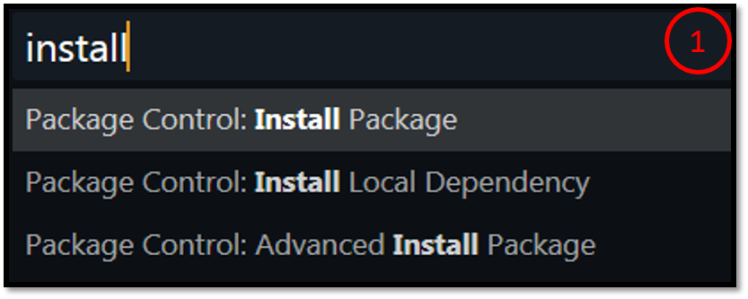
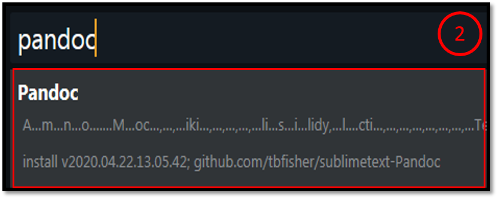

Hola! hace ya un tiempo que tenía ganas de crear una guía, en la que vamos a ver cómo pasar un texto escrito en [Markdown](#) a [PDF](#), [HTML](#) o un documento [Word](#) desde Sublime Text. Como ya saben Sublime Text es un editor "todoterreno". Yo personalmente lo utilizo para programar en cualquier lenguaje y también para escribir documentos e informes en Markdown y luego pasarlos a PDF con Latex.

1. Primer paso es instalar el plugin "pandoc". Para ello, pulsando las teclas <kbd>CTRL</kbd> + <kbd>Shift</kbd> + <kbd>P</kbd>,escribimos "install" y luego "pandoc".

	
	

Tras haber instalado nuestro plugin, debemos tener también instalado Pandoc en nuestro sistema operativo. Para instalar Pandoc, te recomiendo esta [guía de instalación](https://pandoc.org/installing.html). 

