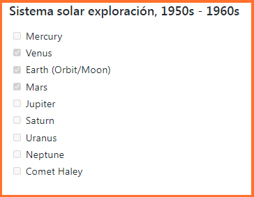

# fast-guide

### Guía rápida Markdown y Pygments Lexers 

Esta guía rápida sirve para recordar todas las posibilidades que ofrecen [Markdown](https://es.wikipedia.org/wiki/Markdown) y [Pygments](https://pygments.org) para editar y formatear texto y comúnmente lo empleo para crear documentación, artículos de blog, generar páginas web estáticas. Espero que no solo me sirva de guía a mí, si no a cualquiera que se acerque por primera vez a Markdown o Pygments.

A continuación sigue una lista detallada de todas las características que se pueden emplear en Markdown y Markdown Extra y los lexers más comunes de Pygments para resaltar el código fuente.

* [Markdown](./#mark0)
  * [¿Que es Markdown?](./#mark-0)
  * [Editor Markdown online](https://dillinger.io)
  * [Ventajas de usar Markdown](./#mark-1)
* [Sintaxys Markdown](./#mark0)
  * [Cabeceras](./#mark1)
  * [Enlaces](./#mark2)
  * [Párrafos](./#mark3)
  * [Formato](./#mark4)
  * [Citas](./#mark5)
  * [Listas](./#mark6)
  * [Listas de definiciones](./#mark7)
  * [Imágenes](./#mark8)
  * [Tablas](./#mark9)
  * [Código](./#mark10)
  * [Lineas Horizontales](./#mark11)
  * [Escapar caracteres](./#mark12)
  * [Notas a pie de página](./#mark13)
  * [Abreviaturas](./#mark14)
  * [Indentificadores de cabecera](./#mark15)
  * [Casillas de verificación](./#mark16)
  * [Emojis](./#mark17)
* [Pygments](./#mark18)
  * Lexers de Pygments más comunes para resaltado de sintaxis

### Markdown

Este es el lenguaje de marcado que permite formatear el texto fácilmente sin la necesidad de emplear HTML o emplear un editor visual.

### ¿Que es Markdown?

Markdown es un lenguaje de marcado ligero parecido al que se emplea en muchas wikis y basado originalmente en convenciones existentes en el marcado de los correos electrónicos. Emplea texto plano, procurando que sea legible pero consiguiendo que se convierta en XHTML correctamente formateado. Aunque no es muy conocido, empieza a ser muy popular y utilizado por programadores y blogueros que escriben sus artículos en este formato.

### Ventajas de usar Markdown

* :raised\_hands:    **Es sencillo de aprender**
* :rocket:    **Es bastante más legible y fácil de mantener**
* :runner:    **Escribir para web es más rápido y cómodo**
* :interrobang:    **Es más difícil de cometer errores se sintaxis**
* :pencil:    **Es perfecto para usarlo con editores de texto minimalistas**
* :computer:    **Permite que te concentres en generar contenido en lugar de generar formato correctamente**
* :eyes:    **Lo que ves es lo que quieres decir**

\
\


### Sintaxis Markdown

#### Cabeceras

Los encabezamintos HTML se producen colocando un número determinado de almohadillas '`#`' antes del texto correspondiente al nivel de encabezamiento deseado (HTML ofrece hasta seis niveles). Los encabezamientos posibles se pueden ver en la siguiente tabla:

| Tecleas                                                     | Obtienes                              |
| ----------------------------------------------------------- | ------------------------------------- |
| <pre><code># Esto es un &#x3C;h1> en html</code></pre>      | <h3>Esto es un &#x3C;h1> en html</h3> |
| <pre><code>## Esto es un &#x3C;h2> en html</code></pre>     | <h3>Esto es un &#x3C;h2> en html</h3> |
| <pre><code>### Esto es un &#x3C;h3> en html</code></pre>    | <h4>Esto es un &#x3C;h3> en html</h4> |
| <pre><code>#### Esto es un &#x3C;h4> en html</code></pre>   | **Esto es un \<h4> en html**          |
| <pre><code>##### Esto es un &#x3C;h5> en html</code></pre>  | **Esto es un \<h5> en html**          |
| <pre><code>###### Esto es un &#x3C;h6> en html</code></pre> | **Esto es un \<h6> en html**          |

Markdown también nos permite encerrar cada encabezado entre almohadillas, pero con el único fin de esto es un **motivo estético** porque no es necesario en absoluto, es decir, que podemos hacer lo siguiente:

\
\


| Tecleas                                                      | Obtienes                              |
| ------------------------------------------------------------ | ------------------------------------- |
| <pre><code>### Esto es un &#x3C;h3> en html ###</code></pre> | <h4>Esto es un &#x3C;h3> en html</h4> |

Para los encabezamientos de los dos primeros niveles existe también otra manera de hacer lo mismo seria lo siguiente:

| Tecleas                                                                     | Obtienes                              |
| --------------------------------------------------------------------------- | ------------------------------------- |
| <pre><code>Esto es un &#x3C;h1> en html=======================</code></pre> | <h3>Esto es un &#x3C;h1> en html</h3> |
| <pre><code>Esto es un h2-------------</code></pre>                          | <h3>Esto es un h2</h3>                |

Es decir para los encabezamientos principales se subraya el texto con el signo igual '`=`'. Para los encabezamientos de segundo nivel se utilizan guiones '`-`' para subrayar. Es indiferente el número de signos iguales o guiones que se empleen, con uno es suficiente.

[volver a índice](./#top) ⤴

***

\


#### Enlaces

Existen también dos maneras de crear enlaces, se pueden ver en la siguiente tabla:

| Tecleas                                                                                                                                                   | Obtienes                                                      |
| --------------------------------------------------------------------------------------------------------------------------------------------------------- | ------------------------------------------------------------- |
| <pre><code>[Con título](https://eniblog.com "título")</code></pre>                                                                                        | [Con título](./#mark2)                                        |
| <pre><code>[Sin titulo](https://eniblog.com)</code></pre>                                                                                                 | [Sin título](./#mark2)                                        |
| <pre><code>[Enlace 1][1], [Enlace 2][2],[Enlace 3][3][1]: http://eniblog.com/tips[2]: http://eniblog.com/tips "Tips"[3]: http://eniblog.com/</code></pre> | [Enlace1](./#mark2), [Enlace2](./#mark2), [Enlace3](./#mark2) |

Existe una manera adicional de crear enlaces automáticos para direcciones URL, simplemente encerrarla entre los caracteres '`<`' y '`>`':

| Tecleas                                                         | Obtienes                        |
| --------------------------------------------------------------- | ------------------------------- |
| <pre><code>       &#x3C;http://eniblog.com>       </code></pre> | [http://eniblog.com ](./#mark2) |

> **Consideración**: Markdown no tiene la opción de publicar links que se abran en una nueva pestaña del navegador. Para eso habría que utilizar HTML con el atributo (target='\_blank').

[volver a índice](./#top) ⤴

***

\


#### Párrafos

Para crear párrafos se deja una línea en blanco. De este mondo:

| Tecleas                                                                                      | Obtienes                                                          |
| -------------------------------------------------------------------------------------------- | ----------------------------------------------------------------- |
| <pre><code>    Este es el primer párrafo             Este es el segundo párrado</code></pre> | <p>Este es el primer párrafo</p><p>Este es el segundo párrafo</p> |

\


Para crear un salto de línea dentro de un parráfo, simplemente se dejan dos espacios al final de la última palabra de esa línea, de este modo:

\


| Tecleas                                                                                   | Obtienes                                                       |
| ----------------------------------------------------------------------------------------- | -------------------------------------------------------------- |
| <pre><code>    Esta es la primera línea           y este es la segunda línea</code></pre> | <p>Esta es la primera línea<br>y este es el salto de línea</p> |

[volver a índice](./#top) ⤴

***

\
\


#### Formato

El formato básico del texto, es decir negritas y cursivas, tachado, markdown no tiene para subrayar texto pero siempre podemos utilizar etiquetas HTML para ello. Se pueden realizar de varias maneras:

\
\
\


| Tecleas                                                         | Obtienes                                |
| --------------------------------------------------------------- | --------------------------------------- |
| <pre><code>**Esto es negrita**</code></pre>                     | **Esto es negrita**                     |
| <pre><code>__Esto también es negrita__</code></pre>             | **Esto también es negrita**             |
| <pre><code>*Esto es cursiva*</code></pre>                       | _Esto es cursiva_                       |
| <pre><code>_Esto también es cursiva_</code></pre>               | _Esto también es cursiva_               |
| <pre><code>***Esto es negrita y cursiva***</code></pre>         | _**Esto es negrita y cursiva**_         |
| <pre><code>___Esto también es negrita y cursiva___</code></pre> | _**Esto también es negrita y cursiva**_ |
| <pre><code>~~Esto es tachado~~</code></pre>                     | ~~Esto es tachado~~                     |

Se pueden emplear indistintamente tanto el asterisco '`*`' como el guión bajo '`_`' siempre y cuando no se mezclen y lo que determina el formato es el número de ellos antes y después del bloque de texto a formatear. Uno es cursiva, dos es negrita, y tres ambas, así de sencillo.

[volver a índice](./#top) ⤴

***

\
\


#### Citas

Para crear bloques de cita, se emplea el carácter mayor que '`>`' antes del bloque de texto. En la siguiente tabla se pueden ver las opciones para crearlos:

\
\
\
\
\


| Tecleas                                                                                                                                                                                                                                                         | Obtienes                                                                                                                                                                                                                                               |
| --------------------------------------------------------------------------------------------------------------------------------------------------------------------------------------------------------------------------------------------------------------- | ------------------------------------------------------------------------------------------------------------------------------------------------------------------------------------------------------------------------------------------------------ |
| <pre><code>Esto es una línea normal>Esto es parte de un bloque de cita.>Esto es parte del mismo bloque de cita.</code></pre>                                                                                                                                    | <p>Esto de una línea normal</p><p>Esto es parte de un bloque de cita. Esto es parte del mismo bloque de cita.</p>                                                                                                                                      |
| <pre><code>>Esto es parte de un bloque de cita. Esto continúa el bloque incluso aunque no hay símbolo 'mayor que'.La línea en blanco finaliza el bloque</code></pre>                                                                                            | <p>Esto es parte de un bloque de cita. Esto continúa el bloque incluso aunque no hay símbolo 'mayor que'.</p><p>La Línea en blanco finaliza el bloque</p>                                                                                              |
| <pre><code>Esto es una línea normal>Esto es parte de un bloque de cita.>Esto es parte del mismo bloque de cita.>>>Esto de otro bloque de cita anidado.>>Esto es parte del bloque anidado. >>Esto es parte del bloque de cita del primer nivel.
			</code></pre> | <p>Esto es una línea normal</p><p>Esto es parte de un bloque de cita. Esto es parte del mismo bloque de cita.</p><p>Esto es otro bloque de cita anidado. Esto es parte del bloque anidado.</p><p>Esto de parte del bloque de cita de primer nivel.</p> |

[volver a índice](./#top) ⤴

***

\


#### Listas

Markdown permite crear dos tipos de listas, ordenadas y desordenadas, es decir numeradas o listas de puntos. Para distinguir los tipos y como se crean, nada mejor que verlo con ejemplos:

\
\
\
\


| Tecleas                                                                                                                                                                                                                                                                                                                                                                               | Obtienes                                                                                                                                                                                                                                                                                                                                                                                                                                         |
| ------------------------------------------------------------------------------------------------------------------------------------------------------------------------------------------------------------------------------------------------------------------------------------------------------------------------------------------------------------------------------------- | ------------------------------------------------------------------------------------------------------------------------------------------------------------------------------------------------------------------------------------------------------------------------------------------------------------------------------------------------------------------------------------------------------------------------------------------------ |
| <pre><code>Lista numerada (ordenada)1. Este es el primer elemento2. Este es el segundo elemento3. Este es el tercer elemento
			</code></pre>                                                                                                                                                                                                                                         | <p>Lista numerada (ordenada)</p><ol><li>Este es el primer elemento</li><li>Este es el segundo elemento</li><li>Este es el tercer elemento</li></ol>                                                                                                                                                                                                                                                                                              |
| <pre><code>Lista de puntos (desordenada)* Un elemento de la lista* Otro elemento de la lista* Tercer elemento de la lista</code></pre>                                                                                                                                                                                                                                                | <p>Lista de puntos (desordenada)</p><ul><li>Un elemento de la lista</li><li>Otro elemento de la lista</li><li>Tercer elemento de la lista</li></ul>                                                                                                                                                                                                                                                                                              |
| <pre><code>Se pueden emplear también + y -en vez de ** Un elemento de la lista+ Otro elemento de la lista- Tercer elemento de la lista</code></pre>                                                                                                                                                                                                                                   | <p>Se pueden emplear también + y - en vez *</p><ul><li>Un elemento de la lista</li><li>Otro elemento de la lista</li><li>Tercer elemento de la lista</li></ul>                                                                                                                                                                                                                                                                                   |
| <pre><code>Se pueden mezclar distintos tiposde listas y anidar unas dentro deotras.1. Esto es una lista ordenada2. Segundo elemento de la lista ordenada    1. Esta es una lista ordenada anidada dentro de otra        * Lista desordenada anidada a tercer nivel        * Segundo elemento de esta lista    2. Este es el segundo elementode la lista ordenada anidada</code></pre> | <p>Se pueden mezclar distintos tipos de listas y anidar unas dentro de otras.</p><ol><li>Esto es una lista ordenada</li><li>Segundo elemento de la lista ordenada</li><li><p></p><ol><li>Esta es una lista ordenada anidada dentro de otra</li><li><p></p><ul><li>Lista desordenada anidada a tercer nivel</li><li>Segundo elemento de esta lista</li></ul></li><li>Este es el segundo elemento de la lista ordenada anidada</li></ol></li></ol> |

[volver a índice](./#top) ⤴

***

\
\


#### Listas de definiciones

Se pueden crear listas de definiciones, que están compuestas del **término** y la **lista de definiciones** del mismo, como si fuera un diccionario. Su creación es muy simple:

| Tecleas                                                                                                                                                                 | Obtienes                                                                                                                                                                                                                        |
| ----------------------------------------------------------------------------------------------------------------------------------------------------------------------- | ------------------------------------------------------------------------------------------------------------------------------------------------------------------------------------------------------------------------------- |
| <pre><code>Primer término : Primera definiciónSegundo término : segunda definición
			</code></pre>                                                                     | <p><strong>Primer término</strong><br>    Primera definición</p><p><strong>Segundo término</strong><br>    Segunda definición</p>                                                                                               |
| <pre><code>Se pueden aplicar más de unadefinición a un términoPrimer término : Primera definición : Segunda definiciónSegundo término : Segunda definición</code></pre> | <p>Se pueden aplicar más de una definición a un término</p><p><strong>Primer término</strong><br>    Primera definición<br>    Segunda definición</p><p><strong>Segundo término</strong><br>    Segunda definición</p>          |
| <pre><code>Se pueden aplicar más de untérmino a una definiciónPrimer términoSegundo término : Primera definiciónTercer término : Segunda definición</code></pre>        | <p>Se pueden aplicar más de un término a una definición</p><p><strong>Primer término</strong><br><strong>Segundo término</strong><br>    Primera definición</p><p><strong>Tercer término</strong><br>    Segunda definición</p> |
| <pre><code>Una definición puede contar devarios párrafos.Primer término : Primera definiciónSegundo párrafo de la primeradefinición</code></pre>                        | <p>Una definición puede contar de varios párrafos.</p><p><strong>Primer término</strong><br>    Primera definición<br></p><p>    Segundo parráfo de la primera definición</p>                                                   |

> **Consideración**: En la primera línea escribimos el término y en la siguiente dejamos un espacio en blanco e ingresamos el carácter **'`:`'** y la definición de cuyo término precedido de un espacio en blanco.

\


[volver a índice](./#top) ⤴

***

\


#### Imágenes

La manera de enlazar imágenes es básicamente la misma de crear enlaces, con una única diferencia de que se añade el carácter de exclamación **'`!`'** al principio de la pareja de corchetes que definen el nombre del enlace.

Ejemplos:

| Tecleas                                                                                                   | Obtienes                                     |
| --------------------------------------------------------------------------------------------------------- | -------------------------------------------- |
| <pre><code></code></pre>                                           |                    |
| <pre><code></code></pre>                                                   |                    |
| <pre><code>![Imagen 1][1]  ![Imagen 2][2][1]: pictures/avatar.png[2]: pictures/spy.png "spy"</code></pre> |   |

[volver a índice](./#top) ⤴

***

\


#### Tablas

Crear tablas es sumamente sencillo, simplemente debemos indicar cuales son los elementos de la cabecera y separar los campos con el símbolo.

Ejemplos:

\
\
\


| Tecleas                                                                                                                                                                                                                                                                                                                                                                                                                                                                                                              | Obtienes                                                                                                                                                                                                                                                                                                                                                                                                                                                                                                                                                                                           |        |
| -------------------------------------------------------------------------------------------------------------------------------------------------------------------------------------------------------------------------------------------------------------------------------------------------------------------------------------------------------------------------------------------------------------------------------------------------------------------------------------------------------------------- | -------------------------------------------------------------------------------------------------------------------------------------------------------------------------------------------------------------------------------------------------------------------------------------------------------------------------------------------------------------------------------------------------------------------------------------------------------------------------------------------------------------------------------------------------------------------------------------------------- | ------ |
| <pre><code>Cabecera A | Cabecera B-- | --Campo A0 | Campo B0Campo A1 | Campo B1</code></pre>                                                                                                                                                                                                                                                                                                                                                                                                                         | <table><thead><tr><th>Cabecera A</th><th>Cabecera B</th></tr></thead><tbody><tr><td>Campo A0</td><td>Campo B0</td></tr><tr><td>Campo A1</td><td>Campo B1</td></tr></tbody></table>                                                                                                                                                                                                                                                                                                                                                                                                                 |        |
| Cabecera A                                                                                                                                                                                                                                                                                                                                                                                                                                                                                                           | Cabecera B                                                                                                                                                                                                                                                                                                                                                                                                                                                                                                                                                                                         |        |
| Campo A0                                                                                                                                                                                                                                                                                                                                                                                                                                                                                                             | Campo B0                                                                                                                                                                                                                                                                                                                                                                                                                                                                                                                                                                                           |        |
| Campo A1                                                                                                                                                                                                                                                                                                                                                                                                                                                                                                             | Campo B1                                                                                                                                                                                                                                                                                                                                                                                                                                                                                                                                                                                           |        |
| <pre><code>Si prefiere, por estética, sepueden alinear las columnas e incluso comenzar y finalizarlasfilas con el símbolo '|', perono es necesario| Cabecera A | Cabecera B || ---------- | ---------- || Campo A0   | Campo B0   || Campo A1   | Campo B1   |</code></pre>                                                                                                                                                                                                                                          | <p>Si prefiere, por estética, se pueden alinear las columnas e incluso comenzar y finalizar las filas con el símbolo |, pero no es necesario</p><table><thead><tr><th>Cabecera A</th><th>Cabecera B</th></tr></thead><tbody><tr><td>Campo A0</td><td>Campo B0</td></tr><tr><td>Campo A1</td><td>Campo B1</td></tr></tbody></table>                                                                                                                                                                                                                                                                 |        |
| Cabecera A                                                                                                                                                                                                                                                                                                                                                                                                                                                                                                           | Cabecera B                                                                                                                                                                                                                                                                                                                                                                                                                                                                                                                                                                                         |        |
| Campo A0                                                                                                                                                                                                                                                                                                                                                                                                                                                                                                             | Campo B0                                                                                                                                                                                                                                                                                                                                                                                                                                                                                                                                                                                           |        |
| Campo A1                                                                                                                                                                                                                                                                                                                                                                                                                                                                                                             | Campo B1                                                                                                                                                                                                                                                                                                                                                                                                                                                                                                                                                                                           |        |
| <pre><code>Se puede especificar la alineaciónde cada columna mediante la adición de dos puntos ':' a las líneas de separación, ':' a la izquierda de la línea de separación hará que columna esté alineada a la izquierda, ':' a la derecha de la línea hará que la columna esté alineada a la derecha, ':' en ambos lados significa que la columna sealinea al centro.| Elemento | Cantidad | Precio || :------- | :------: | -----: || Item 1   | 15       | $1.200 || Item 2   | 103      | $2.500 |</code></pre> | <p>Se puede especificar la alineación de cada columna mediante la adición de dos puntos ':' a las líneas de separación, ':' a la izquierda de la línea de separación hará que la columna esté alineada a la izquierda, ':' a la derecha de la línea de separación hará que la columna esté alineada a la derecha, ':' en ambos lados significa que la columna se alinea al centro.</p><table><thead><tr><th>Elemento</th><th>Cantidad</th><th>Precio</th></tr></thead><tbody><tr><td>Item 1</td><td>15</td><td>$1.200</td></tr><tr><td>Item 2</td><td>103</td><td>$2.500</td></tr></tbody></table> |        |
| Elemento                                                                                                                                                                                                                                                                                                                                                                                                                                                                                                             | Cantidad                                                                                                                                                                                                                                                                                                                                                                                                                                                                                                                                                                                           | Precio |
| Item 1                                                                                                                                                                                                                                                                                                                                                                                                                                                                                                               | 15                                                                                                                                                                                                                                                                                                                                                                                                                                                                                                                                                                                                 | $1.200 |
| Item 2                                                                                                                                                                                                                                                                                                                                                                                                                                                                                                               | 103                                                                                                                                                                                                                                                                                                                                                                                                                                                                                                                                                                                                | $2.500 |

[volver a índice](./#top) ⤴

***

\


#### Código

Se pueden crear bloques de código para albergar extractos de código fuente de un lenguaje de programación o para reproducir literalmente cualquier tipo de texto que sea interpretado por markdown. Lo único necesario es que cada línea de este bloque empiece por al menos 4 espacios o 1 tabulado.

\
\


**De todos modos, es mucho más recomendable para estas tareas emplear el resaltado de código que se puede ver en esta** [**sección**](./#mark18)**.**

Ejemplos:

\


| Tecleas                                                   | Obtienes                        |
| --------------------------------------------------------- | ------------------------------- |
| <pre><code>Esto es un parráfo normal</code></pre>         | Esto es un parráfo normal       |
| <pre><code>    Esto es un parráfo de código.</code></pre> | `Esto es un parráfo de código.` |

Existe otro modo de crear un bloque de código, encerrándolo entre dos líneas formadas por tres o más caracteres tilde '`~`'.

| Tecleas                                                    | Obtienes                        |
| ---------------------------------------------------------- | ------------------------------- |
| <pre><code>Esto es un parráfo normal         </code></pre> | Esto es un parráfo normal       |
| <pre><code>~~~Esto es un parráfo de código~~~</code></pre> | `Esto es un parráfo de código.` |

Por último existe una opción para resaltar pequeños trozos de código dentro de parráfos de texto normal.\
Para lograr esto debemos encerrar el código entre dos acentos graves '\` \`'. Por ejemplo:

| Tecleas                                                                                                                 | Obtienes                                                                                          |
| ----------------------------------------------------------------------------------------------------------------------- | ------------------------------------------------------------------------------------------------- |
| <pre><code>Esto es un parráfo normal, con untrozo de código, `import this`insertado en el medio del mismo.</code></pre> | Esto es un parráfo normal, con un trozo de código, `import this` insertado en el medio del mismo. |

[volver a índice](./#top) ⤴

***

\
\
\


#### Líneas Horizontales

Para crear líneas horizontales se debe crear una línea rodeaba de líneas en blanco y compuesta por 3 o más símbolos, que pueden ser guiones, asteriscos o guiones bajos. Pueden crearse espacios entre caracteres si así se desea por estética.

| Tecleas                              | Obtienes |
| ------------------------------------ | -------- |
| <pre><code>				***
			</code></pre>  |          |
| <pre><code>- - -</code></pre>        |          |
| <pre><code>					___
			</code></pre> |          |

[volver a índice](./#top) ⤴

***

\


#### Escapar caracteres

¿Que ocurre cuando queremos mostrar un carácter que markdown emplea para el marcado? Es posible que dependiendo de donde y como se emplee esté símbolo, sea interpretado por markdown y alterará el formato del texto. En este caso lo que se necesita es **escapar el carácter** con el símbolo backslash '`\`'. En esta tabla se muestran los símbolos que pueden ser escapados por markdown.

| Tecleas                                                                     | Obtienes                                |
| --------------------------------------------------------------------------- | --------------------------------------- |
| <pre><code>\\ \` \* \_ \{\} \[\] \(\) \# \+ \- \. \! \: \|
			</code></pre> | **\ \` \* \_ {} \[] () # + - . ! : \|** |

[volver a índice](./#top) ⤴

***

\
\
\


#### Notas a pie de página

Las notas de páginas se crean de una manera muy sencilla en Markdown. Cada nota de pie página se compone de dos elementos:

1. Un marcador al lado del texto que se convierte en un superíndice.
2. Una definición que se puede colocar en una lista de notas al pie al final de documento.

Ejemplo:

| Tecleas                                                                                                   | Obtienes                                                                                                                                           |
| --------------------------------------------------------------------------------------------------------- | -------------------------------------------------------------------------------------------------------------------------------------------------- |
| <pre><code>Esto es un texto con nota al pie[^1]
				[^1]: Esto es una nota al pie de página.</code></pre> | <p>Esto es un texto con nota al pie <a href="./#fn:1">1</a></p><hr><ol><li>Esto es una nota al pie de página. <a href="./#fnref:1">↩</a></li></ol> |

Las definiciones de la nota al pie se pueden encontrar en cualquier parte del documento, pero las notas siempre se mostrarán en el orden en que están vinculados en el texto. Hay que tener en cuenta que no puede hacer dos enlaces a la misma nota al pie, si se intenta, la referencia de la nota segunda quedará como texto sin formato.

Cada marcador de nota debe tener un nombre distinto. Ese nombre se utiliza para vincular la nota a la que hace referencia a las definiciones de la nota, pero no tiene ningún efecto sobre la numeración de las notas al pie. Los nombres pueden contener cualquier carácter válido que sirva para la identificación de un atributo HTML (es decir, que cumpla con la expresión regular `[A-Za-z][-A-Za-z0-9_:.]*`), no tienen porque ser necesariamente números. Ejemplo:

| Tecleas                                                                                                                                                                                | Obtienes                                                                                                                                                                                                                                                            |
| -------------------------------------------------------------------------------------------------------------------------------------------------------------------------------------- | ------------------------------------------------------------------------------------------------------------------------------------------------------------------------------------------------------------------------------------------------------------------- |
| <pre><code>Esto es un texto con nota al pie[^nota1] y esta es otra nota [^nota2]
				[^nota1]: Esto es una nota al pie de página.[^nota2]: Esto es la segunda nota alpie.</code></pre> | <p>Esto es un texto con nota al pie <a href="./#fn:1">1</a> y esta es otra nota <a href="https://fn:2">2</a></p><hr><ol><li>Esto es una nota al pie de página. <a href="./#fnref:1">↩</a></li><li>Esto es segunda nota al pie. <a href="./#fnref:1">↩</a></li></ol> |

[volver a índice](./#top) ⤴

***

\
\
\
\


#### Abreviaturas

Para crear abreviaturas HTML lo único necesario es crear una lista de ellas (normalmente al final del texto) y en cualquier lugar del texto que aparezca la abreviatura se aplicará automáticamente. Las listas de abreviaturas se crean como las listas de enlaces, pero precedidas por un asterisco.

| Tecleas                                                                                                                                    | Obtienes                                        |
| ------------------------------------------------------------------------------------------------------------------------------------------ | ----------------------------------------------- |
| <pre><code>La especificación HTML es mantenida por elW3C.*[HTML]: Hyper Text Markup Language*[W3C]: World Wide Web Consortium</code></pre> | La especificación HTML es mantenida por el W3C. |

Las abreviaturas son sensibles a mayúsculas, por lo que hay que tenerlo en cuenta. Se pueden crear abreviaturas de más de una palabra.

[volver a índice](./#top) ⤴

***

\


#### Identificadores de Cabecera

Los identificadores de cabecera nos permiten establecer un identificador a las cabeceras para luego poder enlazarlas en cualquier otro lugar del texto.

| Tecleas                                                                                                   | Obtienes                                                                                                   |
| --------------------------------------------------------------------------------------------------------- | ---------------------------------------------------------------------------------------------------------- |
| <pre><code>### Esto es una cabecera con un Id{#cabecera1}[Enlace a esa cabecera](#cabecera1)</code></pre> | <h4 id="cabecera1">Esto es una cabecera con Id</h4><p><a href="./#cabecera1">Enlace a esa cabecera</a></p> |

En Markdown Python todas las cabeceras llevan por defecto asociado un Id que depende del texto de la misma, aunque siempre prevalece la que nosotros establezcamos.

[volver a índice](./#top) ⤴

***

\


#### Casillas de verificación

Puede crear una lista de tareas pendientes utilizando Markdown que se convertirá en una lista de casillas de verificación.

\
\


| Tecleas                                                                                                                                                                                               | Obtienes                |
| ----------------------------------------------------------------------------------------------------------------------------------------------------------------------------------------------------- | ----------------------- |
| <pre><code>### Sistema solar exploración, 1950s - 1960s- [ ] Mercury- [x] Venus- [x] Earth (Orbit/Moon)- [x] Mars- [ ] Jupiter- [ ] Saturn- [ ] Uranus- [ ] Neptune- [ ] Comet Haley
			</code></pre> |  |

[volver a índice](./#top) ⤴

***

\


#### Emojis

Esta es la lista completa de emojis y emoticonos disponibles en Markdown junto con sus respectivos **shorcodes**. Ten en cuenta que los shortcodes pueden variar entre diferentes aplicaciones. Por ello a continuación de deja el sabor a github o si esta visualizando este documento en formato pdf puede verse distinto.

People

| :bowtie: `:bowtie:`                                                 | :smile: `:smile:`                                                   | :laughing: `:laughing:`                       |
| ------------------------------------------------------------------- | ------------------------------------------------------------------- | --------------------------------------------- |
| :blush: `:blush:`                                                   | :smiley: `:smiley:`                                                 | :relaxed: `:relaxed:`                         |
| :smirk: `:smirk:`                                                   | :heart\_eyes: `:heart_eyes:`                                        | :kissing\_heart: `:kissing_heart:`            |
| :kissing\_closed\_eyes: `:kissing_closed_eyes:`                     | :flushed: `:flushed:`                                               | :relieved: `:relieved:`                       |
| :satisfied: `:satisfied:`                                           | :grin: `:grin:`                                                     | :wink: `:wink:`                               |
| :stuck\_out\_tongue\_winking\_eye: `:stuck_out_tongue_winking_eye:` | :stuck\_out\_tongue\_closed\_eyes: `:stuck_out_tongue_closed_eyes:` | :grinning: `:grinning:`                       |
| :kissing: `:kissing:`                                               | :kissing\_smiling\_eyes: `:kissing_smiling_eyes:`                   | :stuck\_out\_tongue: `:stuck_out_tongue:`     |
| :sleeping: `:sleeping:`                                             | :worried: `:worried:`                                               | :frowning: `:frowning:`                       |
| :anguished: `:anguished:`                                           | :open\_mouth: `:open_mouth:`                                        | :grimacing: `:grimacing:`                     |
| :confused: `:confused:`                                             | :hushed: `:hushed:`                                                 | :expressionless: `:expressionless:`           |
| :unamused: `:unamused:`                                             | :sweat\_smile: `:sweat_smile:`                                      | :sweat: `:sweat:`                             |
| :disappointed\_relieved: `:disappointed_relieved:`                  | :weary: `:weary:`                                                   | :pensive: `:pensive:`                         |
| :disappointed: `:disappointed:`                                     | :confounded: `:confounded:`                                         | :fearful: `:fearful:`                         |
| :cold\_sweat: `:cold_sweat:`                                        | :persevere: `:persevere:`                                           | :cry: `:cry:`                                 |
| :sob: `:sob:`                                                       | :joy: `:joy:`                                                       | :astonished: `:astonished:`                   |
| :scream: `:scream:`                                                 | :neckbeard: `:neckbeard:`                                           | :tired\_face: `:tired_face:`                  |
| :angry: `:angry:`                                                   | :rage: `:rage:`                                                     | :triumph: `:triumph:`                         |
| :sleepy: `:sleepy:`                                                 | :yum: `:yum:`                                                       | :mask: `:mask:`                               |
| :sunglasses: `:sunglasses:`                                         | :dizzy\_face: `:dizzy_face:`                                        | :imp: `:imp:`                                 |
| :smiling\_imp: `:smiling_imp:`                                      | :neutral\_face: `:neutral_face:`                                    | :no\_mouth: `:no_mouth:`                      |
| :innocent: `:innocent:`                                             | :alien: `:alien:`                                                   | :yellow\_heart: `:yellow_heart:`              |
| :blue\_heart: `:blue_heart:`                                        | :purple\_heart: `:purple_heart:`                                    | :heart: `:heart:`                             |
| :green\_heart: `:green_heart:`                                      | :broken\_heart: `:broken_heart:`                                    | :heartbeat: `:heartbeat:`                     |
| :heartpulse: `:heartpulse:`                                         | :two\_hearts: `:two_hearts:`                                        | :revolving\_hearts: `:revolving_hearts:`      |
| :cupid: `:cupid:`                                                   | :sparkling\_heart: `:sparkling_heart:`                              | :sparkles: `:sparkles:`                       |
| :star: `:star:`                                                     | :star2: `:star2:`                                                   | :dizzy: `:dizzy:`                             |
| :boom: `:boom:`                                                     | :collision: `:collision:`                                           | :anger: `:anger:`                             |
| :exclamation: `:exclamation:`                                       | :question: `:question:`                                             | :grey\_exclamation: `:grey_exclamation:`      |
| :grey\_question: `:grey_question:`                                  | :zzz: `:zzz:`                                                       | :dash: `:dash:`                               |
| :sweat\_drops: `:sweat_drops:`                                      | :notes: `:notes:`                                                   | :musical\_note: `:musical_note:`              |
| :fire: `:fire:`                                                     | :hankey: `:hankey:`                                                 | :poop: `:poop:`                               |
| :shit: `:shit:`                                                     | :thumbsup: `:+1:`                                                   | :thumbsup: `:thumbsup:`                       |
| :thumbsdown: `:-1:`                                                 | :thumbsdown: `:thumbsdown:`                                         | :ok\_hand: `:ok_hand:`                        |
| :punch: `:punch:`                                                   | :facepunch: `:facepunch:`                                           | :fist: `:fist:`                               |
| :v: `:v:`                                                           | :wave: `:wave:`                                                     | :hand: `:hand:`                               |
| :raised\_hand: `:raised_hand:`                                      | :open\_hands: `:open_hands:`                                        | :point\_up: `:point_up:`                      |
| :point\_down: `:point_down:`                                        | :point\_left: `:point_left:`                                        | :point\_right: `:point_right:`                |
| :raised\_hands: `:raised_hands:`                                    | :pray: `:pray:`                                                     | :point\_up\_2: `:point_up_2:`                 |
| :clap: `:clap:`                                                     | :muscle: `:muscle:`                                                 | :metal: `:metal:`                             |
| :fu: `:fu:`                                                         | :walking: `:walking:`                                               | :runner: `:runner:`                           |
| :running: `:running:`                                               | :couple: `:couple:`                                                 | :family: `:family:`                           |
| :two\_men\_holding\_hands: `:two_men_holding_hands:`                | :two\_women\_holding\_hands: `:two_women_holding_hands:`            | :dancer: `:dancer:`                           |
| :dancers: `:dancers:`                                               | :ok\_woman: `:ok_woman:`                                            | :no\_good: `:no_good:`                        |
| :information\_desk\_person: `:information_desk_person:`             | :raising\_hand: `:raising_hand:`                                    | :bride\_with\_veil: `:bride_with_veil:`       |
| :person\_with\_pouting\_face: `:person_with_pouting_face:`          | :person\_frowning: `:person_frowning:`                              | :bow: `:bow:`                                 |
| :couplekiss: `:couplekiss:`                                         | :couple\_with\_heart: `:couple_with_heart:`                         | :massage: `:massage:`                         |
| :haircut: `:haircut:`                                               | :nail\_care: `:nail_care:`                                          | :boy: `:boy:`                                 |
| :girl: `:girl:`                                                     | :woman: `:woman:`                                                   | :man: `:man:`                                 |
| :baby: `:baby:`                                                     | :older\_woman: `:older_woman:`                                      | :older\_man: `:older_man:`                    |
| :person\_with\_blond\_hair: `:person_with_blond_hair:`              | :man\_with\_gua\_pi\_mao: `:man_with_gua_pi_mao:`                   | :man\_with\_turban: `:man_with_turban:`       |
| :construction\_worker: `:construction_worker:`                      | :cop: `:cop:`                                                       | :angel: `:angel:`                             |
| :princess: `:princess:`                                             | :smiley\_cat: `:smiley_cat:`                                        | :smile\_cat: `:smile_cat:`                    |
| :heart\_eyes\_cat: `:heart_eyes_cat:`                               | :kissing\_cat: `:kissing_cat:`                                      | :smirk\_cat: `:smirk_cat:`                    |
| :scream\_cat: `:scream_cat:`                                        | :crying\_cat\_face: `:crying_cat_face:`                             | :joy\_cat: `:joy_cat:`                        |
| :pouting\_cat: `:pouting_cat:`                                      | :japanese\_ogre: `:japanese_ogre:`                                  | :japanese\_goblin: `:japanese_goblin:`        |
| :see\_no\_evil: `:see_no_evil:`                                     | :hear\_no\_evil: `:hear_no_evil:`                                   | :speak\_no\_evil: `:speak_no_evil:`           |
| :guardsman: `:guardsman:`                                           | :skull: `:skull:`                                                   | :feet: `:feet:`                               |
| :lips: `:lips:`                                                     | :kiss: `:kiss:`                                                     | :droplet: `:droplet:`                         |
| :ear: `:ear:`                                                       | :eyes: `:eyes:`                                                     | :nose: `:nose:`                               |
| :tongue: `:tongue:`                                                 | :love\_letter: `:love_letter:`                                      | :bust\_in\_silhouette: `:bust_in_silhouette:` |
| :busts\_in\_silhouette: `:busts_in_silhouette:`                     | :speech\_balloon: `:speech_balloon:`                                | :thought\_balloon: `:thought_balloon:`        |
| :feelsgood: `:feelsgood:`                                           | :finnadie: `:finnadie:`                                             | :goberserk: `:goberserk:`                     |
| :godmode: `:godmode:`                                               | :hurtrealbad: `:hurtrealbad:`                                       | :rage1: `:rage1:`                             |
| :rage2: `:rage2:`                                                   | :rage3: `:rage3:`                                                   | :rage4: `:rage4:`                             |
| :suspect: `:suspect:`                                               | :trollface: `:trollface:`                                           |                                               |

Nature

| :sunny: `:sunny:`                                                   | :umbrella: `:umbrella:`                           | :cloud: `:cloud:`                                                 |
| ------------------------------------------------------------------- | ------------------------------------------------- | ----------------------------------------------------------------- |
| :snowflake: `:snowflake:`                                           | :snowman: `:snowman:`                             | :zap: `:zap:`                                                     |
| :cyclone: `:cyclone:`                                               | :foggy: `:foggy:`                                 | :ocean: `:ocean:`                                                 |
| :cat: `:cat:`                                                       | :dog: `:dog:`                                     | :mouse: `:mouse:`                                                 |
| :hamster: `:hamster:`                                               | :rabbit: `:rabbit:`                               | :wolf: `:wolf:`                                                   |
| :frog: `:frog:`                                                     | :tiger: `:tiger:`                                 | :koala: `:koala:`                                                 |
| :bear: `:bear:`                                                     | :pig: `:pig:`                                     | :pig\_nose: `:pig_nose:`                                          |
| :cow: `:cow:`                                                       | :boar: `:boar:`                                   | :monkey\_face: `:monkey_face:`                                    |
| :monkey: `:monkey:`                                                 | :horse: `:horse:`                                 | :racehorse: `:racehorse:`                                         |
| :camel: `:camel:`                                                   | :sheep: `:sheep:`                                 | :elephant: `:elephant:`                                           |
| :panda\_face: `:panda_face:`                                        | :snake: `:snake:`                                 | :bird: `:bird:`                                                   |
| :baby\_chick: `:baby_chick:`                                        | :hatched\_chick: `:hatched_chick:`                | :hatching\_chick: `:hatching_chick:`                              |
| :chicken: `:chicken:`                                               | :penguin: `:penguin:`                             | :turtle: `:turtle:`                                               |
| :bug: `:bug:`                                                       | :honeybee: `:honeybee:`                           | :ant: `:ant:`                                                     |
| :beetle: `:beetle:`                                                 | :snail: `:snail:`                                 | :octopus: `:octopus:`                                             |
| :tropical\_fish: `:tropical_fish:`                                  | :fish: `:fish:`                                   | :whale: `:whale:`                                                 |
| :whale2: `:whale2:`                                                 | :dolphin: `:dolphin:`                             | :cow2: `:cow2:`                                                   |
| :ram: `:ram:`                                                       | :rat: `:rat:`                                     | :water\_buffalo: `:water_buffalo:`                                |
| :tiger2: `:tiger2:`                                                 | :rabbit2: `:rabbit2:`                             | :dragon: `:dragon:`                                               |
| :goat: `:goat:`                                                     | :rooster: `:rooster:`                             | :dog2: `:dog2:`                                                   |
| :pig2: `:pig2:`                                                     | :mouse2: `:mouse2:`                               | :ox: `:ox:`                                                       |
| :dragon\_face: `:dragon_face:`                                      | :blowfish: `:blowfish:`                           | :crocodile: `:crocodile:`                                         |
| :dromedary\_camel: `:dromedary_camel:`                              | :leopard: `:leopard:`                             | :cat2: `:cat2:`                                                   |
| :poodle: `:poodle:`                                                 | :paw\_prints: `:paw_prints:`                      | :bouquet: `:bouquet:`                                             |
| :cherry\_blossom: `:cherry_blossom:`                                | :tulip: `:tulip:`                                 | :four\_leaf\_clover: `:four_leaf_clover:`                         |
| :rose: `:rose:`                                                     | :sunflower: `:sunflower:`                         | :hibiscus: `:hibiscus:`                                           |
| :maple\_leaf: `:maple_leaf:`                                        | :leaves: `:leaves:`                               | :fallen\_leaf: `:fallen_leaf:`                                    |
| :herb: `:herb:`                                                     | :mushroom: `:mushroom:`                           | :cactus: `:cactus:`                                               |
| :palm\_tree: `:palm_tree:`                                          | :evergreen\_tree: `:evergreen_tree:`              | :deciduous\_tree: `:deciduous_tree:`                              |
| :chestnut: `:chestnut:`                                             | :seedling: `:seedling:`                           | :blossom: `:blossom:`                                             |
| :ear\_of\_rice: `:ear_of_rice:`                                     | :shell: `:shell:`                                 | :globe\_with\_meridians: `:globe_with_meridians:`                 |
| :sun\_with\_face: `:sun_with_face:`                                 | :full\_moon\_with\_face: `:full_moon_with_face:`  | :new\_moon\_with\_face: `:new_moon_with_face:`                    |
| :new\_moon: `:new_moon:`                                            | :waxing\_crescent\_moon: `:waxing_crescent_moon:` | :first\_quarter\_moon: `:first_quarter_moon:`                     |
| :waxing\_gibbous\_moon: `:waxing_gibbous_moon:`                     | :full\_moon: `:full_moon:`                        | :waning\_gibbous\_moon: `:waning_gibbous_moon:`                   |
| :last\_quarter\_moon: `:last_quarter_moon:`                         | :waning\_crescent\_moon: `:waning_crescent_moon:` | :last\_quarter\_moon\_with\_face: `:last_quarter_moon_with_face:` |
| :first\_quarter\_moon\_with\_face: `:first_quarter_moon_with_face:` | :moon: `:moon:`                                   | :earth\_africa: `:earth_africa:`                                  |
| :earth\_americas: `:earth_americas:`                                | :earth\_asia: `:earth_asia:`                      | :volcano: `:volcano:`                                             |
| :milky\_way: `:milky_way:`                                          | :partly\_sunny: `:partly_sunny:`                  | :octocat: `:octocat:`                                             |
| :squirrel: `:squirrel:`                                             |                                                   |                                                                   |

Objects

| :bamboo: `:bamboo:`                                                    | :gift\_heart: `:gift_heart:`                                   | :dolls: `:dolls:`                                     |
| ---------------------------------------------------------------------- | -------------------------------------------------------------- | ----------------------------------------------------- |
| :school\_satchel: `:school_satchel:`                                   | :mortar\_board: `:mortar_board:`                               | :flags: `:flags:`                                     |
| :fireworks: `:fireworks:`                                              | :sparkler: `:sparkler:`                                        | :wind\_chime: `:wind_chime:`                          |
| :rice\_scene: `:rice_scene:`                                           | :jack\_o\_lantern: `:jack_o_lantern:`                          | :ghost: `:ghost:`                                     |
| :santa: `:santa:`                                                      | :christmas\_tree: `:christmas_tree:`                           | :gift: `:gift:`                                       |
| :bell: `:bell:`                                                        | :no\_bell: `:no_bell:`                                         | :tanabata\_tree: `:tanabata_tree:`                    |
| :tada: `:tada:`                                                        | :confetti\_ball: `:confetti_ball:`                             | :balloon: `:balloon:`                                 |
| :crystal\_ball: `:crystal_ball:`                                       | :cd: `:cd:`                                                    | :dvd: `:dvd:`                                         |
| :floppy\_disk: `:floppy_disk:`                                         | :camera: `:camera:`                                            | :video\_camera: `:video_camera:`                      |
| :movie\_camera: `:movie_camera:`                                       | :computer: `:computer:`                                        | :tv: `:tv:`                                           |
| :iphone: `:iphone:`                                                    | :phone: `:phone:`                                              | :telephone: `:telephone:`                             |
| :telephone\_receiver: `:telephone_receiver:`                           | :pager: `:pager:`                                              | :fax: `:fax:`                                         |
| :minidisc: `:minidisc:`                                                | :vhs: `:vhs:`                                                  | :sound: `:sound:`                                     |
| :speaker: `:speaker:`                                                  | :mute: `:mute:`                                                | :loudspeaker: `:loudspeaker:`                         |
| :mega: `:mega:`                                                        | :hourglass: `:hourglass:`                                      | :hourglass\_flowing\_sand: `:hourglass_flowing_sand:` |
| :alarm\_clock: `:alarm_clock:`                                         | :watch: `:watch:`                                              | :radio: `:radio:`                                     |
| :satellite: `:satellite:`                                              | :loop: `:loop:`                                                | :mag: `:mag:`                                         |
| :mag\_right: `:mag_right:`                                             | :unlock: `:unlock:`                                            | :lock: `:lock:`                                       |
| :lock\_with\_ink\_pen: `:lock_with_ink_pen:`                           | :closed\_lock\_with\_key: `:closed_lock_with_key:`             | :key: `:key:`                                         |
| :bulb: `:bulb:`                                                        | :flashlight: `:flashlight:`                                    | :high\_brightness: `:high_brightness:`                |
| :low\_brightness: `:low_brightness:`                                   | :electric\_plug: `:electric_plug:`                             | :battery: `:battery:`                                 |
| :calling: `:calling:`                                                  | :email: `:email:`                                              | :mailbox: `:mailbox:`                                 |
| :postbox: `:postbox:`                                                  | :bath: `:bath:`                                                | :bathtub: `:bathtub:`                                 |
| :shower: `:shower:`                                                    | :toilet: `:toilet:`                                            | :wrench: `:wrench:`                                   |
| :nut\_and\_bolt: `:nut_and_bolt:`                                      | :hammer: `:hammer:`                                            | :seat: `:seat:`                                       |
| :moneybag: `:moneybag:`                                                | :yen: `:yen:`                                                  | :dollar: `:dollar:`                                   |
| :pound: `:pound:`                                                      | :euro: `:euro:`                                                | :credit\_card: `:credit_card:`                        |
| :money\_with\_wings: `:money_with_wings:`                              | :e-mail: `:e-mail:`                                            | :inbox\_tray: `:inbox_tray:`                          |
| :outbox\_tray: `:outbox_tray:`                                         | :envelope: `:envelope:`                                        | :incoming\_envelope: `:incoming_envelope:`            |
| :postal\_horn: `:postal_horn:`                                         | :mailbox\_closed: `:mailbox_closed:`                           | :mailbox\_with\_mail: `:mailbox_with_mail:`           |
| :mailbox\_with\_no\_mail: `:mailbox_with_no_mail:`                     | :door: `:door:`                                                | :smoking: `:smoking:`                                 |
| :bomb: `:bomb:`                                                        | :gun: `:gun:`                                                  | :hocho: `:hocho:`                                     |
| :pill: `:pill:`                                                        | :syringe: `:syringe:`                                          | :page\_facing\_up: `:page_facing_up:`                 |
| :page\_with\_curl: `:page_with_curl:`                                  | :bookmark\_tabs: `:bookmark_tabs:`                             | :bar\_chart: `:bar_chart:`                            |
| :chart\_with\_upwards\_trend: `:chart_with_upwards_trend:`             | :chart\_with\_downwards\_trend: `:chart_with_downwards_trend:` | :scroll: `:scroll:`                                   |
| :clipboard: `:clipboard:`                                              | :calendar: `:calendar:`                                        | :date: `:date:`                                       |
| :card\_index: `:card_index:`                                           | :file\_folder: `:file_folder:`                                 | :open\_file\_folder: `:open_file_folder:`             |
| :scissors: `:scissors:`                                                | :pushpin: `:pushpin:`                                          | :paperclip: `:paperclip:`                             |
| :black\_nib: `:black_nib:`                                             | :pencil2: `:pencil2:`                                          | :straight\_ruler: `:straight_ruler:`                  |
| :triangular\_ruler: `:triangular_ruler:`                               | :closed\_book: `:closed_book:`                                 | :green\_book: `:green_book:`                          |
| :blue\_book: `:blue_book:`                                             | :orange\_book: `:orange_book:`                                 | :notebook: `:notebook:`                               |
| :notebook\_with\_decorative\_cover: `:notebook_with_decorative_cover:` | :ledger: `:ledger:`                                            | :books: `:books:`                                     |
| :bookmark: `:bookmark:`                                                | :name\_badge: `:name_badge:`                                   | :microscope: `:microscope:`                           |
| :telescope: `:telescope:`                                              | :newspaper: `:newspaper:`                                      | :football: `:football:`                               |
| :basketball: `:basketball:`                                            | :soccer: `:soccer:`                                            | :baseball: `:baseball:`                               |
| :tennis: `:tennis:`                                                    | :8ball: `:8ball:`                                              | :rugby\_football: `:rugby_football:`                  |
| :bowling: `:bowling:`                                                  | :golf: `:golf:`                                                | :mountain\_bicyclist: `:mountain_bicyclist:`          |
| :bicyclist: `:bicyclist:`                                              | :horse\_racing: `:horse_racing:`                               | :snowboarder: `:snowboarder:`                         |
| :swimmer: `:swimmer:`                                                  | :surfer: `:surfer:`                                            | :ski: `:ski:`                                         |
| :spades: `:spades:`                                                    | :hearts: `:hearts:`                                            | :clubs: `:clubs:`                                     |
| :diamonds: `:diamonds:`                                                | :gem: `:gem:`                                                  | :ring: `:ring:`                                       |
| :trophy: `:trophy:`                                                    | :musical\_score: `:musical_score:`                             | :musical\_keyboard: `:musical_keyboard:`              |
| :violin: `:violin:`                                                    | :space\_invader: `:space_invader:`                             | :video\_game: `:video_game:`                          |
| :black\_joker: `:black_joker:`                                         | :flower\_playing\_cards: `:flower_playing_cards:`              | :game\_die: `:game_die:`                              |
| :dart: `:dart:`                                                        | :mahjong: `:mahjong:`                                          | :clapper: `:clapper:`                                 |
| :memo: `:memo:`                                                        | :pencil: `:pencil:`                                            | :book: `:book:`                                       |
| :art: `:art:`                                                          | :microphone: `:microphone:`                                    | :headphones: `:headphones:`                           |
| :trumpet: `:trumpet:`                                                  | :saxophone: `:saxophone:`                                      | :guitar: `:guitar:`                                   |
| :shoe: `:shoe:`                                                        | :sandal: `:sandal:`                                            | :high\_heel: `:high_heel:`                            |
| :lipstick: `:lipstick:`                                                | :boot: `:boot:`                                                | :shirt: `:shirt:`                                     |
| :tshirt: `:tshirt:`                                                    | :necktie: `:necktie:`                                          | :womans\_clothes: `:womans_clothes:`                  |
| :dress: `:dress:`                                                      | :running\_shirt\_with\_sash: `:running_shirt_with_sash:`       | :jeans: `:jeans:`                                     |
| :kimono: `:kimono:`                                                    | :bikini: `:bikini:`                                            | :ribbon: `:ribbon:`                                   |
| :tophat: `:tophat:`                                                    | :crown: `:crown:`                                              | :womans\_hat: `:womans_hat:`                          |
| :mans\_shoe: `:mans_shoe:`                                             | :closed\_umbrella: `:closed_umbrella:`                         | :briefcase: `:briefcase:`                             |
| :handbag: `:handbag:`                                                  | :pouch: `:pouch:`                                              | :purse: `:purse:`                                     |
| :eyeglasses: `:eyeglasses:`                                            | :fishing\_pole\_and\_fish: `:fishing_pole_and_fish:`           | :coffee: `:coffee:`                                   |
| :tea: `:tea:`                                                          | :sake: `:sake:`                                                | :baby\_bottle: `:baby_bottle:`                        |
| :beer: `:beer:`                                                        | :beers: `:beers:`                                              | :cocktail: `:cocktail:`                               |
| :tropical\_drink: `:tropical_drink:`                                   | :wine\_glass: `:wine_glass:`                                   | :fork\_and\_knife: `:fork_and_knife:`                 |
| :pizza: `:pizza:`                                                      | :hamburger: `:hamburger:`                                      | :fries: `:fries:`                                     |
| :poultry\_leg: `:poultry_leg:`                                         | :meat\_on\_bone: `:meat_on_bone:`                              | :spaghetti: `:spaghetti:`                             |
| :curry: `:curry:`                                                      | :fried\_shrimp: `:fried_shrimp:`                               | :bento: `:bento:`                                     |
| :sushi: `:sushi:`                                                      | :fish\_cake: `:fish_cake:`                                     | :rice\_ball: `:rice_ball:`                            |
| :rice\_cracker: `:rice_cracker:`                                       | :rice: `:rice:`                                                | :ramen: `:ramen:`                                     |
| :stew: `:stew:`                                                        | :oden: `:oden:`                                                | :dango: `:dango:`                                     |
| :egg: `:egg:`                                                          | :bread: `:bread:`                                              | :doughnut: `:doughnut:`                               |
| :custard: `:custard:`                                                  | :icecream: `:icecream:`                                        | :ice\_cream: `:ice_cream:`                            |
| :shaved\_ice: `:shaved_ice:`                                           | :birthday: `:birthday:`                                        | :cake: `:cake:`                                       |
| :cookie: `:cookie:`                                                    | :chocolate\_bar: `:chocolate_bar:`                             | :candy: `:candy:`                                     |
| :lollipop: `:lollipop:`                                                | :honey\_pot: `:honey_pot:`                                     | :apple: `:apple:`                                     |
| :green\_apple: `:green_apple:`                                         | :tangerine: `:tangerine:`                                      | :lemon: `:lemon:`                                     |
| :cherries: `:cherries:`                                                | :grapes: `:grapes:`                                            | :watermelon: `:watermelon:`                           |
| :strawberry: `:strawberry:`                                            | :peach: `:peach:`                                              | :melon: `:melon:`                                     |
| :banana: `:banana:`                                                    | :pear: `:pear:`                                                | :pineapple: `:pineapple:`                             |
| :sweet\_potato: `:sweet_potato:`                                       | :eggplant: `:eggplant:`                                        | :tomato: `:tomato:`                                   |
| :corn: `:corn:`                                                        |                                                                |                                                       |

Places

| :house: `:house:`                              | :house\_with\_garden: `:house_with_garden:`              | :school: `:school:`                                   |
| ---------------------------------------------- | -------------------------------------------------------- | ----------------------------------------------------- |
| :office: `:office:`                            | :post\_office: `:post_office:`                           | :hospital: `:hospital:`                               |
| :bank: `:bank:`                                | :convenience\_store: `:convenience_store:`               | :love\_hotel: `:love_hotel:`                          |
| :hotel: `:hotel:`                              | :wedding: `:wedding:`                                    | :church: `:church:`                                   |
| :department\_store: `:department_store:`       | :european\_post\_office: `:european_post_office:`        | :city\_sunrise: `:city_sunrise:`                      |
| :city\_sunset: `:city_sunset:`                 | :japanese\_castle: `:japanese_castle:`                   | :european\_castle: `:european_castle:`                |
| :tent: `:tent:`                                | :factory: `:factory:`                                    | :tokyo\_tower: `:tokyo_tower:`                        |
| :japan: `:japan:`                              | :mount\_fuji: `:mount_fuji:`                             | :sunrise\_over\_mountains: `:sunrise_over_mountains:` |
| :sunrise: `:sunrise:`                          | :stars: `:stars:`                                        | :statue\_of\_liberty: `:statue_of_liberty:`           |
| :bridge\_at\_night: `:bridge_at_night:`        | :carousel\_horse: `:carousel_horse:`                     | :rainbow: `:rainbow:`                                 |
| :ferris\_wheel: `:ferris_wheel:`               | :fountain: `:fountain:`                                  | :roller\_coaster: `:roller_coaster:`                  |
| :ship: `:ship:`                                | :speedboat: `:speedboat:`                                | :boat: `:boat:`                                       |
| :sailboat: `:sailboat:`                        | :rowboat: `:rowboat:`                                    | :anchor: `:anchor:`                                   |
| :rocket: `:rocket:`                            | :airplane: `:airplane:`                                  | :helicopter: `:helicopter:`                           |
| :steam\_locomotive: `:steam_locomotive:`       | :tram: `:tram:`                                          | :mountain\_railway: `:mountain_railway:`              |
| :bike: `:bike:`                                | :aerial\_tramway: `:aerial_tramway:`                     | :suspension\_railway: `:suspension_railway:`          |
| :mountain\_cableway: `:mountain_cableway:`     | :tractor: `:tractor:`                                    | :blue\_car: `:blue_car:`                              |
| :oncoming\_automobile: `:oncoming_automobile:` | :car: `:car:`                                            | :red\_car: `:red_car:`                                |
| :taxi: `:taxi:`                                | :oncoming\_taxi: `:oncoming_taxi:`                       | :articulated\_lorry: `:articulated_lorry:`            |
| :bus: `:bus:`                                  | :oncoming\_bus: `:oncoming_bus:`                         | :rotating\_light: `:rotating_light:`                  |
| :police\_car: `:police_car:`                   | :oncoming\_police\_car: `:oncoming_police_car:`          | :fire\_engine: `:fire_engine:`                        |
| :ambulance: `:ambulance:`                      | :minibus: `:minibus:`                                    | :truck: `:truck:`                                     |
| :train: `:train:`                              | :station: `:station:`                                    | :train2: `:train2:`                                   |
| :bullettrain\_front: `:bullettrain_front:`     | :bullettrain\_side: `:bullettrain_side:`                 | :light\_rail: `:light_rail:`                          |
| :monorail: `:monorail:`                        | :railway\_car: `:railway_car:`                           | :trolleybus: `:trolleybus:`                           |
| :ticket: `:ticket:`                            | :fuelpump: `:fuelpump:`                                  | :vertical\_traffic\_light: `:vertical_traffic_light:` |
| :traffic\_light: `:traffic_light:`             | :warning: `:warning:`                                    | :construction: `:construction:`                       |
| :beginner: `:beginner:`                        | :atm: `:atm:`                                            | :slot\_machine: `:slot_machine:`                      |
| :busstop: `:busstop:`                          | :barber: `:barber:`                                      | :hotsprings: `:hotsprings:`                           |
| :checkered\_flag: `:checkered_flag:`           | :crossed\_flags: `:crossed_flags:`                       | :izakaya\_lantern: `:izakaya_lantern:`                |
| :moyai: `:moyai:`                              | :circus\_tent: `:circus_tent:`                           | :performing\_arts: `:performing_arts:`                |
| :round\_pushpin: `:round_pushpin:`             | :triangular\_flag\_on\_post: `:triangular_flag_on_post:` | :jp: `:jp:`                                           |
| :kr: `:kr:`                                    | :cn: `:cn:`                                              | :us: `:us:`                                           |
| :fr: `:fr:`                                    | :es: `:es:`                                              | :it: `:it:`                                           |
| :ru: `:ru:`                                    | :gb: `:gb:`                                              | :uk: `:uk:`                                           |
| :de: `:de:`                                    |                                                          |                                                       |

Symbols

| :one: `:one:`                                                              | :two: `:two:`                                                    | :three: `:three:`                                            |
| -------------------------------------------------------------------------- | ---------------------------------------------------------------- | ------------------------------------------------------------ |
| :four: `:four:`                                                            | :five: `:five:`                                                  | :six: `:six:`                                                |
| :seven: `:seven:`                                                          | :eight: `:eight:`                                                | :nine: `:nine:`                                              |
| :keycap\_ten: `:keycap_ten:`                                               | :1234: `:1234:`                                                  | :zero: `:zero:`                                              |
| :hash: `:hash:`                                                            | :symbols: `:symbols:`                                            | :arrow\_backward: `:arrow_backward:`                         |
| :arrow\_down: `:arrow_down:`                                               | :arrow\_forward: `:arrow_forward:`                               | :arrow\_left: `:arrow_left:`                                 |
| :capital\_abcd: `:capital_abcd:`                                           | :abcd: `:abcd:`                                                  | :abc: `:abc:`                                                |
| :arrow\_lower\_left: `:arrow_lower_left:`                                  | :arrow\_lower\_right: `:arrow_lower_right:`                      | :arrow\_right: `:arrow_right:`                               |
| :arrow\_up: `:arrow_up:`                                                   | :arrow\_upper\_left: `:arrow_upper_left:`                        | :arrow\_upper\_right: `:arrow_upper_right:`                  |
| :arrow\_double\_down: `:arrow_double_down:`                                | :arrow\_double\_up: `:arrow_double_up:`                          | :arrow\_down\_small: `:arrow_down_small:`                    |
| :arrow\_heading\_down: `:arrow_heading_down:`                              | :arrow\_heading\_up: `:arrow_heading_up:`                        | :leftwards\_arrow\_with\_hook: `:leftwards_arrow_with_hook:` |
| :arrow\_right\_hook: `:arrow_right_hook:`                                  | :left\_right\_arrow: `:left_right_arrow:`                        | :arrow\_up\_down: `:arrow_up_down:`                          |
| :arrow\_up\_small: `:arrow_up_small:`                                      | :arrows\_clockwise: `:arrows_clockwise:`                         | :arrows\_counterclockwise: `:arrows_counterclockwise:`       |
| :rewind: `:rewind:`                                                        | :fast\_forward: `:fast_forward:`                                 | :information\_source: `:information_source:`                 |
| :ok: `:ok:`                                                                | :twisted\_rightwards\_arrows: `:twisted_rightwards_arrows:`      | :repeat: `:repeat:`                                          |
| :repeat\_one: `:repeat_one:`                                               | :new: `:new:`                                                    | :top: `:top:`                                                |
| :up: `:up:`                                                                | :cool: `:cool:`                                                  | :free: `:free:`                                              |
| :ng: `:ng:`                                                                | :cinema: `:cinema:`                                              | :koko: `:koko:`                                              |
| :signal\_strength: `:signal_strength:`                                     | :u5272: `:u5272:`                                                | :u5408: `:u5408:`                                            |
| :u55b6: `:u55b6:`                                                          | :u6307: `:u6307:`                                                | :u6708: `:u6708:`                                            |
| :u6709: `:u6709:`                                                          | :u6e80: `:u6e80:`                                                | :u7121: `:u7121:`                                            |
| :u7533: `:u7533:`                                                          | :u7a7a: `:u7a7a:`                                                | :u7981: `:u7981:`                                            |
| :sa: `:sa:`                                                                | :restroom: `:restroom:`                                          | :mens: `:mens:`                                              |
| :womens: `:womens:`                                                        | :baby\_symbol: `:baby_symbol:`                                   | :no\_smoking: `:no_smoking:`                                 |
| :parking: `:parking:`                                                      | :wheelchair: `:wheelchair:`                                      | :metro: `:metro:`                                            |
| :baggage\_claim: `:baggage_claim:`                                         | :accept: `:accept:`                                              | :wc: `:wc:`                                                  |
| :potable\_water: `:potable_water:`                                         | :put\_litter\_in\_its\_place: `:put_litter_in_its_place:`        | :secret: `:secret:`                                          |
| :congratulations: `:congratulations:`                                      | :m: `:m:`                                                        | :passport\_control: `:passport_control:`                     |
| :left\_luggage: `:left_luggage:`                                           | :customs: `:customs:`                                            | :ideograph\_advantage: `:ideograph_advantage:`               |
| :cl: `:cl:`                                                                | :sos: `:sos:`                                                    | :id: `:id:`                                                  |
| :no\_entry\_sign: `:no_entry_sign:`                                        | :underage: `:underage:`                                          | :no\_mobile\_phones: `:no_mobile_phones:`                    |
| :do\_not\_litter: `:do_not_litter:`                                        | :non-potable\_water: `:non-potable_water:`                       | :no\_bicycles: `:no_bicycles:`                               |
| :no\_pedestrians: `:no_pedestrians:`                                       | :children\_crossing: `:children_crossing:`                       | :no\_entry: `:no_entry:`                                     |
| :eight\_spoked\_asterisk: `:eight_spoked_asterisk:`                        | :eight\_pointed\_black\_star: `:eight_pointed_black_star:`       | :heart\_decoration: `:heart_decoration:`                     |
| :vs: `:vs:`                                                                | :vibration\_mode: `:vibration_mode:`                             | :mobile\_phone\_off: `:mobile_phone_off:`                    |
| :chart: `:chart:`                                                          | :currency\_exchange: `:currency_exchange:`                       | :aries: `:aries:`                                            |
| :taurus: `:taurus:`                                                        | :gemini: `:gemini:`                                              | :cancer: `:cancer:`                                          |
| :leo: `:leo:`                                                              | :virgo: `:virgo:`                                                | :libra: `:libra:`                                            |
| :scorpius: `:scorpius:`                                                    | :sagittarius: `:sagittarius:`                                    | :capricorn: `:capricorn:`                                    |
| :aquarius: `:aquarius:`                                                    | :pisces: `:pisces:`                                              | :ophiuchus: `:ophiuchus:`                                    |
| :six\_pointed\_star: `:six_pointed_star:`                                  | :negative\_squared\_cross\_mark: `:negative_squared_cross_mark:` | :a: `:a:`                                                    |
| :b: `:b:`                                                                  | :ab: `:ab:`                                                      | :o2: `:o2:`                                                  |
| :diamond\_shape\_with\_a\_dot\_inside: `:diamond_shape_with_a_dot_inside:` | :recycle: `:recycle:`                                            | :end: `:end:`                                                |
| :on: `:on:`                                                                | :soon: `:soon:`                                                  | :clock1: `:clock1:`                                          |
| :clock130: `:clock130:`                                                    | :clock10: `:clock10:`                                            | :clock1030: `:clock1030:`                                    |
| :clock11: `:clock11:`                                                      | :clock1130: `:clock1130:`                                        | :clock12: `:clock12:`                                        |
| :clock1230: `:clock1230:`                                                  | :clock2: `:clock2:`                                              | :clock230: `:clock230:`                                      |
| :clock3: `:clock3:`                                                        | :clock330: `:clock330:`                                          | :clock4: `:clock4:`                                          |
| :clock430: `:clock430:`                                                    | :clock5: `:clock5:`                                              | :clock530: `:clock530:`                                      |
| :clock6: `:clock6:`                                                        | :clock630: `:clock630:`                                          | :clock7: `:clock7:`                                          |
| :clock730: `:clock730:`                                                    | :clock8: `:clock8:`                                              | :clock830: `:clock830:`                                      |
| :clock9: `:clock9:`                                                        | :clock930: `:clock930:`                                          | :heavy\_dollar\_sign: `:heavy_dollar_sign:`                  |
| :copyright: `:copyright:`                                                  | :registered: `:registered:`                                      | :tm: `:tm:`                                                  |
| :x: `:x:`                                                                  | :heavy\_exclamation\_mark: `:heavy_exclamation_mark:`            | :bangbang: `:bangbang:`                                      |
| :interrobang: `:interrobang:`                                              | :o: `:o:`                                                        | :heavy\_multiplication\_x: `:heavy_multiplication_x:`        |
| :heavy\_plus\_sign: `:heavy_plus_sign:`                                    | :heavy\_minus\_sign: `:heavy_minus_sign:`                        | :heavy\_division\_sign: `:heavy_division_sign:`              |
| :white\_flower: `:white_flower:`                                           | :100: `:100:`                                                    | :heavy\_check\_mark: `:heavy_check_mark:`                    |
| :ballot\_box\_with\_check: `:ballot_box_with_check:`                       | :radio\_button: `:radio_button:`                                 | :link: `:link:`                                              |
| :curly\_loop: `:curly_loop:`                                               | :wavy\_dash: `:wavy_dash:`                                       | :part\_alternation\_mark: `:part_alternation_mark:`          |
| :trident: `:trident:`                                                      | :black\_square: `:black_square:`                                 | :white\_square: `:white_square:`                             |
| :white\_check\_mark: `:white_check_mark:`                                  | :black\_square\_button: `:black_square_button:`                  | :white\_square\_button: `:white_square_button:`              |
| :black\_circle: `:black_circle:`                                           | :white\_circle: `:white_circle:`                                 | :red\_circle: `:red_circle:`                                 |
| :large\_blue\_circle: `:large_blue_circle:`                                | :large\_blue\_diamond: `:large_blue_diamond:`                    | :large\_orange\_diamond: `:large_orange_diamond:`            |
| :small\_blue\_diamond: `:small_blue_diamond:`                              | :small\_orange\_diamond: `:small_orange_diamond:`                | :small\_red\_triangle: `:small_red_triangle:`                |
| :small\_red\_triangle\_down: `:small_red_triangle_down:`                   | :shipit: `:shipit:`                                              |                                                              |

A continuación te dejo un ejemplo de como podemos usar emojis dentro de una tabla:

| Tecleas                                                                                                                                  | Obtienes                       |
| ---------------------------------------------------------------------------------------------------------------------------------------- | ------------------------------ |
| <pre><code>Function | MySQL | PostgreSQL:------- | :-----| :---------substr | :heavy_check_mark: |  :white_check_mark: 
			</code></pre> |  |

[volver a índice](./#top) ⤴

***

\


#### Pygments: Resaltado de Sintaxis para Código Fuente

Para introducir ejemplos de código fuente en el sitio, habilitar el resaltado (o coloreado) de sintaxis mejora la presentación y legibilidad de los mismos. Existen diversos motores que nos permiten realizar esta función y **Pygments** es uno de los mejores. Está realizado en Python.

Resaltar código con markdown y Pygments es realmente sencillo, solamente hay que hacer lo mismo que haríamos con markdown, pero añadiendo un **lexer** de Pygments en la primera línea. Un lexer es un indentificador del lenguaje que queremos resaltar para que el coloreado se haga correctamente. Los lexer se construyen empleando 2 caracteres '`~`' seguidos del nombre del lexer, por ejemplo, '`~~~python`' sería el lexer empleado para identificar un fragmento de código en lenguaje Python o en su lugar puede emplear también el acento grave '\` \`'.

\


Lo podemos ver mejor con un ejemplo:

\
\
\


| Tecleas                                                                                             | Obtienes                                                                                    |
| --------------------------------------------------------------------------------------------------- | ------------------------------------------------------------------------------------------- |
| <pre><code>```pythonimport lifetimefor each_day in lifetime.days():    carpe_diem()```</code></pre> | <pre><code>import lifetinefor each_day in lifetime.days():    carpe_diem()
			</code></pre> |

Lexers de Pygments más comunes para resaltado de sintaxys.

A continuación muestro una relación de los lexers más comunes empleados para el resaltado de código fuente.

* `apache` - configuración Apache

```
<VirtualHost *:80>
DocumentRoot /www/example1
ServerName www.example1.com

# Other directives here

</VirtualHost>
```

* `bash` y `console` - Bash y Shell

```bash
#!/bin/bash
echo "Hola mundo"
```

* `bat` - Archivos Batch DOS/Windows

```
@echo ¡Hola, Mundo!
```

* `boo` - Boo

```
print "Hello, world"
```

* `c` - C

```c
#include <stdio.h>
int main()
{
    printf("¡Hola, mundo!\n");
    return 0;
}
```

* `cpp` - C++

```cpp
#include <iostream.h>
using namespace std;

int main() {
  cout << "¡Hola, mundo!" << endl;
  return 0;
}
```

* `csharp`- C#

```csharp
using System;

class MainClass
{
	public static void Main()
	{
		System.Console.WriteLine("¡Hola, mundo!");
	}
}
```

* `css` - Cascade Style Sheet (CSS)

```css
body {
    font: 75% georgia, sans-serif;
    color: #555753;
    background: #fff;
    margin: 0;
    padding: 5px;
}
```

* `diff` ó `udiff` - Diff

```diff
--- /path/to/original ''timestamp''
+++ /path/to/new      ''timestamp''
@@ -1,3 +1,9 @@
+This is an important
+notice! It should
+therefore be located at
+the beginning of this
+document!
+
 This part of the
 document has stayed the
 same from version to
```

* `erlang` - Erlang

```erlang
-module (hola).
-export ([hola_mundo/0]).

hola_mundo() -> io:fwrite("Hola mundo!\n").
```

* `go` - Go

```go
package main

import "fmt"

func main() {
   fmt.Println("Hello World!")
}
```

* `haskell` - Haskell

```haskell
holaMundo :: IO ()
holaMundo = putStrLn "Hola mundo!"
```

* `html` - HTML

```html
<html>
  <head>
    <title>Hola Mundo</title>
  </head>
  <body>¡Hola Mundo!
   </body>
</html>
```

* `java` - Java

```java
public class HolaMundo {
       public static void main(String[] args) {
          System.out.println("¡Hola, mundo!");
       }
}
```

* `js` - javascript

```js
<script type="text/javascript">
  document.write("¡Hola, mundo!");
</script>
```

* `latex` - LaTex

```latex
\documentclass[12pt]{article}
\usepackage{lingmacros}
\usepackage{tree-dvips}
\begin{document}

\section*{Notes for My Paper}
```

* `cl` - Common Lisp

```
(format t "¡Hola, mundo!")
```

[volver a índice](./#top) ⤴

#### FIN

***

Sigueme en:\
[](https://www.facebook.com/profile.php?id=100009064421475) [](https://github.com/EniDev911) [](https://twitter.com/MarcoContreraas)
