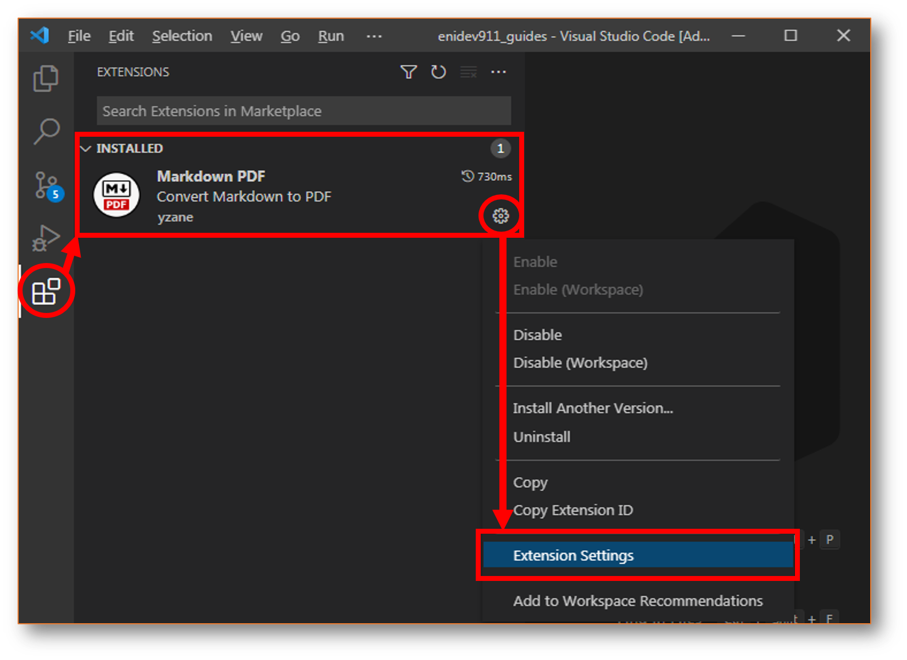
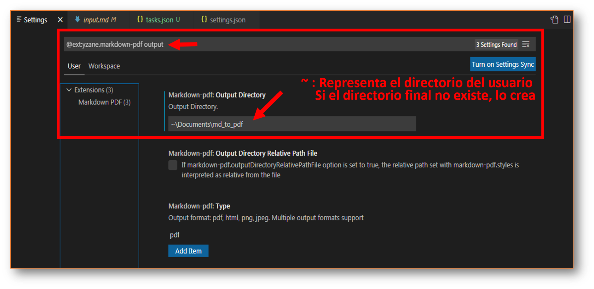

### Como configurar VS code para Multi-Markdown.

1. Primer paso sera descargar la extensión MARKDOWN PDF:  

	

2. Entramos a sus configuraciones:

	

3. Podemos filtrar una opción en el cuadro de diálogo. Por ejemplo: buscamos la opción para establecer un directorio de salida donde podemos almacenar los pdf generados por ej:

	

4. También es posible escribir las configuraciones en el archivo **settings.json**  

	
	

Opciones 

|opción|descripción|
|------|-----------|
|markdown-pdf.outputDirectory|Establece el directorio de salida de los archivos convertidos por la extensión.|
|markdown-pdf.outputDirectoryRelativePathFile|Si se establece l valor de sta opción en `true` la ruta relativa establecida con **markdown-pdf.styles** se interpreta como relativa al archivo.|
|markdown-pdf.convertOnSave|Habilita la conversión automática al guardar. Para aplicar la configuración, debe reiniciar VS code. Para habilitar establezca su valor en `true`.|
|markdown-pdf.convertOnSaveExclude|Nombre de archivo excluido de la opción convertOnSave, quiere decir un nombre de archivo por ejemplo: `readme.md`, cuando guardamos este archivo no será procesado.|
|markdown-pdf.type|Formato de salida: pdf, html, png, jpeg. Compatibilidad con múltiples formatos de salida. Por defecto el valor es pdf pero puede agregas más formatos para que al momento de procesarse con el guardado automático, obtenga la salida en cuyos formatos.|

**Opciones de estilos**

|opción|descripción|
|------|-----------|
|markdown-pdf.highlightStyle|Establezca el nombre del archivo estilo.|

/play crickets