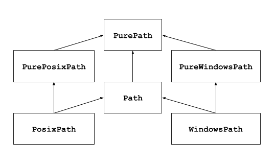

Pathlib - (Rutas del sistema de archivos orientados a objetos) 


Este módulo ofrece clases que representan rutas del sistema de archivos con semántica apropiada para diferentes sistemas operativos. La clases de ruta se dividen entre [rutas puras](#), que proporcionan operaciones puramente computacionales sin E/S, y [rutas concretas](#), que heredan de rutas puras pero también proporcionan operaciones de E/S. 

<p align="center">
	
</p>


Las rutas puras son útiles en algunos casos especiales; por ejemplo:

1. Si desea manipular las rutas de Windows en una máquina Unix (o viceversa). No puede crear instancias de **WindowsPath** cuando se ejecuta en Unix, pero puede crear instancias de **PureWindowsPath**.  
2. Desea asegurarse de que su código solo manipule las rutas sin acceder realmente al sistema operativo. En este caso, crear una instancia de una de las clases puras puede ser útil, ya que simplemente no tienen ninguna operación de acceso al sistema operativo.  

### <a href="uso">Uso básico</a>

Importando la clase principal:  

```py
from pathlib import Path
```
Listar subdirectorios:  

```py
p = Path('.')
[x for x in p.iterdir() if x.is_dir()]
#[WindowsPath('folders')] or
#[PosixPath('.hg'), PosixPath('docs'), PosixPath('dist'),
# PosixPath('__pycache__'), PosixPath('build')]
```

Listar archivos fuentes de Python en este árbol de directorios:  

```py
list(p.glob('**/*.py'))
#[WindowsPath('factorial.py'), WindowsPath('input.py'), 
#WindowsPath('pathlib_usos.py'), WindowsPath('time.py')]
```

Navegando dentro de un árbol de directorio :  

```py
p = Path('/folders')
q = p / 'sub_folder' / 'src'
# \folders\sub_folder\src
# C:\folders\sub_folder\src or
```

Consultando las propiedades de la ruta: 

```py
q.exists()
# True
q.is_dir()
# False
```

### <a href="purepath">Pure paths</a>

Los objeto de ruta proporcionan operaciones de manejo de rutas que en realidad no acceden a un sistema de archivos. Hay tres formas de acceder a estas clases, que también llamamos *sabores*: 

### Rutas Puras (Pure paths)

Como se indicó anteriormente, las rutas puras proporcionan operaciones puramente computacionales. Los objetos de clases de rutas puras proporcionan varios métodos para las operaciones de manejo de rutas. El objeto de ruta puta funciona sin acceder realmente al sistema de archivos.   

**Pure path** es útil cuando solo queremos manipular una ruta y sin acceder al sistema de archivos. Podemos manipular una ruta del sistema de archivos de Windows en una máquina Unix o viceversa fácilmente instanciando una de las clases puras.  


**class pathlib.PurePath(\*pathsegments)**

Esta es una clase genérica que representa el estilo de la ruta del sistema. Al instanciar esta clase, se creará **pathlib.PurePosixPath** o **pathlib.PureWindowsPath**  

```py
from pathlib import PurePath

obj = PurePath('foo/bar')

print(obj)
```

**class pathlib.PurePosixPath(\*pathsegments) –**

Esta es una subclase de la clase PurePath . Representa rutas de sistemas de archivos que no son de Windows.

```py
from pathlib import PurePosixPath
obj = PurePosixPath('foo/baar')
print(obj)
```

**class pathlib.PureWindowsPath(\*pathsegments):**

esta también es una subclase de la clase patlib.PurePath . Representa las rutas del sistema de archivos de Windows.

```py
from pathlib import PureWindowsPath
obj = PureWindowsPath('foo/baar')
print(obj)
```

**Propiedad PurePath.name –**

Esta propiedad de ruta pura devuelve el componente de ruta final después de excluir la unidad y el componente raíz, si corresponde.

```py
from pathlib import PurePath
path = '/Desktop/file.txt'
obj = PurePath(path)
comp = obj.name
print(comp)
```

