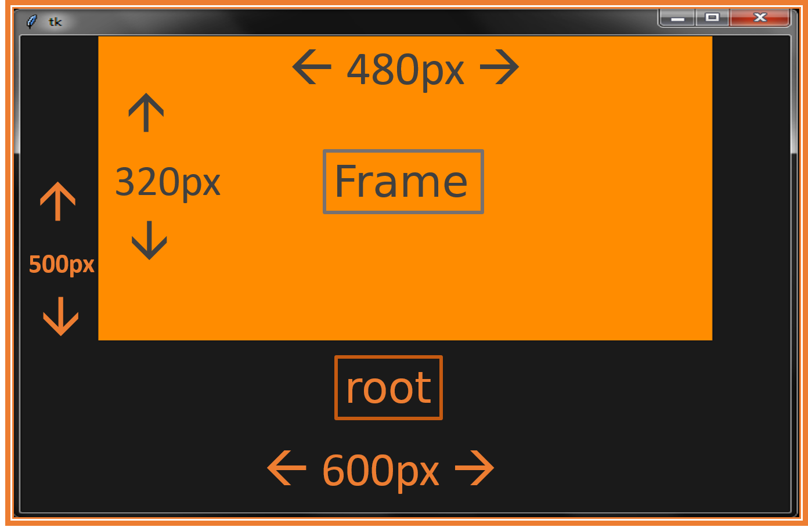

# tkinter\_8.x

### Guía rápida de Tkinter 8.5

Esta guía rápida sirve para recordar todas las posibilidades que ofrece la librería Tkinter en su versión 8.x, describe el conjunto de widgets de Tkinter. Incluye cobertura de los widgets temáticos de ttk.

***

A continuación sigue una lista detallada de todas las características que se pueden emplear en Tkinter.

### tabla de contenido

* [Tkinter](./#mark)
  * [¿Que es Tkinter?](./#mark-0)
  * [Definiciones](./#mark-1)
  * [Una aplicación mínima](a\_minimal\_application/)
* [Gestión de diseño](./#mark)
  * [Método **.grid()**](./)
  * [Método **.pack()**](./)
* [Widgets](./#mark0)
  * [Contenedores](./#mark2)
    * [LabelFrame](widgets/LabelFrame/)
  * [Entry](widgets/Entry/)
  * [Enlaces](./#mark2)
  * [Parrafos](./#mark3)
  * [Formato](./#mark4)
  * [Citas](./#mark5)
  * [Listas](./#mark6)
  * [Listas de definiciones](./#mark7)
  * [Imágines](./#mark8)
  * [Tablas](./#mark9)
  * [Código](./#mark10)
  * [Lineas Horizontales](./#mark11)
  * [Escapar caracteres](./#mark12)
  * [Notas a pie de página](./#mark13)
  * [Abreviaturas](./#mark14)
  * [Indentificadores de cabecera](./#mark15)
  * [Extras](./#mark16)

#### ¿Que es Tkinter?

_Tkinter_ es un conjunto de widgets GUI(graphical user interface) para Python, en otras palabras podriamos decir que es un creador de interfaz gráfica de usuario, es multiplataforma quiere decir que es compatible con varios sistemas operativos como Windows, Linux, MacOS.

#### Definiciones

Antes de continuar, definamos algunos de los términos comunes.

**window**

Este término tiene diferentes significados en diferentes contextos, pero en general se refiere a un área rectangular en algún lugar de la pantalla de visualización.

**top-level window**

Una ventana que existe de forma independiente en su pantalla. Se decorará con su marco(Frame) y los controles estándar para el administrador de escritorio de su sistema. Puede moverlo en su escritorio. Por lo general, puede cambiar su tamaño, aunque su aplicación puede evitarlo.

**widget**

Término genérico para cualquiera de los componentes básicos que componen una aplicación en una interfaz gráfica de usuario. Ejemplos de widgets: botones de radio, campos de texto, marcos y etiquetas de texto, etc.

**frame**

En _tkinter_, el _widget Frame_ es la unidad básica de organización para diseños complejos. Un _frame_ es un área rectangular que puede contener otros widgets.

**child, parent**

Cuando se crea un _widget_, se crea una relación _padre-hijo_. Por ejemplo, si se coloca una etiqueta de texto dentro de un _frame_, el _frame_ es el padre de la etiqueta.

***

[volver a índice](./#top)

***

#### ¿Que son los contenedores o frames?

Los **Frame** son contenedores de otros **widgets**. Pueden tener tamaño propio y posicionarse en distintos lugares de otro contenedor (ya sea la raíz u otro frame):

**Ejemplo**:

```python
from tkinter import *

root = Tk()
# Podemos establecer las dimensiones para ver el frame dentro de la raiz
root.geometry('600x500')
# Color de fondo para diferenciar del frame
root.config(bg='gray10')

# Hijo de root, no ocurre nada
frame = Frame(root)  

# Empaqueta el frame en la raíz
frame.pack()      

# Como no tenemos ningún elemento dentro del frame, 
# no tiene tamaño y aparece ocupando lo mínimo posible, 0*0 px

# Color de fondo, background
frame.config(bg="darkorange")     

# Establecemos el tamaño para el frame y verlo
frame.config(width=480,height=320) 

root.mainloop()
```

**Resultado**:



* [LabelFrame](LabelFrame.md)
* [Listbox\</a](Listbox.md)
