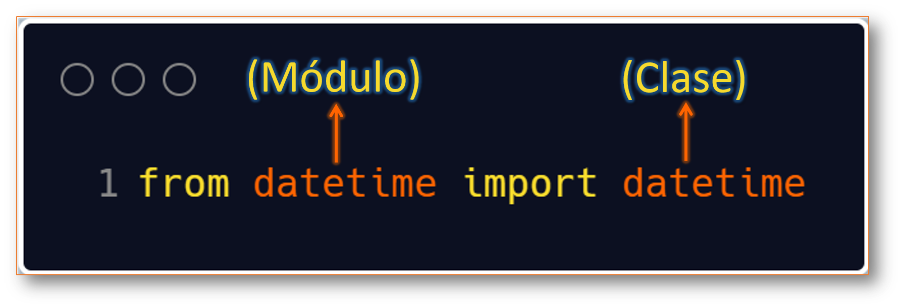
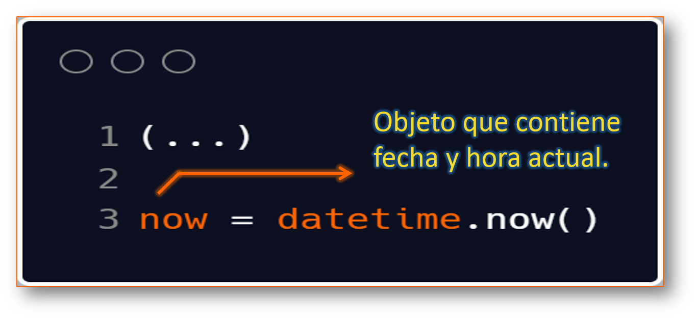
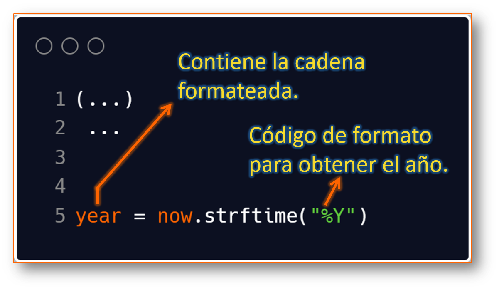
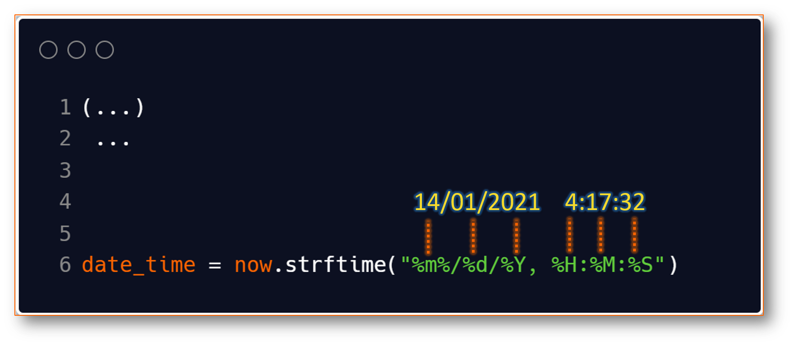

Python strftime()

Veamos como convertir objetos de fecha, hora y fecha y hora en su cadena equivalente. 


El método **strftime** devuelve una cadena que representa la fecha y la hora mediante el objeto **date**, **time** o **datetime**.


**Ejemplo 1:**

El siguiente programa convierte un objeto `datetime` que contiene la fecha y hora actual en diferentes formatos de cadena.  


```py
from datetime import datetime

# current date and time
now = datetime.now()

year = now.strftime("%Y")
print("año: ", year)

month = now.strftime("%m")
print("mes: ", month)

day = now.strftime("%d")
print("día: ", day)

time = now.strftime("%H:%M:%S")
print("hora: ", time)


date_time = now.strftime("%m/%d/%Y, %H:%M:%S")
print("fecha y hora: ", date_time)


# output:
# año: 2021
# mes: 12
# día: 05
# hora: 04:59:31
# fecha y hora: 05/11/2021, 04:59:31
```

### ¿Cómo funciona strftime()?

En el programa anterior, `%Y`, `%m`, `%d` etc. Son códigos de formato. El método `strftime()` toma uno o más códigos de formato como argumento y devuelve una cadena formateada basada en él.  

1. Importamos la clase `datetime` del módulo `datetime`. Es porque el objeto de la clase `datetime` puede acceder al método `strftime()`.  

<p align="center">
	
</p>

2. El objeto `datetime` que contiene la fecha y la hora actual se almacena en una variable

<p align="center">
	
</p>


3. El método `strftime()` se puede utilizar para crear cadenas formateadas.

<p align="center">
	
</p>

4. La cadena que pasa al método `strftime()` puede contener más de un código de formato.

<p align="center">
	
</p>


**Ejemplo 2:**  

Crear una cadena a partir de una marca de tiempo. 


```py
from datetime import datetime as dt

timestamp = 1528797322
date_time = dt.fromtimestamp(timestamp)

print("Date time object: ", date_time)
```


### <a name="formatos">Lista de códigos de formato</a>

La siguiente tabla muesta todos los códigos que puede pasar al método `strftime()`.  


|**Directiva**|**Significado**|**Ejemplo**|
|:-----------:|---------------|-----------|
|%a|Nombre abreviado del día de la semana|dom, lun,...|
|%A|Nombre completo del día de la semana.|Domingo, Lunes,..|
|%w|Día de la semana como un número decimal|0, 1, ...,6|
|%d|Día del mes como decimal con ceros.|01,02,...,31|
|%-d|Día del mes como número decimal.|1,2,...,30|
|%b|Nombre del mes abreviado|ene, feb, ..., dic|
|%B|Nombre del mes completo|Enero, febrero,...|
|%y|Año sin siglo como un número decimal con ceros.|00, 01, ..., 99|
|%-y|Año sin siglo como número decimal.|0, 1, ..., 99|
|%Y|Año con siglo como número decimal.|2010, 2015, etc|
|%H|Hora (reloj de 24 horas) como un número decimal con ceros.|00, 01, ..., 23|


