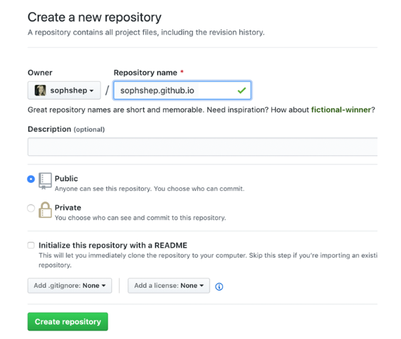
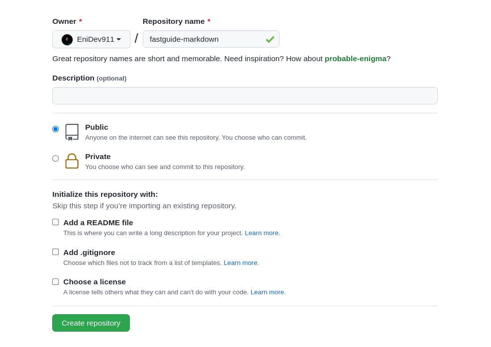
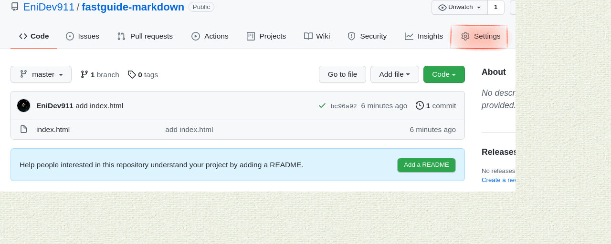
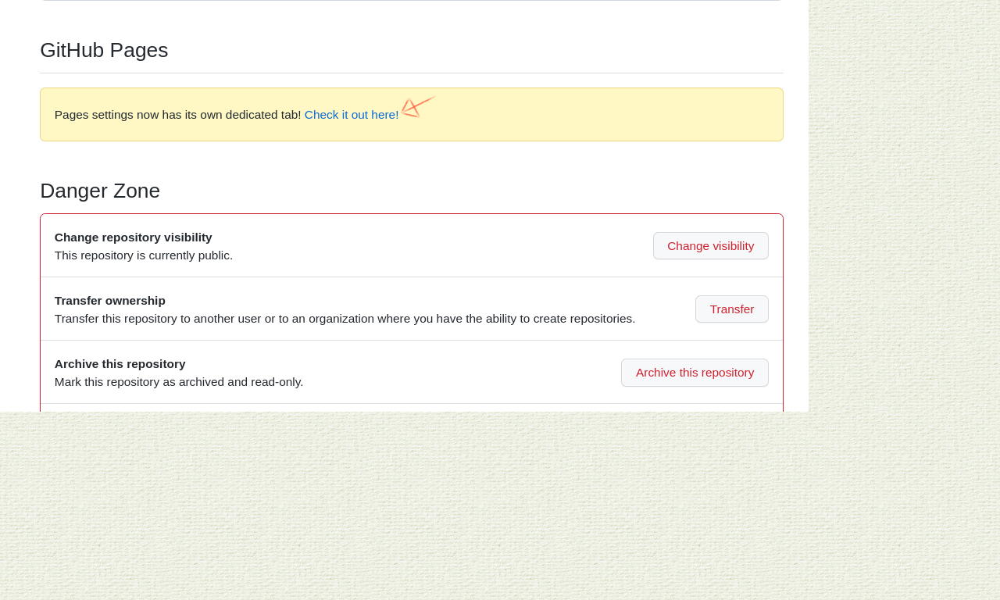
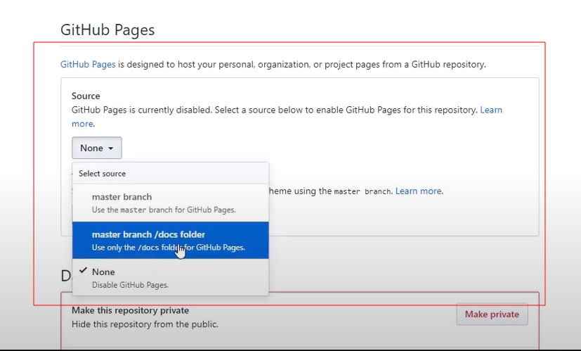

### Github Pages

Nos permite crear una página de aterrizaje o sea una página web, por cada uno de estos repositorios o sea vamos a tener un hosting totalmente gratuito por cada uno de ellos. Es un recurso bastante utilizado para poder mostrar cualquier tipo de información.  

Estos pasos sirven para trabajar la página general de su GitHub

1. Crear un nuevo repositorio
2. Colocar el nombre de su usuario como nombre de repositorio de la siguiente manera: 
	- nombreusuario.github.io
	- 
3. Crea un archivo index.html en tu sistema de archivo local
4. Realizar el vinculo de git hacia el repositorio remoto.
5. Listo. puedes ir a visitar la página.

Estos pasos sirven para trabajar una página para un repositorio existente.  

1. Crear un nuevo repositorio

2. Realizar el vinculo de git hacia el repositorio remoto.
3. (Opcional) puedes aterrizar la página en una carpeta con el nombre 'docs' aquí dentro van sus archivos html, css, js por si el repositorio esta basado en otro proyecto, podría ser esta una buena opción para mostrar la información del mismo.
4 Vamos a nuestro repositorio y seleccionamos las configuraciones.

5. Bajamos hasta le sección de github pages

6. Según la opción que elijas, seleccionas una o la otra  

## Agregar un tema

1. En GitHub, navegue hasta el repositorio de su sitio.
2. Debajo del nombre de su repositorio, hacemos clic en Settings. 
3. En la barra lateral izquierda, haz clic en **Pages**. 
4. En GitHub Pages, hacemos clic en **Elegir un tema** o **Cambiar tema**.
