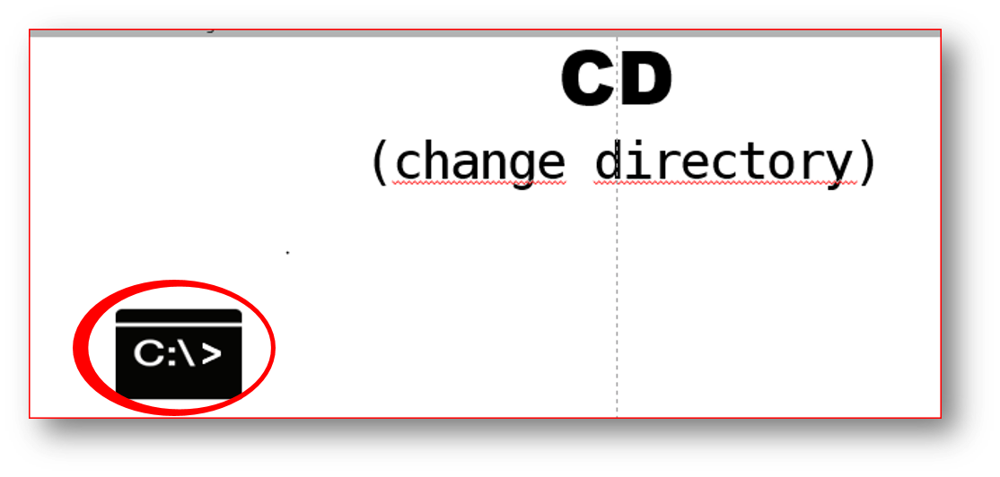
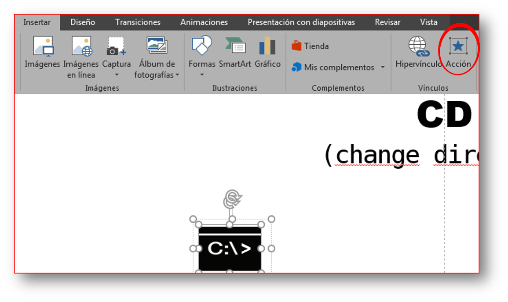
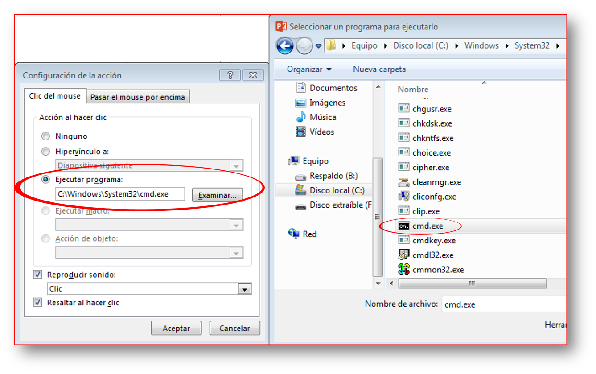
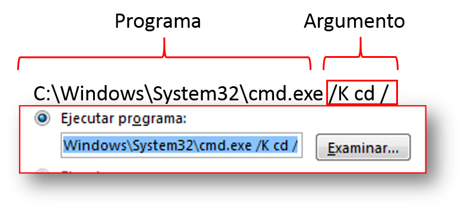
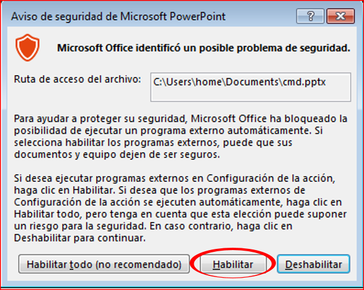

## Pasos para incluir la ejecución de programas en una diapositiva

**Paso1:** Crear una diapositiva con algún texto u objeto en ella.

Como en la siguiente imagen usaremos el objeto que esta marcado para asignarle la acción:

	

**Paso2:** Seleccionado el objeto/texto, navegamos hasta la pestaña **insertar**. En la sección de **Vínculos**, damos clic en **Acción**:

	

**Paso3:** Se abrirá la ventana *Configuración de acciones*, seleccionamos alguna ficha, y se nos habilitará el botón para examinar y buscar el programa que deseamos asociar a nuestro objeto:

	

**Nota:** Además, puede proporcionar un parámetro con el que desee que se abra la aplicación. Por ejemplo en mi caso:

	

Lo que causará que cuando yo presione sobre mi objeto, se abrirá el programa **CMD** y ejecutará el comando **cd /** para que cambie de ubicación a la raiz del disco C.

Eso es todo, en el modo presentación puede iniciar el programa sin tener que salir de su presentación. Podría recibir una advertencia de seguridad mientras lo hacem, aceptamos y listo:

	

