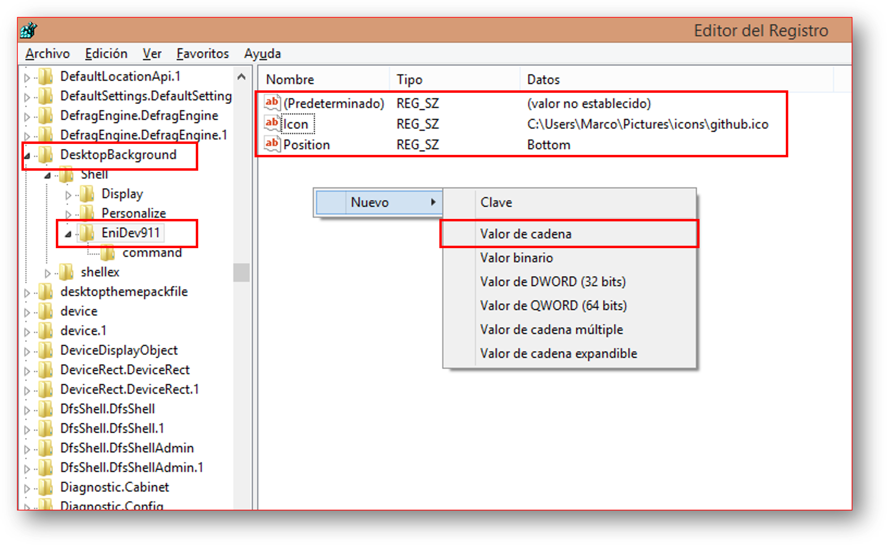
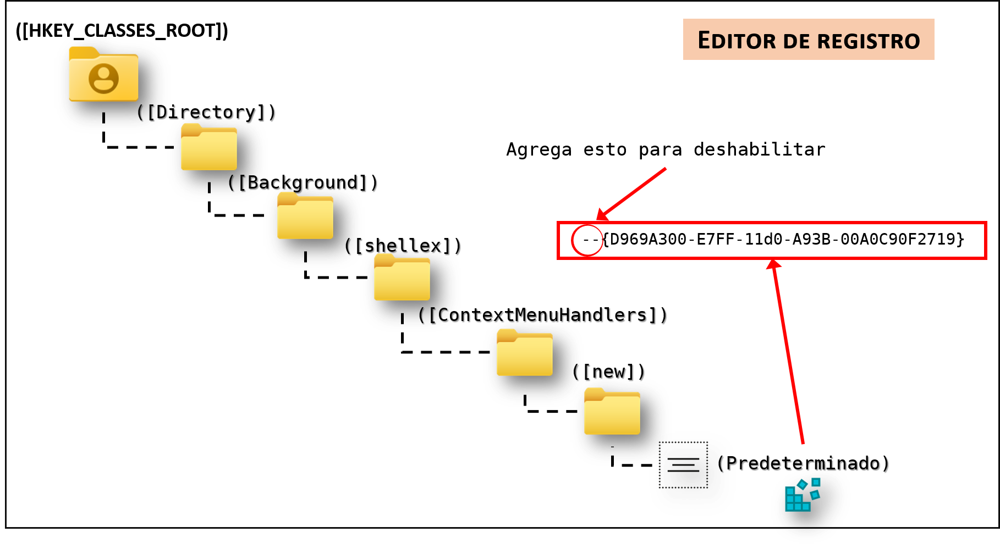
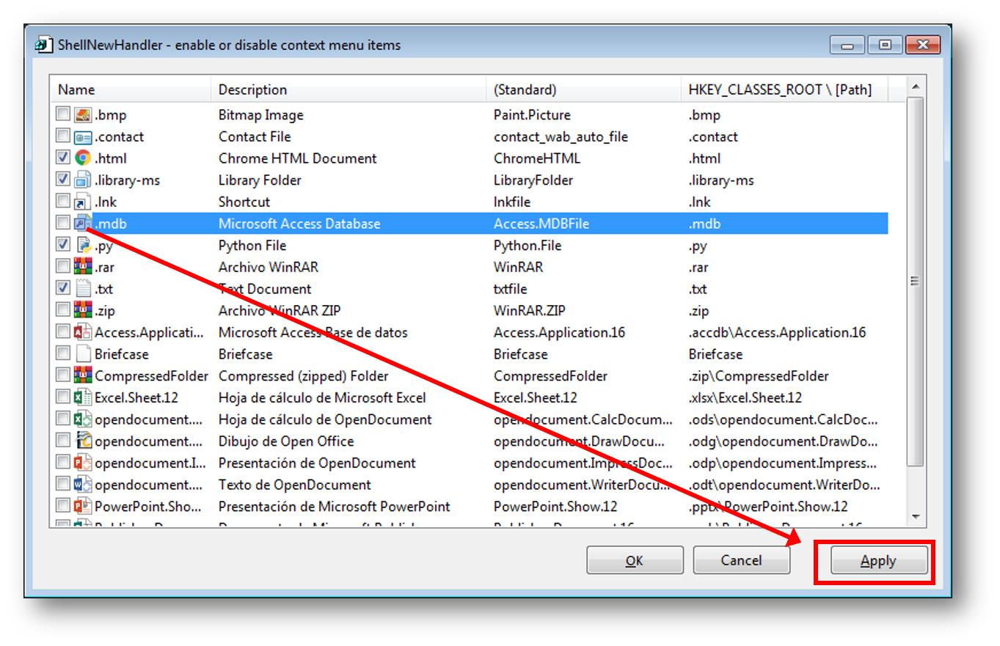
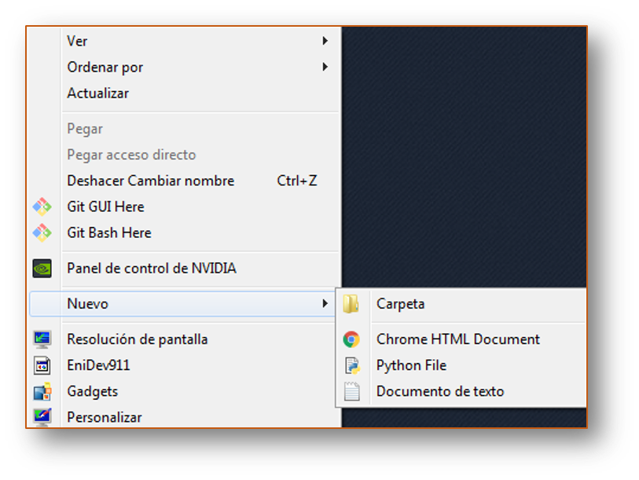
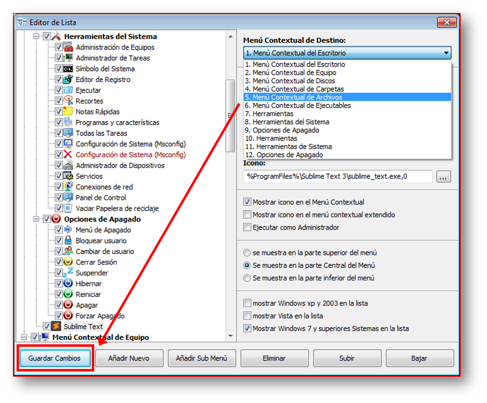
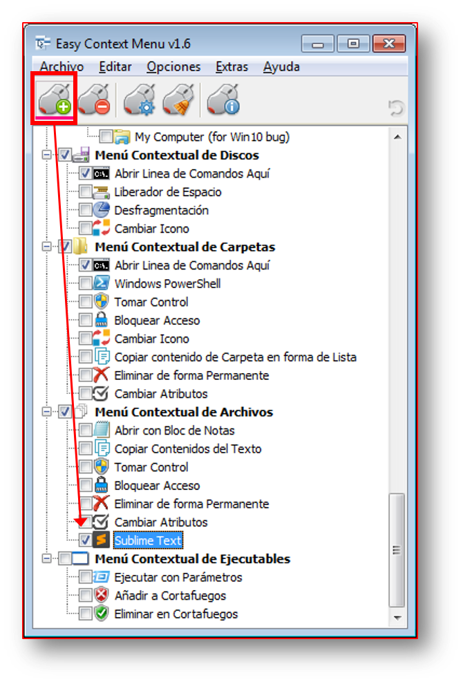

### Editor de registro


Los archivos REG son como colecciones de instrucciones dedicadas a modificar el Registro de Windows. Toda la información contenida dentro del archivo REG dictará los cambios específicos que deben aplicarse en el registro. En otras palabras, ejecutar un archivo REG llevará a añadir o eliminar claves o valores de registro determinados. Por ejemplo, la siguiente información corresponde al contenido de un archivo REG simple de 3 líneas capaz de añadir un valor a una clave específica dentro del registro. 

Tener en cuenta, todos los archivos REG deben seguir y respetar la siguiente **sintaxis** de manera tal que el Editor de registro pueda interpretar su información:


```
Windows Registry Editor Version 5.00

[<Hive name>\<Key name>\<Subkey name>]

«Value name»=<Value type>:<Value data>
```


**RegistryEditorVersion**:  es "Windows Registry Editor Version 5.00" para Windows 2000, Windows XP y Windows Server 2003 o "REGEDIT4" para Windows 98 y Windows NT 4.0. El encabezado "REGEDIT4" también funciona en equipos basados en Windows 2000, Windows XP o Windows Server 2003.


**Línea en blanco es una línea en blanco**: Esto identifica el inicio de una nueva ruta del Registro. Cada clave o subclave es una nueva ruta del Registro. Si tiene varias claves en el archivo .reg, las líneas en blanco pueden ayudarle a examinar y solucionar problemas del contenido.


**RegistryPathx**: es la ruta de la subclave que contiene el primer valor que va a importar. Agregue la ruta entre corchetes y separe cada nivel de la jerarquía con una barra diagonal inversa.

**Importante:** si bien los contenidos de los archivos REG y las claves en el Registro de Windows no distinguen entre caracteres en mayúsculas y minúsculas, ha de tenerse en cuenta que ciertos valores del registro si lo hacen. Procura ser muy cuidadoso a la hora de trabajar en la modificación de valores.

Algunas claves que vamos a conocer:


**HKEY_CLASSES_ROOT\\\*\\shell**: Las claves creadas aquí se mostrarán en el menú contextual al dar un clic derecho en cualquier tipo de archivo, por lo que se debe de utilizar en funciones que involucren solo a archivos, no carpetas ni directorio.


**HKEY_CLASSES_ROOT\\Directory\\shell**: Las claves creadas aquí se mostrarán en el menú al dar un clic derecho en cualquier directorio o carpeta.


**HKEY_CLASSES_ROOT\\DesktopBackground\\shell**: Las claves creadas aquí se mostrarán en el menú al dar un clic derecho solo en el escritorio, por ejemplo, aquí se encuentra la opción de Resolución de pantalla, Gatgets, etc.


**HKEY_CLASSES_ROOT\\Directory\\Background\\shell**: Las claves creadas aquí se mostrarán en el menú al dar un clic derecho en el fondo de cualquier directorio y en el escritorio.


**HKEY_CLASSES_ROOT\\Directory\\Background\\shell**: Las claves creadas aquí se mostraran en el menú al dar un clic derecho en las unidades de disco.


<h4><u>Como ajustar la posición de las nuevas entradas en el menú</u></h4>

Creamos un nuevo valor de cadena y acepta los siguientes valores:

- **Position**
	+ **Bottom** : Se mostrará en la parte inferior del menú
	+ **Top** : Se mostrará en la parte superior del menú


<h4><u>Como indicar en el registro un icono</u></h4>

Creamos un nuevo valor de cadena y acepta los siguientes valores:

- **Icon**
	+ **ruta** : Debe indicar la ruta hacia el recurso. 


Si este se encuentra en un .dll es importante indicar su ubicación

Ejemplo: 

```bat
rem Indicar el primer icono
%SystemRoot%\system32\SHELL32.dll,-1
```


Archivos DLL con mayor número de iconos en Windows 7 y 8


|Nombre|Descripción|Número de iconos|
|------|-----------|---------------:|
|shell.dll|Windows Shell Common Dll|306|
|imageres.dll|Windows Image Resources|218|
|wmploc.dll|Windows Media Player Resources|208|
|netshell.dll|Network Connection Shell|164|
|mmcndmgr.dll|MMC Node Manager DLL|129|
|moricons.dll|Windows NT Setup Icon Resources Library|113|
|ieframe.dll|Internet Browser|105|
|compstui.dll|Common Property Sheet User Interface DLL|101|


Los valores de cadenas se indican un nivel arriba de la clave **command**:

<p align="center">
 
</p>


<h4><u>CREAR NUEVAS ENTRADAS EN EL SUBMENU CONTEXTUAL NUEVO</u></h4>


**Deshabilitar completamente el submenu Nuevo en el menu contextual**

Para eso accede a la siguiente clave de registro:

**HKEY_CLASSES_ROOT\Directory\Background\shellex\ContextMenuHandlers**

allí te vas a encontrar la subclave **New**, en el panel de la derecha da dos clic en el valor predeterminado y agregale dos guiones a su valor, te quedaría de la siguiente forma:

```
--{D969A300-E7FF-11d0-A93B-00A0C90F2719}
```

<p align="center">
 
</p>

Esto lo deshabilitará temporalmente, para volverlo a habilitar simplemente quítale los guiones que añadiste.


<h4>Programas para poder añadir y quitar elementos en el menú 'nuevo'</h4>


<u><b>ShellNewHandler</b></u>, organiza todo el menú de manera eficiente.


Para organizar el contenido del menú contextual podemos hechar mano de esta herramienta. Es completamente gratuita y la podemos descargar desde este [enlace](https://sourceforge.net/projects/shellnewhandler/). Es portable, bastará con descomprimirla y ejecutarla para comenzar a usarla.

Una vez lo ejecutamos nos aparece un menú donde se encuentra todas las aplicaciones que se encuentran actualmente en el menú contextual. Si queremos desactivarla tan sólo será necesario **desmarcar la casilla correspondiente** y finalmente pulsar sobre el botón <kbd>Apply</kbd>. Pasados unos instantes se verán reflejados los cambios dando como resultado la desapareción del menú contextual de dichas entradas. Con ello podemos organizar a nuestra preferencia lo que queremos mostrar o no. Además, evitamos que se carguen entradas que no vamos a utilizar.


<p align="center">
 
 
</p>


<u><b>Easy Context Menu</b></u>, agrega y quita contenido de forma rápida.


Este programa nos permite realizar diferentes acciones con las que poder organizar nuestro menú contextual en Windows. Podremos **agregar y quitar contenido**. Es una herramienta **gratuita y portable** que podemos descargar desde su [Página web](https://www.sordum.org/7615/easy-context-menu-v1-6/)

Una vez descargada, descomprimimos el ZIP y tendremos el archivo ejecutable. Dispondremos de una opción para sistema de 32 bits y otro para sistemas de 64 bits. Nos aparecerá su menú principal con seis categorías: **Menú Contextual del Escritorio**, **Menú Contextual de Equipo**,**«Menú Contextual de Discos**, **Menú Contextual de Carpetas**, **Menú Contextual de Archivos** y **Menú Contextual de Ejecutables**. Podemos plegar o desplegar cada menú para tener una vista mejor organizada.

Si queremos agregar cualquier programa a la lista podremos hacerlo con el **Editor de Lista**, representado por un icono con forma de ratón con un engranaje. Al abrir el editor debemos de arrastrar y soltar el archivo ejecutable de la aplicación que queremos insertar y por último pulsar en **Guardar cambios**

<p align="center">
 
  
</p>


## Reglas a seguir para crear los archivos REG

l crear un archivo para agregar al registro es necesario tener presente las siguientes reglas.
La primera línea en los sistemas operativos XP, Vista y Windows 7, 8 y 10 debe ser:

```
Windows Registry Editor Version 5.00
```

A continuación debe dejarse una línea en blanco.

Para crear una clave, un ejemplo seria:

```
[HKEY_CURRENT_USER\Software\MiPrograma]
```


Un valor contenido en la clave anterior:

```
[HKEY_CURRENT_USER\Software\MiPrograma]
"mi_valor"="como"
```

Para eliminar una clave antepone un signo menos:

```
[-HKEY_CURRENT_USER\Software\MiPrograma]
```

Para eliminar un valor:

```
[HKEY_CURRENT_USER\Software\MiPrograma]
"valor a quitar"=-
```


Si el carácter punto y coma (;) está delante de cualquier línea esta será ignorada y considerada como un comentario, por ejemplo:

```
[HKEY_CURRENT_USER\Software\MiPrograma]
; esta línea es un comentario
```


Más ejemplos:  

```
Windows Registry Editor Version 5.00

[HKEY_CLASSES_ROOT\.py\ShellNew]
"NullFile"=""
"Data"=""
```


### Guardar los ajustes de configuración de la consola en el Registro de Windows.


Los valores de la configuración de la consola CMD para el uso general, se encuentran en la siguiente clave de registro: 


```
HKEY_CURRENT_USER\Console\
```

```
HKEY_CURRENT_USER 
```


Mediante la línea de comandos es posible modificar, editar y cambiar 